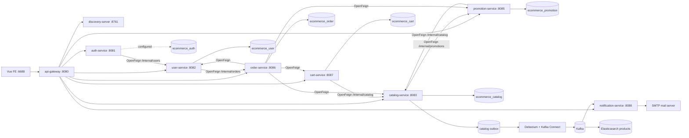
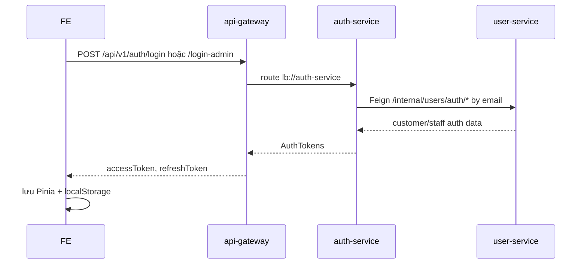
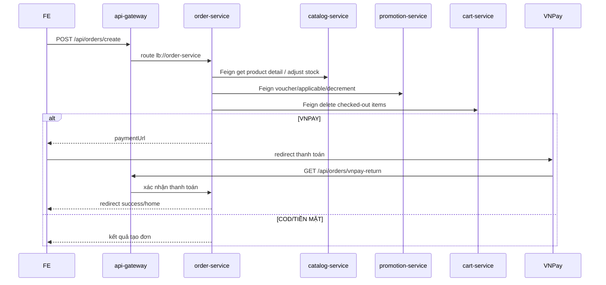
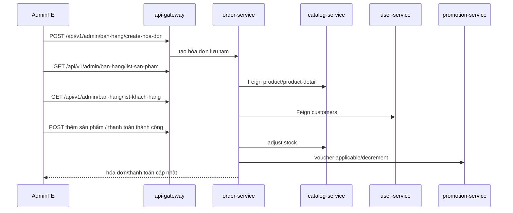

# ARCHITECTURE.md

## 1. Tổng quan dự án

Dự án là hệ thống e-commerce bán giày, đang migrate từ monolith sang microservices. Nghiệp vụ chính gồm: quản lý sản phẩm và thuộc tính sản phẩm, khách hàng/nhân viên, giỏ hàng, voucher/đợt giảm giá, bán hàng tại quầy, đặt hàng online, thanh toán VNPay, lịch sử đơn hàng, thống kê admin và gửi email thông báo.

Nguồn đọc chính: `backend-microservice/README.md`, `RUN_PROJECT_LOCAL.md`, `backend-microservice/settings.gradle`, các `application.yml`, controller, entity, Feign client, `FE/package.json`, `FE/src/routes/router.ts`, `FE/src/services`.

Ghi chú: trong workspace hiện tại không thấy `README-Microservice.md`, `AGENTS.md` vật lý hoặc thư mục `BE` monolith; tài liệu này dựa trên source microservice và FE hiện có.

### Stack chính

| Phần | Công nghệ |
|---|---|
| Backend | Java 17, Spring Boot 3.4.4, Spring Cloud 2024.0.1, Gradle multi-module |
| Service discovery | Netflix Eureka (`discovery-server`) |
| Gateway | Spring Cloud Gateway (`api-gateway`) |
| Service-to-service | OpenFeign qua Eureka service name |
| Database | MySQL 8.4, database riêng theo service |
| ORM | Spring Data JPA; một số phần `order-service` vẫn dùng `JdbcTemplate` cho checkout/admin/order |
| Message/CDC | Kafka, Kafka Connect, Debezium Outbox cho product search; `notification-service` consume Kafka topic email |
| Search | Elasticsearch + Kibana, index/alias `products` |
| Monitoring/logging | Actuator, Micrometer Prometheus, Prometheus, Grafana, Filebeat, Logstash |
| Frontend | Vue 3, TypeScript, Vite, Vue Router, Pinia, Axios, Ant Design Vue, Bootstrap, Tailwind CSS |
| Payment/email | VNPay sandbox config trong `order-service`, SMTP qua `notification-service` |

## 2. Danh sách các service

### Tổng quan service

| Service | Đường dẫn | Port local | Database | Trách nhiệm chính |
|---|---|---:|---|---|
| `discovery-server` | `backend-microservice/discovery-server` | 8761 | Không | Eureka registry cho toàn bộ service |
| `api-gateway` | `backend-microservice/api-gateway` | 8080 | Không | Public entrypoint, route theo path, kiểm tra JWT/admin cho API admin |
| `common-lib` | `backend-microservice/common-lib` | N/A | Không | DTO response/exception/common utilities, không chứa shared JPA entity |
| `auth-service` | `backend-microservice/auth-service` | 8081 | `ecommerce_auth` cấu hình, chưa thấy entity JPA | Login/register/change password, tạo JWT/refresh token, OAuth2 |
| `user-service` | `backend-microservice/user-service` | 8082 | `ecommerce_user` | Khách hàng, nhân viên, profile, dữ liệu auth nội bộ cho user/staff |
| `catalog-service` | `backend-microservice/catalog-service` | 8083 | `ecommerce_catalog` | Category, product, variant, thuộc tính động, tồn kho, search outbox |
| `promotion-service` | `backend-microservice/promotion-service` | 8085 | `ecommerce_promotion` | Voucher sàn/shop, campaign STANDARD, Flash Sale |
| `order-service` | `backend-microservice/order-service` | 8086 | `ecommerce_order` | Đơn hàng, hóa đơn, bán hàng tại quầy, checkout online, VNPay, thống kê |
| `cart-service` | `backend-microservice/cart-service` | 8087 | `ecommerce_cart` | Giỏ hàng khách hàng và chi tiết giỏ hàng |
| `notification-service` | `backend-microservice/notification-service` | 8088 | Không | Gửi email qua REST hoặc consume Kafka topic email |

### API Gateway

| Method | Path | Mục đích |
|---|---|---|
| ANY | `/api/v1/auth/**`, `/oauth2/**` | Route tới `auth-service` |
| ANY | `/api/v1/admin/khach-hang/**`, `/api/v1/admin/nhan-vien/**`, `/api/v1/permitall/profile/**` | Route tới `user-service` |
| ANY | `/api/v1/admin/categories/**`, `/api/v1/admin/product-attributes/**`, `/api/v1/admin/product-variant-axes/**`, `/api/v1/permitall/products/**`, `/api/v1/permitall/categories/**`, `/api/v1/seller/products/**` | Route canonical tới `catalog-service` |
| ANY | `/api/v1/admin/campaigns/**`, `/api/v1/admin/voucher/**`, `/api/v1/admin/flash-sales/**`, `/api/v1/seller/vouchers/**`, `/api/v1/seller/promotions/**`, `/api/v1/seller/flash-sales/**`, `/api/v1/permitall/flash-sales/**` | Route tới `promotion-service` |
| ANY | `/api/v1/admin/thong-ke/**`, `/api/v1/admin/disputes/**`, `/api/v1/permitall/don-mua/**`, `/api/orders/**`, `/api/v1/seller/orders/**`, `/api/v1/seller/disputes/**`, `/api/v1/buyer/disputes/**` | Route tới `order-service` |
| ANY | `/api/v1/permitall/cart/**` | Route tới `cart-service` |
| ANY | `/api/v1/notifications/**` | Route tới `notification-service` |

### auth-service

| Method | Path | Mục đích |
|---|---|---|
| POST | `/api/v1/auth/login` | Đăng nhập khách hàng, trả `AuthTokens` |
| POST | `/api/v1/auth/login-admin` | Đăng nhập admin/nhân viên, trả `AuthTokens` |
| PUT | `/api/v1/auth/register` | Đăng ký khách hàng |
| POST | `/api/v1/auth/change-password` | Đổi mật khẩu bằng session email hoặc Bearer token |

| Mục | Chi tiết |
|---|---|
| Bảng sở hữu | Chưa thấy entity `@Table` trong source; có cấu hình datasource `ecommerce_auth` |
| Dependency | Gọi `user-service` qua OpenFeign `UserClient` path `/internal/users` để tìm/tạo khách hàng, tìm staff, đổi mật khẩu |

### user-service

| Method | Path | Mục đích |
|---|---|---|
| GET/POST/PUT | `/api/v1/admin/khach-hang`, `/api/v1/admin/khach-hang/{id}`, `/change-status` | Quản lý khách hàng |
| GET/POST/PUT | `/api/v1/admin/nhan-vien`, `/api/v1/admin/nhan-vien/{id}`, `/change-status`, `/change-role`, `/check-duplicate` | Quản lý nhân viên |
| GET/POST | `/api/v1/permitall/profile/**` | Xem/cập nhật profile và lịch sử liên quan |
| GET/POST | `/internal/users/**` | API nội bộ cho auth/order: customer, staff, auth lookup |

| Mục | Chi tiết |
|---|---|
| Bảng sở hữu | `khach_hang`, `nhan_vien` |
| Dependency | Gọi `order-service` qua OpenFeign `OrderClient` path `/internal/orders` để lấy lịch sử đơn theo customer |

### catalog-service

| Method | Path | Mục đích |
|---|---|---|
| GET/POST/PUT | `/api/v1/admin/categories/**`, `/product-attributes/**`, `/product-variant-axes/**` | Taxonomy và hậu kiểm thuộc tính động |
| GET/POST/PUT | `/api/v1/seller/products/**` | Product aggregate, variant/SKU, tồn kho và low-stock theo seller |
| GET | `/api/v1/permitall/products/**`, `/api/v1/permitall/categories/**` | Storefront product/category canonical |
| GET/POST | `/internal/catalog/**` | Snapshot product/variant và điều chỉnh stock cho service nội bộ |

| Mục | Chi tiết |
|---|---|
| Bảng sở hữu | `category`, `product`, `product_variant`, `product_image`, `product_attribute_*`, `product_variant_axis*`, `outbox` |
| Dependency | Cấp snapshot canonical cho cart/order/promotion; ghi outbox để đồng bộ search |

### promotion-service

| Method | Path | Mục đích |
|---|---|---|
| GET/POST/PUT | `/api/v1/admin/campaigns/**` | Quản lý campaign sàn STANDARD và variant áp dụng |
| GET/POST/PUT | `/api/v1/admin/voucher/**` | Quản lý phiếu giảm giá/voucher và khách hàng áp dụng |
| GET/POST | `/internal/promotions/**` | API nội bộ: voucher theo mã, voucher áp dụng, giảm số lượng, discount active |

| Mục | Chi tiết |
|---|---|
| Bảng sở hữu | `promotion_campaign`, `promotion_campaign_product`, `voucher`, `voucher_customer` |
| Dependency | Gọi `catalog-service` qua OpenFeign để lấy product/variant snapshot canonical |

### order-service

| Method | Path | Mục đích |
|---|---|---|
| GET/POST/PUT | `/api/v1/admin/hoa-don/**` | Quản lý hóa đơn, lịch sử thanh toán, đổi trạng thái, xuất PDF |
| GET/POST | `/api/v1/admin/ban-hang/**` | Bán hàng tại quầy: tạo/hủy hóa đơn, thêm/xóa sản phẩm, khách hàng, thanh toán, voucher |
| GET | `/api/v1/admin/thong-ke/**` | Thống kê doanh thu, đơn hoàn thành, top sản phẩm, tỉ lệ trạng thái |
| POST/GET | `/api/orders/create`, `/api/orders/vnpay-return`, `/api/orders/pgg`, `/api/orders/pgg/list`, `/api/orders/khach-hang/{id}` | Checkout online, VNPay, voucher checkout |
| GET/POST/PUT | `/api/v1/permitall/don-mua/**` | Lịch sử đơn mua, chi tiết đơn, sửa thông tin, đổi trạng thái |
| GET | `/internal/orders/customers/{customerId}/history` | API nội bộ trả lịch sử đơn theo khách hàng |

| Mục | Chi tiết |
|---|---|
| Bảng sở hữu | `hoa_don`, `hoa_don_chi_tiet`, `lich_su_thanh_toan`, `lich_su_trang_thai_hoa_don` |
| Dependency | Gọi `catalog-service` qua OpenFeign để lấy product-detail và trừ tồn kho; gọi `promotion-service` để kiểm voucher/discount và giảm số lượng voucher; gọi `user-service` để lấy/tạo khách hàng; gọi `cart-service` để xóa item sau checkout |
| Ghi chú | Có cấu hình Kafka và dependency `spring-kafka`, nhưng trong source hiện tại chưa thấy producer gửi email/event từ `order-service`; cần xác nhận thêm nếu muốn coi order event là flow chính |

### cart-service

| Method | Path | Mục đích |
|---|---|---|
| GET | `/api/v1/permitall/cart` | Lấy giỏ hàng theo request |
| POST | `/api/v1/permitall/cart` | Thêm sản phẩm vào giỏ |
| PUT | `/api/v1/permitall/cart/{id}` | Xóa/đánh dấu xóa chi tiết giỏ |
| DELETE | `/internal/carts/items` | API nội bộ xóa nhiều item sau checkout |

| Mục | Chi tiết |
|---|---|
| Bảng sở hữu | `gio_hang`, `gio_hang_chi_tiet` |
| Dependency | Gọi `catalog-service` qua OpenFeign để lấy thông tin product-detail |

### notification-service

| Method | Path | Mục đích |
|---|---|---|
| POST | `/api/v1/notifications/email` | Gửi email trực tiếp qua SMTP |
| Kafka listener | topic `${EMAIL_TOPIC:email-notification}` | Consume payload `EmailRequest` và gửi email |

| Mục | Chi tiết |
|---|---|
| Bảng sở hữu | Không thấy datasource/entity |
| Dependency | Kafka broker, SMTP (`MAIL_HOST`, `MAIL_PORT`, `MAIL_USERNAME`, `MAIL_PASSWORD`) |

## 3. Kiến trúc tổng thể



Có API Gateway: `api-gateway` là entrypoint chính cho FE. Có message broker: Kafka chạy trong compose; dùng rõ nhất cho search pipeline Outbox/Debezium/Kafka Connect và `notification-service` email consumer. Kafka producer email từ nghiệp vụ order chưa thấy trong source hiện tại, cần xác nhận thêm.

## 4. Luồng nghiệp vụ chính

### 4.1 Đăng nhập user/admin

1. FE gọi `POST {VITE_BASE_URL_SERVER}/api/v1/auth/login` hoặc `/login-admin`.
2. Gateway route tới `auth-service`.
3. `auth-service` set role context (`USER` hoặc `ADMIN`) rồi authenticate bằng Spring Security.
4. Khi cần dữ liệu tài khoản, `auth-service` gọi `user-service` qua OpenFeign `/internal/users/auth/...`.
5. Nếu hợp lệ, `auth-service` tạo access token và refresh token.
6. FE lưu token/user info vào Pinia auth store và `localStorage`; axios interceptor gắn `Authorization: Bearer <token>` cho request sau.



### 4.2 Checkout online và VNPay

1. FE trang checkout lấy sản phẩm từ localStorage/cart, customer id từ localStorage và gọi API thanh toán.
2. FE gọi `POST /api/orders/create` qua gateway.
3. `order-service` tạo hóa đơn/order detail trong `ecommerce_order`.
4. `order-service` gọi `catalog-service` để lấy giá/tồn kho và trừ tồn kho product-detail.
5. Nếu có voucher, `order-service` gọi `promotion-service` để kiểm tra và giảm số lượng voucher.
6. Nếu khách hàng đăng nhập, `order-service` gọi `cart-service` để xóa item đã checkout.
7. Nếu hình thức là `VNPAY`, `order-service` trả URL thanh toán; VNPay redirect về `/api/orders/vnpay-return`, service xử lý kết quả rồi redirect FE tới `/thanh-toan-thanh-cong` hoặc `/trang-chu`.



### 4.3 Admin bán hàng tại quầy

1. Admin FE dùng module `pages/admin/banhang/BanHang.vue`, gọi `/api/v1/admin/ban-hang/**`.
2. Gateway route sang `order-service`.
3. `order-service` tạo hóa đơn lưu tạm, lấy danh sách sản phẩm qua `catalog-service`, lấy khách hàng qua `user-service`.
4. Khi thêm sản phẩm/thay đổi số lượng, service cập nhật `hoa_don_chi_tiet`; khi thanh toán thành công sẽ cập nhật trạng thái hóa đơn, thanh toán và tồn kho.
5. Khi chọn voucher, `order-service` gọi `promotion-service` để lấy voucher áp dụng và giảm số lượng nếu thanh toán thành công.



## 5. Frontend

### Cấu trúc chính

| Thư mục/file | Vai trò |
|---|---|
| `FE/src/main.ts`, `App.vue` | Bootstrap Vue app |
| `FE/src/routes/router.ts` | Vue Router, route user/admin/error |
| `FE/src/layout/Users.vue`, `FE/src/layout/Admin.vue` | Layout user và admin |
| `FE/src/pages/users` | Trang khách: home, products, product detail, cart, checkout, order history, profile |
| `FE/src/pages/admin` | Trang admin: bán hàng, hóa đơn, thống kê, sản phẩm, sản phẩm chi tiết, thuộc tính, khách hàng, nhân viên, voucher, đợt giảm giá |
| `FE/src/services` | Axios clients và API wrapper theo domain |
| `FE/src/stores` | Pinia stores: auth, sidebar, ui |
| `FE/src/constants` | Path, URL, role, storage key |
| `FE/src/components` | Component layout/custom/UI dùng chung |

### FE gọi backend qua đâu

`FE/.env` hiện trỏ:

```text
VITE_BASE_URL_SERVER=http://localhost:8080
VITE_BASE_URL_CLIENT=http://localhost:6688
VITE_BASE_URL_CLIENT_SOCKET=localhost:8080
```

`FE/src/constants/url.ts` dựng:

| Constant | Giá trị logic |
|---|---|
| `API_URL` | `${VITE_BASE_URL_SERVER}/api/v1` |
| `API_URL_1` | `${VITE_BASE_URL_SERVER}/api` |
| `PREFIX_API_ADMIN` | `/api/v1/admin` |
| `PREFIX_API_PERMITALL` | `/api/v1/permitall` |
| `PREFIX_API_AUTH` | `/api/v1/auth` |

### State/auth flow FE

| Mục | Chi tiết |
|---|---|
| State management | Pinia (`stores/auth.ts`, `stores/sidebar.ts`, `stores/modules/ui.js`) |
| Token storage | `localStorage`: access token, refresh token, user info |
| Request auth | `services/request.ts` gắn `Authorization: Bearer <accessToken>` |
| Refresh token | Khi 401, interceptor gọi `/api/v1/auth/refresh`; cần xác nhận thêm vì controller auth hiện đọc được không thấy endpoint refresh trong `AuthController` |
| Route auth | Một số route admin có `meta.requiresAuth/requiresRole`, nhưng nhiều route đang comment meta; cần xác nhận guard thực thi ở đâu |
| Guest cart | `CartView.vue`, `ProductDetail.vue`, `NavBar.vue` có logic giỏ hàng tạm trong localStorage |

## 6. Cấu hình & triển khai

### Chạy local nhanh

```powershell
cd "C:\My Project\e-commerce"
docker compose -f backend-microservice\docker-compose.yml up -d mysql kafka kafka-ui elasticsearch kibana kafka-connect logstash filebeat prometheus grafana node-exporter cadvisor
powershell -ExecutionPolicy Bypass -File backend-microservice\reset-demo-databases.ps1 -UseDocker -Force
```

```powershell
cd "C:\My Project\e-commerce\backend-microservice"
.\gradlew.bat clean build --no-daemon
```

```powershell
cd "C:\My Project\e-commerce"
powershell -ExecutionPolicy Bypass -File backend-microservice\run-all.ps1 -DbPort 3307
```

```powershell
cd "C:\My Project\e-commerce\FE"
npm install
npm run dev
```

URL local:

| Thành phần | URL |
|---|---|
| FE | `http://localhost:6688` |
| API Gateway | `http://localhost:8080` |
| Eureka | `http://localhost:8761` |
| Kafka UI | `http://localhost:8090` |
| Elasticsearch | `http://localhost:9200` |
| Kibana | `http://localhost:5601` |
| Prometheus | `http://localhost:9090` |
| Grafana | `http://localhost:3000` |

### Docker compose

File chính: `backend-microservice/docker-compose.yml`.

Compose có:

| Nhóm | Thành phần |
|---|---|
| Hạ tầng | MySQL 8.4, Kafka KRaft, Kafka UI, Elasticsearch, Kibana, Kafka Connect |
| Logging/monitoring | Filebeat, Logstash, Prometheus, Grafana, node-exporter, cAdvisor |
| Backend app | discovery-server, api-gateway, auth/user/catalog/promotion/order/cart/notification service |

### Biến môi trường quan trọng

| Nhóm | Biến |
|---|---|
| MySQL | `MYSQL_ROOT_PASSWORD`, `*_DATASOURCE_URL`, `*_DATASOURCE_USERNAME`, `*_DATASOURCE_PASSWORD` |
| Eureka | `EUREKA_DEFAULT_ZONE` |
| Service port | `SERVER_PORT` |
| JPA | `JPA_DDL_AUTO`, `JPA_SHOW_SQL` |
| JWT | `JWT_SECRET` |
| Kafka | `KAFKA_BOOTSTRAP_SERVERS`, `KAFKA_CONSUMER_GROUP`, `EMAIL_TOPIC` |
| Email | `MAIL_HOST`, `MAIL_PORT`, `MAIL_USERNAME`, `MAIL_PASSWORD` |
| VNPay | `VNPAY_TMN_CODE`, `VNPAY_HASH_SECRET`, `VNPAY_URL`, `VNPAY_RETURN_URL` |
| FE | `VITE_BASE_URL_SERVER`, `VITE_BASE_URL_CLIENT`, `VITE_BASE_URL_CLIENT_SOCKET`, `VITE_API_BASE_URL` |
| Grafana | `GRAFANA_ADMIN_USER`, `GRAFANA_ADMIN_PASSWORD` |
| Search | `ELASTICSEARCH_URIS`, Kafka Connect connector configs under `backend-microservice/search-pipeline/connectors` |

### Điểm cần xác nhận thêm

| Điểm | Lý do |
|---|---|
| Endpoint `/api/v1/auth/refresh` | FE interceptor đang gọi, nhưng `AuthController` hiện không liệt kê endpoint này |
| Kafka email producer từ `order-service` | `notification-service` có consumer, nhưng chưa thấy producer trong scan source hiện tại |
| `README-Microservice.md` | Hướng dẫn repo yêu cầu đọc/cập nhật file này, nhưng file không tồn tại trong workspace hiện tại |
| Monolith `BE` | `backend-microservice/README.md` nói migrate từ `../BE`, nhưng workspace hiện tại không có thư mục này |
