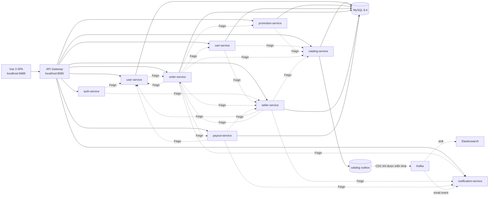
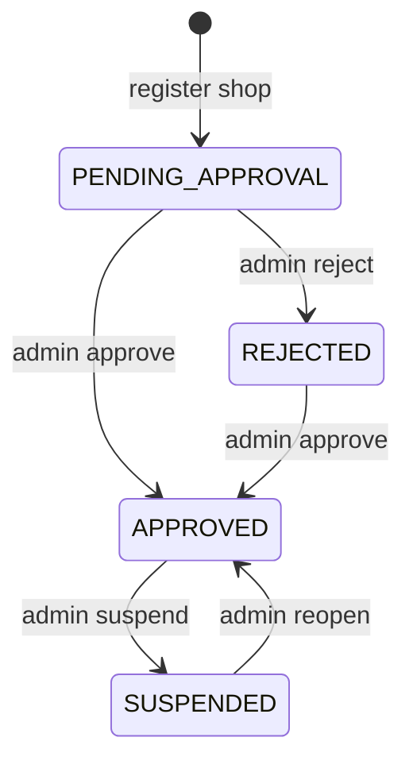
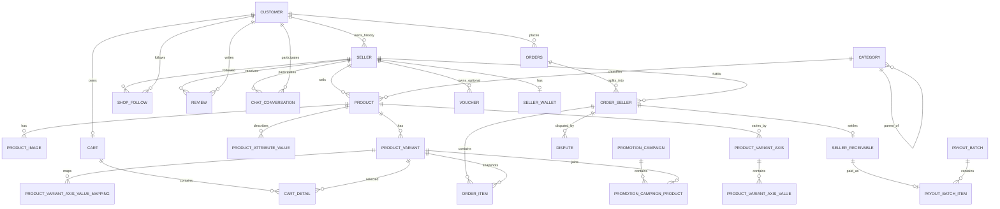
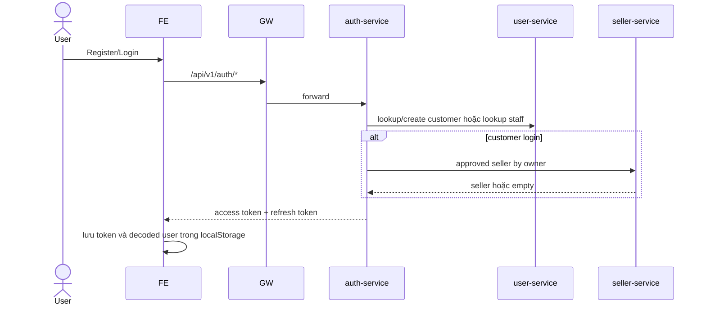
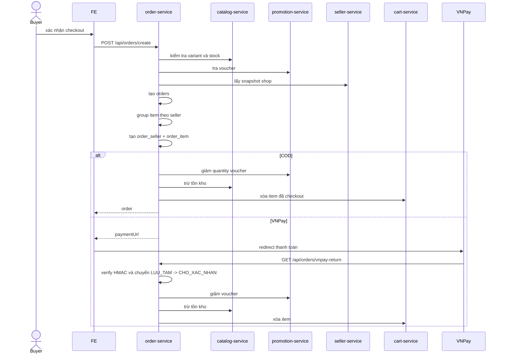
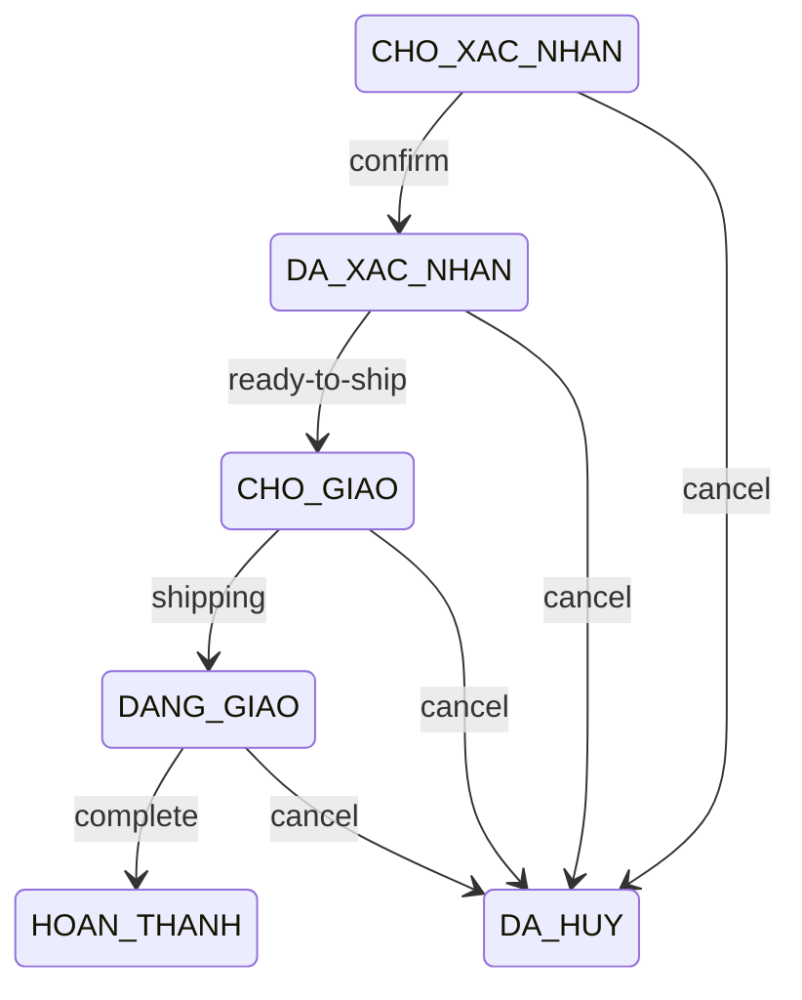
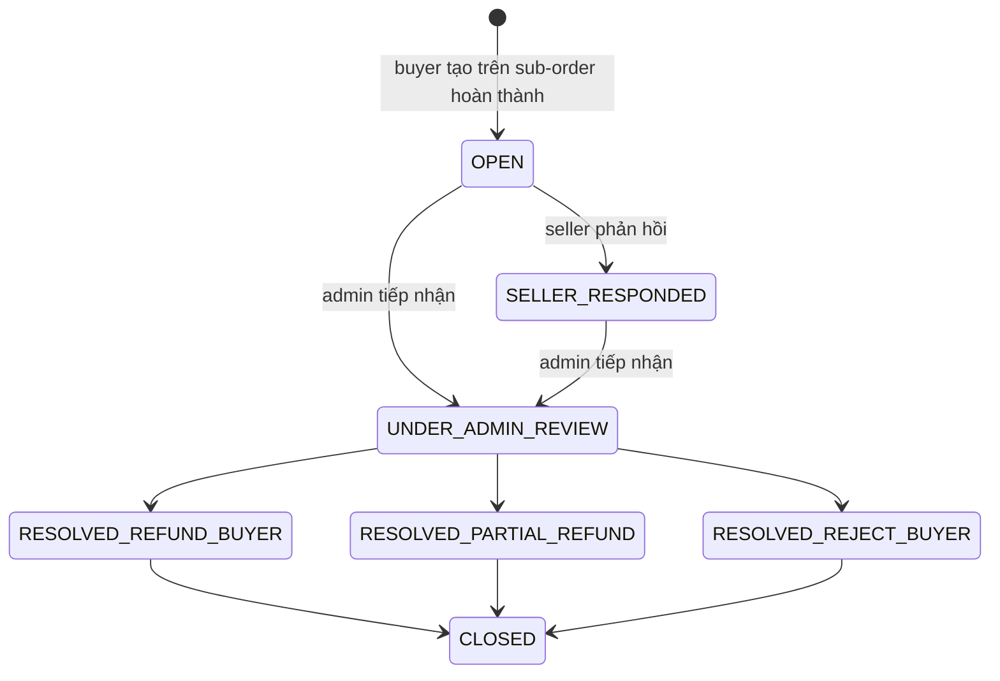

# HỆ THỐNG HIỆN TẠI – MARKETPLACE E-COMMERCE

> Tài liệu mô tả đúng trạng thái **as-is** của repository và môi trường local tại ngày **27/08/2026**. Nội dung được đối chiếu từ source FE, controller/service/entity backend, gateway, cấu hình chạy, SQL migration/seed và database Docker đang được các service sử dụng tại `localhost:3307`.
>
> Đây không phải tài liệu backlog hoặc thiết kế mong muốn. Các điểm chưa hoàn chỉnh được gom riêng tại mục **Giới hạn và rủi ro hiện tại**.

## 1. Kết luận nhanh

Hệ thống hiện tại là marketplace nhiều nhà bán với ba không gian sử dụng:

- **Buyer storefront**: xem sản phẩm/shop, giỏ hàng, checkout, đơn mua, review, follow, chat, khiếu nại và báo cáo.
- **Seller Center**: dashboard, sản phẩm/SKU, đơn theo shop, voucher, khuyến mại, Flash Sale, review, chat, tranh chấp và đối soát.
- **Platform Admin**: vận hành người dùng/nhân sự, seller, taxonomy/thuộc tính, campaign/Flash Sale/voucher sàn, banner, báo cáo, tranh chấp, thống kê và payout.

Kiến trúc backend là Spring Boot microservice qua Eureka và Spring Cloud Gateway. Mỗi domain có database MySQL riêng. Quan hệ giữa các service dùng ID chuỗi UUID và gọi REST/Feign; không có foreign key vật lý xuyên database.

Các đặc điểm marketplace đã có thật trong source:

- Một tài khoản buyer có thể đăng ký một hồ sơ shop đang hoạt động/chờ duyệt.
- Seller được gắn vào JWT sau khi shop ở trạng thái `APPROVED`.
- `sellerId` hiện đồng thời là định danh seller và shop trong toàn hệ thống.
- Sản phẩm thuộc seller, có category, ảnh, thuộc tính động, tối đa hai trục biến thể và nhiều SKU.
- Giỏ hàng và checkout nhận nhiều seller.
- Một lần checkout tạo một `orders`, sau đó tách thành nhiều `order_seller` và `order_item`.
- Mỗi seller xử lý sub-order của mình; khi hoàn thành sẽ tạo khoản phải trả và tính hoa hồng.
- Có voucher sàn/voucher shop, campaign thường, Flash Sale toàn sàn có quy trình seller đăng ký và admin duyệt.
- Có review sản phẩm/shop, follow shop, chat buyer–seller, dispute theo sub-order và report nội dung.

## 2. Kiến trúc tổng thể



### 2.1. Công nghệ chính

- Frontend: Vue 3, TypeScript, Vite 5, Vue Router, Pinia, Axios, Ant Design Vue.
- Backend: Java 17, Spring Boot 3.4.4, Spring Cloud 2024.0.1, Gradle multi-module.
- Service discovery: Netflix Eureka.
- Gateway: Spring Cloud Gateway WebFlux.
- Giao tiếp đồng bộ nội bộ: OpenFeign qua tên service Eureka.
- Database: MySQL 8.4, tách schema theo domain.
- Thanh toán: VNPay sandbox ở `order-service`.
- Vận chuyển: FE gọi trực tiếp GHN API.
- Messaging/search infrastructure: Kafka KRaft, Debezium/Kafka Connect và Elasticsearch.
- Quan sát hệ thống: Spring Actuator, Micrometer/Prometheus; Docker Compose có cấu hình Prometheus, Grafana, Filebeat, Logstash, Kibana, node-exporter và cAdvisor.

### 2.2. Service và cổng mặc định

| Thành phần | Cổng | Database | Trách nhiệm hiện tại |
|---|---:|---|---|
| `api-gateway` | 8080 | Không | Route public API, xác thực JWT theo prefix, inject marketplace context |
| `auth-service` | 8081 | `ecommerce_auth` nhưng hiện không có bảng nghiệp vụ | Login/register/change password, phát JWT; dữ liệu tài khoản lấy từ `user-service` |
| `user-service` | 8082 | `ecommerce_user` | Customer, staff, profile và internal auth lookup |
| `catalog-service` | 8083 | `ecommerce_catalog` | Category, product aggregate, SKU, stock, thuộc tính động, search public và outbox |
| `promotion-service` | 8085 | `ecommerce_promotion` | Voucher, campaign seller/admin và Flash Sale toàn sàn |
| `order-service` | 8086 | `ecommerce_order` | Checkout, VNPay, đơn buyer, sub-order seller, thống kê và dispute |
| `cart-service` | 8087 | `ecommerce_cart` | Giỏ hàng buyer và snapshot shop trên cart item |
| `notification-service` | 8088 | Không | Gửi email qua REST hoặc Kafka consumer |
| `seller-service` | 8089 | `ecommerce_seller` | Shop/seller, duyệt seller, banner, follow, review, chat và report |
| `payout-service` | 8091 | `ecommerce_payout` | Hoa hồng, receivable, ví seller, điều chỉnh tranh chấp và batch payout |
| `discovery-server` | 8761 | Không | Eureka registry |
| FE Vite | 6688 | Không | SPA cho Buyer, Seller và Admin |

Ghi chú cổng dữ liệu local:

- MySQL Docker: host `3307` → container `3306`.
- Kafka: `9092`.
- Elasticsearch: `9200`.
- Kafka Connect nếu chạy: `8084`.
- Kibana nếu chạy: `5601`.

## 3. Vai trò, JWT và phân quyền

### 3.1. Vai trò thực tế

| Vai trò | Claim | Ý nghĩa |
|---|---|---|
| Buyer | `USERS` | Customer đã đăng nhập |
| Seller | `USERS` + `SELLER` | Customer có shop `APPROVED` tại thời điểm token được phát |
| Platform Admin | `ADMIN` | Staff đăng nhập qua luồng admin |

Seller không có tài khoản đăng nhập riêng. Buyer và seller dùng cùng record `customer`; quyền seller được enrich động khi login.

### 3.2. Nội dung JWT

Access token tồn tại 2 giờ; refresh token được phát với hạn 7 ngày. Các claim chính:

- `email`, `userId`, `fullName`, `pictureUrl`.
- `role`: vai trò chính, buyer là `USERS`, admin là `ADMIN`.
- `roles`: danh sách vai trò; buyer có shop approved sẽ có `USERS`, `SELLER`.
- Khi là seller: `sellerId`, `sellerStatus`, `sellerSlug`, `shopName`.

`auth-service` không lưu user riêng. Nó gọi:

- `user-service` để lấy customer/staff và password hash.
- `seller-service /internal/sellers/approved/by-owner` để enrich seller role.

Nếu `seller-service` tạm lỗi, buyer vẫn login được nhưng token không có role `SELLER`.

### 3.3. Gateway authorization

Gateway áp quy tắc theo prefix:

- `/api/v1/admin/**` cần role `ADMIN`.
- `/api/v1/seller/**` cần role `SELLER` và claim `sellerId`.
- `/api/v1/buyer/**` cần role `USERS`.
- `OPTIONS` được bỏ qua để phục vụ CORS.

Sau khi xác thực, gateway inject:

- `X-User-Id` từ claim `userId`.
- `X-Seller-Id` từ claim `sellerId`.

FE cũng có route guard theo role và kiểm tra thời hạn token, nhưng gateway/backend mới là lớp cần quyết định quyền cuối cùng.

Hai ngoại lệ contract cần hiểu đúng:

- `/api/v1/sellers/register-shop` và `/api/v1/sellers/my-shop` không nằm dưới buyer prefix. `seller-service` tự parse và xác minh Bearer JWT để lấy customer ID.
- `/api/orders/**` là contract checkout legacy nằm ngoài `/api/v1/buyer/**`, vì vậy gateway hiện không bắt buộc JWT cho prefix này.

## 4. Mô hình seller và shop

Hệ thống chưa tách `seller` và `shop` thành hai aggregate. Record `seller` chính là hồ sơ nhà bán và hồ sơ shop.

- `seller.id` được dùng như `sellerId` và cũng là shop ID.
- `owner_customer_id` liên kết logic tới `ecommerce_user.customer.id`.
- JWT chỉ chứa một `sellerId`.
- Catalog, cart, order, voucher, review, chat và payout đều scope theo một `sellerId`.

Quy tắc đăng ký hiện tại:

- Một owner không được tạo hồ sơ mới nếu hồ sơ mới nhất khác `REJECTED` và `CLOSED`.
- `shop_name` và `seller_slug` unique trong DB.
- Đăng ký mới tạo trạng thái `PENDING_APPROVAL` và ghi `seller_status_history`.
- Owner có hồ sơ `REJECTED` hoặc `CLOSED` có thể tạo hồ sơ mới; DB không có unique constraint trên `owner_customer_id`, quy tắc nằm ở service.

Trạng thái seller:

```text
DRAFT
PENDING_APPROVAL
APPROVED
REJECTED
SUSPENDED
CLOSED
```

Transition được API hiện tại sử dụng:



`DRAFT` và `CLOSED` có trong enum nhưng chưa có API nghiệp vụ tạo/chuyển tương ứng. API `suspend` và `reopen` hiện cũng không giới hạn chặt trạng thái nguồn như sơ đồ lý tưởng.

## 5. Database hiện tại

### 5.1. Nguyên tắc dữ liệu

- Mỗi service sở hữu schema riêng.
- ID nghiệp vụ chủ yếu là UUID chuỗi 36 ký tự.
- Không có foreign key xuyên schema; ví dụ `product.seller_id`, `orders.customer_id`, `order_seller.seller_id` chỉ là logical reference.
- Foreign key vật lý chỉ tồn tại bên trong một số schema như catalog, cart, promotion và dispute message.
- Nhiều bảng legacy dùng `status` ordinal (`tinyint`) và timestamp epoch milliseconds (`bigint`). Các domain marketplace mới như seller, dispute, report và payout dùng status chuỗi cùng `datetime/Instant`.
- `catalog-service` dùng `ddl-auto=validate`; schema catalog phải được tạo/migrate trước.
- Các service JPA còn lại mặc định dùng `ddl-auto=update` trong local config.

### 5.2. Inventory schema và bảng

| Schema | Bảng hiện có | Ý nghĩa |
|---|---|---|
| `ecommerce_auth` | Không có bảng nghiệp vụ | Auth stateless, đọc user qua `user-service` |
| `ecommerce_user` | `customer`, `staff` | Tài khoản buyer/seller owner và nhân sự platform |
| `ecommerce_seller` | `seller`, `seller_status_history`, `shop_follow`, `danh_gia`, `chat_conversation`, `chat_message`, `platform_banner`, `report` | Shop, social/review/chat và moderation |
| `ecommerce_catalog` | `category`, `product`, `product_image`, `product_variant`, `product_variant_axis`, `product_variant_axis_value`, `product_variant_axis_value_mapping`, `product_attribute_definition`, `product_attribute_option`, `product_attribute_value`, `category_attribute_suggestion`, `product_attribute_moderation_audit`, `variant_axis_name_suggestion`, `outbox` | Product domain canonical và search outbox |
| `ecommerce_cart` | `cart`, `cart_detail` | Giỏ hàng buyer |
| `ecommerce_order` | `orders`, `order_seller`, `order_item`, `order_status_history`, `payment_history`, `dispute`, `dispute_message` | Đơn gốc, sub-order, thanh toán và tranh chấp |
| `ecommerce_promotion` | `voucher`, `voucher_customer`, `promotion_campaign`, `promotion_campaign_product` | Voucher, campaign, Flash Sale registration |
| `ecommerce_payout` | `commission_config`, `seller_wallet`, `seller_receivable`, `payout_adjustment`, `payout_batch`, `payout_batch_item` | Hoa hồng và vòng đời đối soát |

### 5.3. Các bảng cốt lõi

#### User

- `customer`: thông tin cá nhân, email, số điện thoại, địa chỉ, password BCrypt, trạng thái.
- `staff`: thông tin nhân sự, password BCrypt, `role`, `role_type`, trạng thái.

#### Seller

- `seller`: owner, tên/slug shop, mô tả, logo/cover, địa chỉ lấy hàng, liên hệ, định danh, ngân hàng, category chính, trạng thái duyệt.
- `seller_status_history`: from/to status, actor, role, lý do, thời điểm.
- `shop_follow`: unique theo `seller_id + customer_id`.
- `danh_gia`: review gắn customer, seller, product, product variant (`product_detail_id`) và `order_seller`.
- `chat_conversation`: một conversation theo buyer/shop, lưu snapshot tên, unread count và last message.
- `chat_message`: sender `BUYER`/`SELLER`, nội dung, read time.
- `platform_banner`: banner theo position, sort order, thời gian hiệu lực.
- `report`: reporter, target `PRODUCT/SHOP/REVIEW/USER`, reason, evidence, action và resolution.

#### Catalog

- `category`: cây category self-reference qua `parent_id`.
- `product`: thuộc một seller và một leaf category, có rating aggregate.
- `product_image`: danh sách ảnh theo display order.
- `product_variant`: SKU, `combination_key`, giá bán, tồn kho, ảnh và default flag.
- `product_variant_axis` và `product_variant_axis_value`: tối đa hai trục như màu/size/dung tích.
- `product_variant_axis_value_mapping`: ánh xạ SKU với giá trị từng trục.
- `product_attribute_definition`: định nghĩa thuộc tính động `TEXT/NUMBER/SELECT_ONE/SELECT_MULTI`, trạng thái verify/merge.
- `product_attribute_option`: option chuẩn hoặc seller tạo, có verify/merge.
- `product_attribute_value`: giá trị mô tả/filter của sản phẩm.
- `category_attribute_suggestion`: gợi ý thuộc tính theo category, có `required_value` và `filterable`.
- `product_attribute_moderation_audit`: audit chuẩn hóa/merge/hide thuộc tính.
- `variant_axis_name_suggestion`: danh mục tên trục biến thể được gợi ý/kiểm duyệt.
- `outbox`: event search `ProductCreated`, `ProductUpdated`, `ProductDeleted`.

#### Cart và order

- `cart`: một giỏ theo `customer_id`.
- `cart_detail`: variant, quantity, price và snapshot `seller_id/shop_name/seller_slug`.
- `orders`: đơn gốc của buyer, thông tin nhận hàng, tổng tiền, voucher, payment method và root status.
- `order_seller`: sub-order của từng shop, snapshot shop, tổng/ship/discount và status riêng.
- `order_item`: variant, quantity, sale price, seller và sub-order.
- `order_status_history`: lịch sử status cấp đơn gốc.
- `payment_history`: số tiền, transaction code/type và order.
- `dispute`: khiếu nại gắn trực tiếp `order_seller`.
- `dispute_message`: trao đổi buyer/seller/admin trong tranh chấp.

#### Promotion và payout

- `voucher.seller_id = null`: voucher sàn do admin quản lý.
- `voucher.seller_id = sellerId`: voucher shop do seller quản lý.
- `voucher_customer`: voucher chỉ định customer.
- `promotion_campaign`: campaign thường hoặc `FLASH_SALE`; campaign seller có `seller_id`, Flash Sale toàn sàn có `seller_id = null`.
- `promotion_campaign_product`: variant tham gia campaign; với Flash Sale có trạng thái đăng ký và audit duyệt.
- `commission_config`: hoa hồng mặc định (`category_id = null`) hoặc theo category.
- `seller_receivable`: khoản phải trả duy nhất theo `order_seller_id`.
- `seller_wallet`: `pending_amount`, `available_amount`, `paid_amount` theo seller.
- `payout_batch`/`payout_batch_item`: một đợt chi trả nhiều receivable.
- `payout_adjustment`: điều chỉnh âm do quyết định hoàn tiền tranh chấp.

### 5.4. Quan hệ dữ liệu logic



Mermaid trên là logical ERD. Chỉ các quan hệ nội bộ cùng schema mới có thể là FK vật lý; các đường xuyên service dựa trên UUID và API contract.

## 6. Luồng nghiệp vụ hiện tại

### 6.1. Đăng ký và đăng nhập



- Register tạo `customer` với password BCrypt và status active.
- Login buyer chỉ tìm customer active.
- Login admin chỉ tìm staff active.
- Buyer có seller approved nhận thêm role và seller context.
- FE có hai màn login: `/login` và `/admin/login`.

### 6.2. Đăng ký và duyệt shop

1. Buyer đã đăng nhập vào `/dang-ky-ban-hang`.
2. FE gửi hồ sơ shop: tên, slug, mô tả, ảnh, địa chỉ lấy hàng, liên hệ, định danh, ngân hàng và category chính.
3. `seller-service` lấy owner từ Bearer JWT, kiểm tra hồ sơ mới nhất và unique name/slug.
4. Tạo `seller=PENDING_APPROVAL` và một dòng history.
5. Admin xem `/admin/seller-approval`, approve hoặc reject.
6. Khi approve, seller thành `APPROVED`; lần login buyer tiếp theo token mới có role `SELLER`.
7. Email thông báo được gọi best-effort; lỗi notification không rollback quyết định seller.

### 6.3. Seller tạo sản phẩm

1. Gateway xác thực role `SELLER`, inject `X-Seller-Id`.
2. Seller chọn leaf category.
3. FE lấy cây category, gợi ý thuộc tính và gợi ý tên trục biến thể.
4. Seller gửi một product aggregate gồm basic info, ảnh, attributes, variant axes và variants.
5. Catalog validate category leaf, display order, loại giá trị, tối đa hai axes, SKU/combination.
6. Trong transaction MySQL, service lưu product aggregate và ghi outbox event.
7. Seller chỉ list/detail/update/change status sản phẩm có `seller_id` đúng context.

Thuộc tính mô tả và trục biến thể là hai khái niệm khác nhau:

- Thuộc tính mô tả dùng cho thông số/filter, không sinh SKU.
- Trục biến thể tạo tổ hợp SKU, giá, tồn kho và lựa chọn mua.

### 6.4. Tìm kiếm và xem sản phẩm

- Public product list/detail chỉ trả product `ACTIVE`.
- Filter hiện có: keyword, seller, category, giá, attribute filters và sort.
- Product detail trả category, ảnh, thuộc tính, axes và variants.
- Shop public chỉ trả seller `APPROVED`, rating/follower và sold count lấy từ order completed.
- Giá/discount campaign được quản lý trong promotion service; public product read path hiện không tự ghép giá khuyến mại từ Elasticsearch.

Read path hiện tại của `GET /api/v1/permitall/products` là MySQL/JPA rồi filter/sort trong `catalog-service`; API này chưa truy vấn Elasticsearch.

### 6.5. Giỏ hàng

Buyer đăng nhập:

1. Gateway lấy `X-User-Id` từ JWT.
2. `cart-service` tìm hoặc tạo `cart` theo customer.
3. Khi thêm variant, service gọi catalog lấy giá/tồn kho/seller.
4. Service snapshot seller/shop vào `cart_detail`.
5. Response gồm `items` và `shopGroups` theo seller.

Guest storefront:

- FE lưu giỏ tạm trong localStorage.
- Route `/gio-hang` public ở FE, nhưng API `/api/v1/buyer/cart/**` chỉ dùng cho buyer có token.
- Checkout FE hiện yêu cầu buyer route, dù backend `/api/orders/**` vẫn chấp nhận contract customer/guest từ request.

### 6.6. Checkout multi-seller và VNPay



Cấu trúc kết quả:

```text
orders (1 checkout của buyer)
└── order_seller (1 cho mỗi seller)
    └── order_item (variant thuộc seller đó)
```

Status enum order lưu theo ordinal:

| Ordinal | Status |
|---:|---|
| 0 | `CHO_XAC_NHAN` |
| 1 | `DA_XAC_NHAN` |
| 2 | `CHO_GIAO` |
| 3 | `DANG_GIAO` |
| 4 | `HOAN_THANH` |
| 5 | `DA_HUY` |
| 6 | `LUU_TAM` |

Buyer chỉ được hủy khi root order và toàn bộ sub-order còn `CHO_XAC_NHAN`. Luồng hủy hoàn lại stock, tăng lại quantity voucher, chuyển root/sub-order sang `DA_HUY` và ghi history.

### 6.7. Seller xử lý đơn và tạo payout

Seller workflow được enforce theo `order_seller`:



Khi một sub-order chuyển `HOAN_THANH`:

1. Order service tính gross từ item total trừ discount sub-order.
2. Item được phân bổ theo category để payout service tính rate từng dòng.
3. Payout service áp commission config theo category; không có config thì dùng rate default, mặc định code là 5%.
4. Tạo `seller_receivable=PENDING` và cộng net vào `seller_wallet.pending_amount`.
5. Sau hold period mặc định 7 ngày, scheduler chuyển khoản đủ điều kiện sang `AVAILABLE` và dời tiền từ pending sang available.
6. Admin tạo payout batch; receivable thành `PAID`, ví giảm available và tăng paid.
7. Email thanh toán cho seller được gửi best-effort.

### 6.8. Voucher, promotion và Flash Sale

Voucher:

- Admin quản lý voucher sàn (`seller_id=null`).
- Seller quản lý voucher shop của chính mình (`seller_id=sellerId`).
- Voucher hỗ trợ quantity, thời gian, điều kiện đơn, mức giảm, trần giảm và danh sách customer được chỉ định.

Campaign thường:

- Admin có campaign sàn.
- Seller có promotion scope shop và chỉ được chọn variant thuộc seller hiện tại.
- `promotion_campaign_product` lưu giá trước/sau giảm.

Flash Sale toàn sàn:

1. Admin tạo campaign với cửa sổ đăng ký và thời gian chạy.
2. Seller xem campaign còn hiệu lực và variant active của shop.
3. Seller đăng ký variant với giá flash thấp hơn giá đang bán.
4. Registration ở `PENDING`.
5. Admin `APPROVE` hoặc `REJECT`; khi approve service kiểm tra lại ownership và giá.
6. Seller có thể withdraw; registration approved không được rút sau khi Flash Sale bắt đầu.
7. Public API chỉ đưa sản phẩm approved/đang sử dụng vào campaign response.

Registration status: `PENDING`, `APPROVED`, `REJECTED`, `WITHDRAWN`.

Campaign time status: `CHUA_KICH_HOAT`, `DANG_KICH_HOAT`, `HET_HAN_KICH_HOAT`.

### 6.9. Follow, review và chat

Follow:

- Buyer có thể kiểm tra trạng thái, follow và unfollow shop approved.
- Unique theo customer/shop.

Review:

- Chỉ được review variant đã mua trong sub-order `HOAN_THANH`.
- Một customer chỉ review một variant trong một sub-order một lần.
- Lưu cả `product_rating` và `shop_rating`.
- Seller có thể reply review của shop mình.
- Public có thể lấy review theo product hoặc seller.

Chat:

- Một conversation cho mỗi cặp customer/seller.
- Buyer chỉ chat với shop approved.
- Buyer và seller đều có list conversation, list/send message và mark read.
- Chat hiện là REST polling/state trong DB; không có WebSocket controller ở backend hiện tại dù FE có dependency STOMP/SockJS.

### 6.10. Dispute và report

Dispute gắn với `order_seller`, không gắn trực tiếp toàn bộ root order.



Nếu quyết định hoàn toàn phần/một phần, order service gọi payout service tạo `payout_adjustment`:

- Receivable `PENDING`: giảm gross/net và pending wallet.
- Receivable `AVAILABLE`: giảm available/released tương ứng.
- Receivable `PAID`: ghi âm vào pending để bù bằng receivable tương lai.

Report là luồng moderation riêng cho target `PRODUCT`, `SHOP`, `REVIEW`, `USER`. Admin có thể review rồi resolve bằng action `PRODUCT_DELISTED`, `SHOP_SUSPENDED`, `REVIEW_HIDDEN`, `WARNING_SENT` hoặc `NO_ACTION`.

## 7. API contract hiện tại

Tất cả public traffic thông thường đi qua `http://localhost:8080`.

### 7.1. Auth và user

- `POST /api/v1/auth/login`
- `POST /api/v1/auth/login-admin`
- `PUT /api/v1/auth/register`
- `POST /api/v1/auth/change-password`
- Admin customer: `/api/v1/admin/khach-hang/**`
- Admin staff: `/api/v1/admin/nhan-vien/**`
- Profile legacy/public: `/api/v1/permitall/profile/**`

### 7.2. Catalog

Public:

- `GET /api/v1/permitall/products`
- `GET /api/v1/permitall/products/{id}`
- `GET /api/v1/permitall/categories/tree`
- `GET /api/v1/permitall/categories/{categoryId}/attribute-suggestions`

Seller:

- `GET /api/v1/seller/products`
- `GET /api/v1/seller/products/{id}`
- `POST /api/v1/seller/products`
- `PUT /api/v1/seller/products/{id}`
- `PUT /api/v1/seller/products/{id}/status`
- Category/suggestion/low-stock endpoints nằm dưới cùng prefix.

Admin:

- Category: `/api/v1/admin/categories/**`
- Product attributes/options/audit/reindex: `/api/v1/admin/product-attributes/**`
- Variant axis insights/suggestions: `/api/v1/admin/product-variant-axes/**`

### 7.3. Seller/shop domain

- Shop registration/profile owner: `/api/v1/sellers/**`
- Public shop: `/api/v1/permitall/shops/**`
- Buyer follow: `/api/v1/buyer/shops/{sellerId}/follow`
- Admin seller approval: `/api/v1/admin/sellers/**`
- Seller profile: `GET /api/v1/seller/profile`
- Banner public/admin: `/api/v1/permitall/banners`, `/api/v1/admin/banners/**`
- Review: `/api/v1/buyer/reviews/**`, `/api/v1/seller/reviews/**`, `/api/v1/permitall/reviews`
- Chat: `/api/v1/buyer/chat/**`, `/api/v1/seller/chat/**`
- Report: `/api/v1/buyer/reports`, `/api/v1/seller/reports`, `/api/v1/admin/reports/**`

### 7.4. Cart, order và dispute

- Buyer cart: `/api/v1/buyer/cart/**`
- Checkout/VNPay/voucher lookup legacy: `/api/orders/**`
- Buyer order: `/api/v1/buyer/orders/**`
- Seller order/dashboard/status: `/api/v1/seller/orders/**`
- Admin statistics: `/api/v1/admin/thong-ke/**`
- Buyer dispute: `/api/v1/buyer/disputes/**`
- Seller dispute: `/api/v1/seller/disputes/**`
- Admin dispute: `/api/v1/admin/disputes/**`

### 7.5. Promotion, payout và notification

- Admin voucher: `/api/v1/admin/voucher/**`
- Seller voucher: `/api/v1/seller/vouchers/**`
- Admin standard campaign: `/api/v1/admin/campaigns/**`
- Seller promotion: `/api/v1/seller/promotions/**`
- Admin Flash Sale: `/api/v1/admin/flash-sales/**`
- Seller Flash Sale: `/api/v1/seller/flash-sales/**`
- Public Flash Sale: `/api/v1/permitall/flash-sales/**`
- Admin payout: `/api/v1/admin/payout/**`
- Seller payout: `/api/v1/seller/payout/**`
- Email REST: `POST /api/v1/notifications/email`

### 7.6. Internal service API

Các prefix internal không nằm trong danh sách route tĩnh công khai của gateway:

- `/internal/users/**`
- `/internal/sellers/**`
- `/internal/catalog/**`
- `/internal/promotions/**`
- `/internal/carts/**`
- `/internal/orders/**`
- `/internal/payout/**`

Chúng phục vụ Feign giữa service và hiện dựa vào network boundary, chưa có service-to-service authentication riêng. Đồng thời gateway đang bật discovery locator; nếu không chặn route động theo service ID ở môi trường triển khai, internal path vẫn có khả năng bị truy cập qua dạng `/{service-id}/internal/**`.

## 8. Frontend hiện tại

### 8.1. Buyer routes

Public:

- `/trang-chu`
- `/san-pham`
- `/san-pham-chi-tiet/:idsp`
- `/shop/:sellerSlug`
- `/flash-sale`
- `/gio-hang`
- `/thanh-toan-thanh-cong`
- `/lien-he`, `/gioi-thieu`
- `/login`, `/register`

Yêu cầu role `USERS`:

- `/dang-ky-ban-hang`
- `/don-mua`
- `/don-mua-detail/:maHoaDon/:id`
- `/khieu-nai`
- `/tin-nhan`
- `/tra-cuu`
- `/thanh-toan`
- `/thong-tin-ca-nhan`

### 8.2. Seller routes

Tất cả yêu cầu role `SELLER`:

- `/seller/dashboard`
- `/seller/orders`
- `/seller/products`
- `/seller/vouchers`
- `/seller/flash-sales`
- `/seller/payout`
- `/seller/reviews`
- `/seller/profile`
- `/seller/disputes`
- `/seller/chat`

### 8.3. Admin routes

Tất cả yêu cầu role `ADMIN`:

- `/admin/thong-ke`
- `/admin/seller-approval`
- `/admin/categories`
- `/admin/product-attributes`
- `/admin/campaigns`, `/admin/campaigns/new`, `/admin/campaigns/:id/edit`
- `/admin/flash-sales`
- `/admin/voucher`
- `/admin/banners`
- `/admin/payout`
- `/admin/reports`
- `/admin/disputes`
- `/admin/khach-hang`, `/admin/them-khach-hang`
- `/admin/nhan-vien`, `/admin/them-nhan-vien`
- `/admin/login`

FE dùng `VITE_BASE_URL_SERVER=http://localhost:8080`, lưu access token/refresh token/user info trong localStorage và gắn Bearer token qua Axios interceptor.

## 9. Search, Kafka và observability

### 9.1. Product outbox pipeline

Catalog ghi event vào `ecommerce_catalog.outbox` trong cùng transaction với thay đổi product/stock:

```text
catalog transaction
  -> outbox
  -> MySQL ROW binlog
  -> Debezium Outbox Event Router
  -> Kafka topic outbox.event.Product
  -> Elasticsearch sink
  -> products alias / products_v2
```

Payload canonical chứa product/category, attributes nested và variants nested. `ProductDeleted` dùng payload null/tombstone để xóa document.

Trạng thái runtime tại thời điểm kiểm tra:

- Elasticsearch `9200` đang UP.
- Alias `products` đang trỏ `products_v2`; index có 4 document.
- Kafka `9092` đang UP.
- Kafka Connect REST `8084` đang DOWN, nên CDC/sink không chạy liên tục tại snapshot này.
- Public catalog API vẫn đọc MySQL, không phụ thuộc Elasticsearch.

### 9.2. Email

`notification-service` hỗ trợ:

- REST `POST /api/v1/notifications/email`.
- Kafka consumer topic mặc định `email-notification`.

Các luồng seller/order/payout trong source hiện gọi notification đồng bộ bằng Feign REST và đều bắt lỗi để email không rollback transaction nghiệp vụ.

### 9.3. Metrics và logs

- Tất cả Spring service expose `/actuator/health`, `/actuator/info`, `/actuator/prometheus`, `/actuator/metrics`.
- Docker Compose có Prometheus, Grafana, Filebeat, Logstash, Kibana, node-exporter và cAdvisor, nhưng không phải tất cả container đều đang chạy ở snapshot hiện tại.

## 10. Trạng thái runtime đã kiểm tra ngày 27/08/2026

Các kiểm tra read-only đã xác nhận:

- FE `http://127.0.0.1:6688` trả HTTP 200.
- Gateway `8080`, Eureka `8761` và toàn bộ service `8081/8082/8083/8085/8086/8087/8088/8089/8091` đều báo actuator `UP`.
- Eureka có đủ 10 application backend: gateway, auth, user, catalog, promotion, cart, order, notification, seller, payout.
- Public API products, category tree, shops, banners và Flash Sale đều trả HTTP 200 qua gateway.
- Các process đang chạy dùng datasource `localhost:3307`, tức MySQL Docker.
- MySQL Docker có đủ 8 schema marketplace; `ecommerce_auth` không có bảng nghiệp vụ.

Snapshot dữ liệu demo đã quan sát, chỉ để xác nhận liên kết luồng chứ không phải invariant:

- 3 customer, 2 staff, 3 seller.
- 8 category, 4 product, 12 variant.
- 2 cart, 3 cart item.
- 5 root order, 7 sub-order, 7 order item.
- 4 dispute.
- 4 voucher, 4 promotion campaign.
- 2 seller wallet, 5 receivable.

## 11. Giới hạn và rủi ro hiện tại

Đây là các giới hạn được xác minh trực tiếp từ source/config hiện tại.

### 11.1. Checkout chưa phải server-authoritative hoàn toàn

- FE gửi `tongTien`, `phiShip`, `giamGia`, `tongCong`; backend kiểm tra không âm nhưng chưa tự tính lại toàn bộ từ catalog/promotion/shipping.
- Backend lấy giá variant từ catalog khi ghi `order_item`, nhưng tổng root order vẫn lấy từ request.
- Khi tạo mới, mỗi `order_seller` hiện ghi `shipping_fee=0`, `discount_amount=0`, `total_after_discount=item total`; chưa phân bổ phí ship/voucher root xuống shop.
- Checkout chỉ nhận một mã voucher và chưa xác minh voucher shop có cùng seller với item/sub-order tương ứng.
- `/api/orders/**` chưa nằm trong buyer authorization prefix; customer ID cũng được nhận từ body request.
- `POST /api/v1/notifications/email` được gateway route nhưng không thuộc prefix role-protected, nên hiện có thể bị gọi công khai qua gateway.
- GHN token, shop ID và địa chỉ gửi đang hard-code trong FE; phí ship có fallback cố định 30.000đ.

### 11.2. Không có distributed transaction/saga cho checkout

MySQL transaction của `order-service` không bao phủ catalog, promotion và cart. Các thao tác trừ stock, giảm voucher, xóa cart là REST call sang service khác; lỗi giữa chừng có thể tạo partial state. Chưa có idempotency key, reservation, saga/compensation hoặc order event outbox cho luồng này.

### 11.3. Root order và sub-order có thể lệch trạng thái

Seller workflow chỉ update `order_seller.order_status`. Chưa có hàm aggregate trạng thái các sub-order để cập nhật lại `orders.order_status`; buyer có thể nhìn root status không phản ánh đầy đủ từng shop.

### 11.4. Refresh token contract chưa hoàn chỉnh

Auth phát refresh token và FE gọi `POST /api/v1/auth/refresh` khi gặp 401, nhưng `AuthController` hiện không có endpoint refresh. Khi access token hết hạn, refresh tự động sẽ thất bại rồi FE logout.

### 11.5. Review–catalog internal contract đang lệch

`seller-service` gọi:

- `GET /internal/catalog/product-details/{id}`
- `POST /internal/catalog/products/{id}/rating`

Trong `InternalCatalogController` hiện không có hai endpoint này. Vì vậy create/hide review có thể fail khi cần đọc variant hoặc đồng bộ rating product, dù các review seed/public list vẫn đọc được từ seller DB.

### 11.6. Security phụ thuộc mạnh vào gateway/network boundary

- Các downstream service phần lớn cấu hình `anyRequest().permitAll()`.
- Admin/seller/buyer context ở nhiều controller được tin từ header gateway.
- Khi gọi thẳng cổng service local, có thể bỏ qua gateway role filter hoặc giả header nếu mạng không cô lập.
- Internal API chưa có mTLS, signed service token hoặc API key.
- Gateway đang bật discovery locator, vì vậy cần khóa route động để không vô tình expose internal API qua service ID.
- Secret mặc định JWT, MySQL, VNPay và credential GHN đang xuất hiện trong config/source local; không phù hợp production.

Production phải chỉ expose gateway, cô lập service port và chuyển mọi secret sang secret manager/environment.

### 11.7. Seller suspension không revoke token ngay lập tức

Gateway tin role và `sellerId` trong JWT, không lookup seller status trên mỗi request. Token seller đã phát có thể còn dùng tới khi hết hạn 2 giờ. Chưa có blacklist/revocation hoặc live seller-status check.

### 11.8. Search pipeline chưa là read path chính

Outbox/Elasticsearch đã có schema, index và script deploy, nhưng Kafka Connect không chạy tại snapshot và public search vẫn scan/filter product active từ MySQL trong application memory. Với dữ liệu lớn, cách này chưa phù hợp production.

### 11.9. Một số contract/UX còn mang dấu vết legacy

- Xóa cart item dùng `PUT /api/v1/buyer/cart/{id}` thay vì `DELETE`.
- Checkout dùng prefix `/api/orders` và nhiều field request tên cũ song song (`product/sanPham`, `Customer/KhachHang`).
- Profile user vẫn nằm dưới `/permitall/profile` và nhận ID trên URL.
- `ecommerce_auth` được cấu hình datasource nhưng auth thực tế stateless và không có entity riêng.
- Chat dùng REST, chưa realtime WebSocket.
- Seller profile hiện chỉ có API GET, chưa có API update hồ sơ shop.
- Route OAuth2 được gateway/FE khai báo, nhưng source chưa có success handler/controller hoàn thiện cho luồng redirect hiện tại.
- FE `.env.stage` đang đặt backend URL về cổng `6688`, cần rà lại trước khi build stage.

## 12. Cách chạy và quản lý dữ liệu local

Chạy stack khuyến nghị với MySQL Docker:

```powershell
powershell -ExecutionPolicy Bypass -File backend-microservice\run-all.ps1 -DbPort 3307 -WithNotification
```

Dừng backend:

```powershell
powershell -ExecutionPolicy Bypass -File backend-microservice\stop-all.ps1
```

Chạy FE:

```powershell
cd FE
npm run dev -- --host 127.0.0.1 --port 6688
```

Script sau **DROP và tạo lại toàn bộ 8 database, mất dữ liệu không thể hoàn tác**:

```powershell
powershell -ExecutionPolicy Bypass -File backend-microservice\reset-and-run-demo.ps1
```

Catalog là ngoại lệ migration quan trọng:

- `catalog-service` chạy `ddl-auto=validate`.
- Schema canonical được dựng từ `p1_product_domain_reset.sql` trong quy trình reset demo.
- Seed catalog canonical dùng `p1_product_domain_seed.sql`.
- Các script audit/preflight/verify nằm trong `catalog-service/src/main/resources/db/migration/manual`.

## 13. Nguồn sự thật khi cập nhật tài liệu này

Khi source thay đổi, cập nhật tài liệu theo thứ tự ưu tiên:

1. Gateway route và authorization filter.
2. Controller mapping và service implementation đang compile.
3. Entity/repository cùng schema live `information_schema`.
4. FE router, API client và màn hình đang được route tới.
5. Script `run-all.ps1`, Docker Compose và application config.
6. Runtime actuator/public smoke test.
7. SQL migration/seed để giải thích dữ liệu demo, không dùng seed thay cho contract source.

Không dùng folder/build artifact cũ, log cũ hoặc tài liệu progress làm nguồn duy nhất nếu chúng mâu thuẫn với source/runtime hiện tại.
