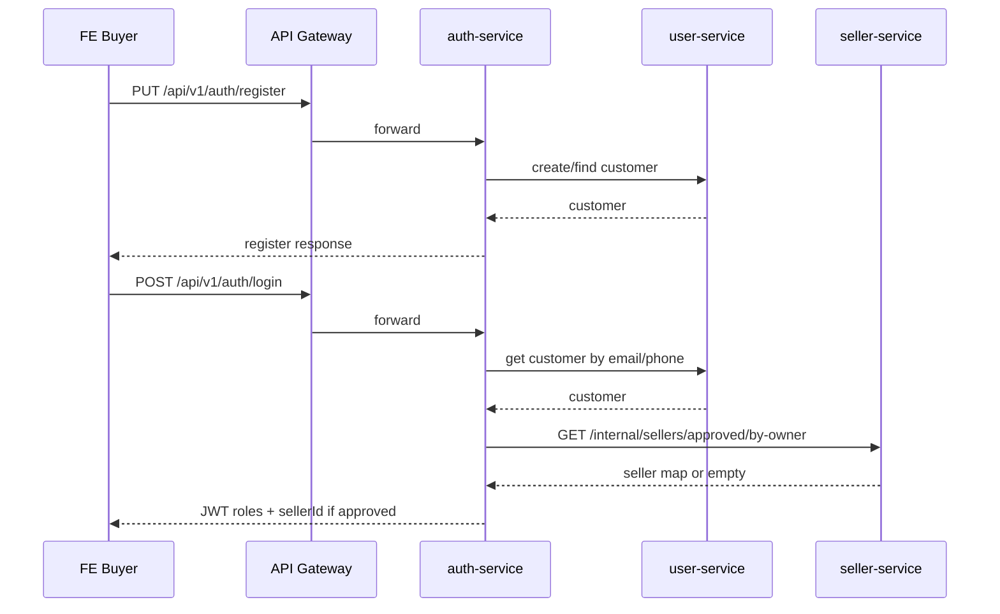
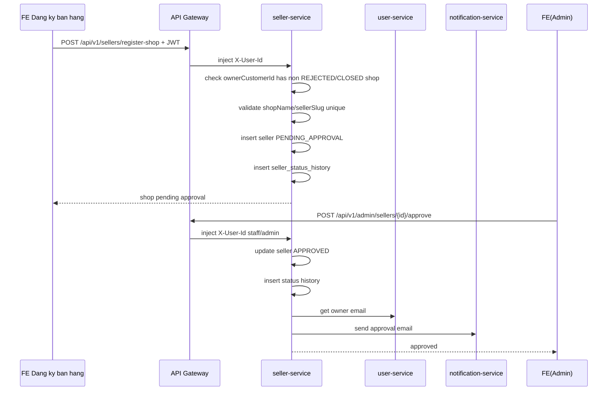
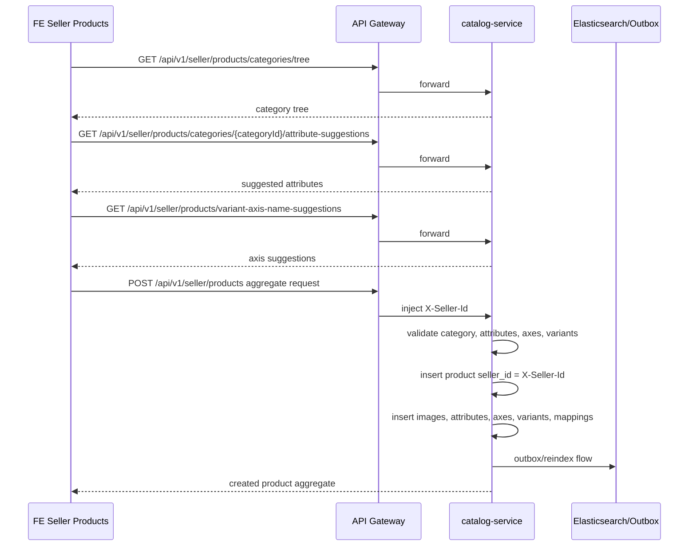
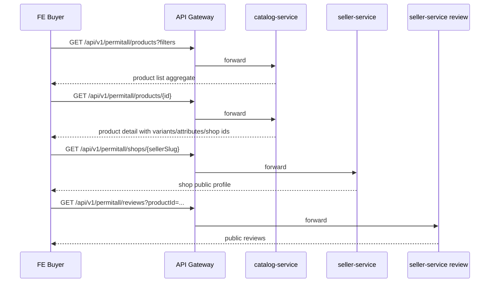
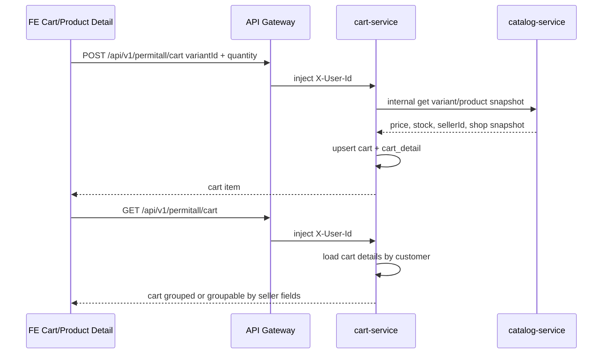
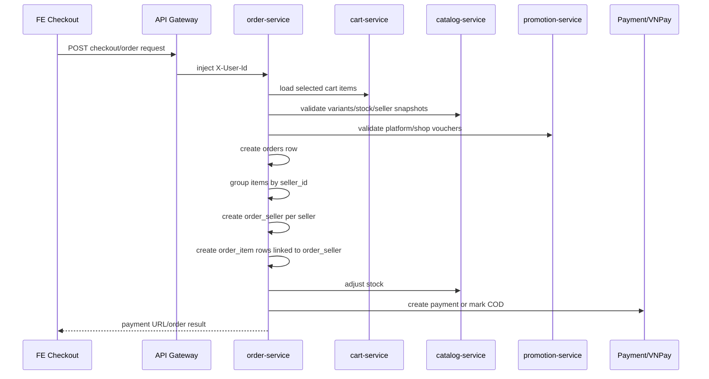
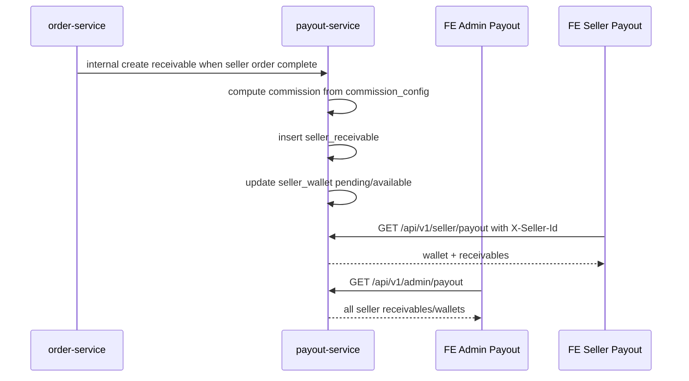
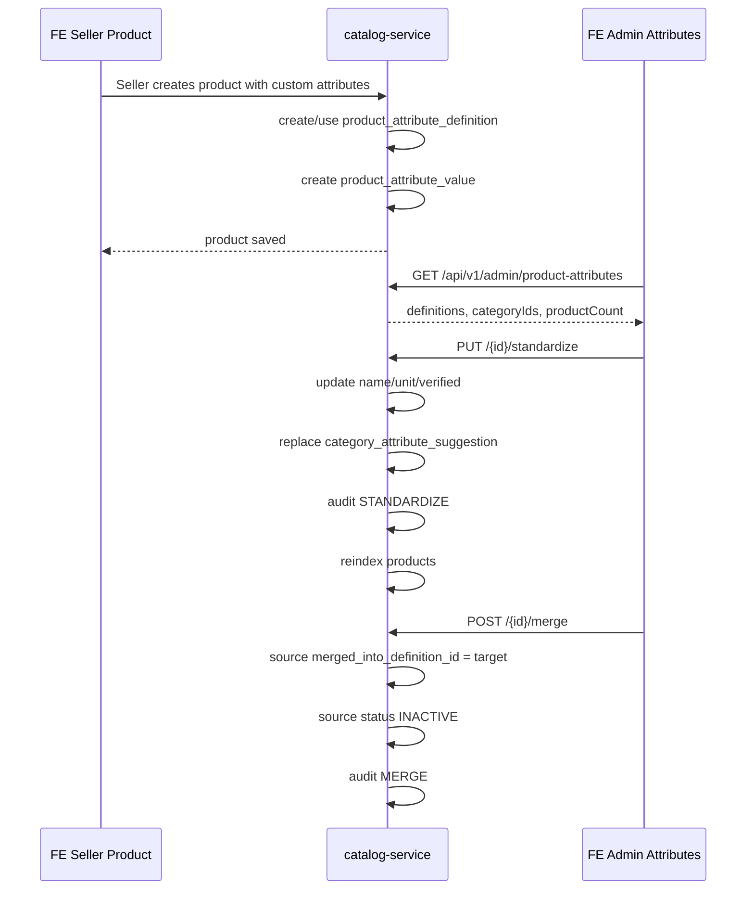
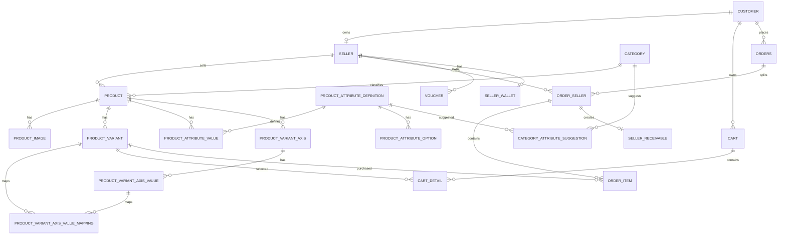

# HE THONG HIEN TAI - MARKETPLACE E-COMMERCE

Tai lieu nay mo ta hien trang source tai thoi diem 2026-08-24 de lam nen cho viec thiet ke lai admin, seller center, buyer storefront va cac luong xu ly con thieu. Noi dung duoc doi chieu tu `docs/PROGRESS.md`, prompt marketplace, route FE, sidebar FE, controller/backend service va gateway route hien co. Cap nhat bo sung 2026-08-25: module Chat buyer-seller da duoc trien khai va runtime acceptance.

## 1. Ket luan nhanh

He thong hien tai da khong con la website ban giay 1 cua hang don thuan. Source da duoc mo rong thanh marketplace theo huong:

- Buyer mua hang tren storefront chung.
- Buyer co the dang ky thanh seller.
- Seller sau khi duoc duyet co "Kenh nguoi ban" rieng.
- Platform Admin quan tri san, duyet seller, banner, doi soat, thong ke, voucher san, thuoc tinh san pham.
- Don hang da co cau truc cha/con theo seller: order goc va `order_seller` cho tung shop.
- Gio hang va checkout da huong toi multi-seller.
- San pham da co `sellerId`, shop public, follow shop, review product/shop.
- Thuoc tinh san pham dong va truc bien the da co backend/UI admin, nhung van dang trong giai doan hoan thien.

Tuy nhien source van con nhieu dau vet cua he thong cu:

- Admin sidebar con hien/khai bao cac man "Quan ly khach hang", "Quan ly nhan vien", "Quan ly phieu giam gia", "Danh muc chung" nhung mot phan con mang tu duy cua hang/POS.
- FE van con folder cu: `admin/banhang`, `admin/hoadon`, `admin/sanpham`, `admin/sanphamchitiet`, `admin/mausac`, `admin/size`, `admin/chatlieu`, `admin/loaide`, `admin/thuonghieu`.
- Gateway van route ca `/api/v1/admin/ban-hang/**`, `/api/v1/admin/hoa-don/**`, `/api/v1/admin/san-pham/**`, `/api/v1/admin/san-pham-chi-tiet/**` du cac man nay khong con phu hop lam nghiep vu ban le cua platform admin.
- Source route FE co nhieu route admin cu khong gan `requiresRole` hoac da redirect ve man moi.
- Model seller/shop hien tai la 1 owner/customer co toi da 1 shop active/pending, chua co mo hinh 1 seller quan ly nhieu shop.
- Live DB theo ghi chu tien do van co phan schema legacy/half-migrated trong catalog, nen source moi va DB runtime co the chua dong bo tuy moi truong.

## 2. Mo hinh vai tro hien tai

### 2.1. Buyer

Buyer la nguoi mua hang tren storefront public. Buyer co the:

- Dang ky/dang nhap.
- Xem trang chu.
- Tim kiem/xem danh sach san pham.
- Xem chi tiet san pham.
- Xem trang shop rieng.
- Follow/unfollow shop.
- Them gio hang.
- Checkout.
- Xem lich su don mua.
- Danh gia san pham/shop sau khi mua.
- Chat truc tiep voi shop va theo doi tin chua doc.
- Dang ky ban hang de tro thanh seller.

Route FE chinh:

- `/trang-chu`
- `/san-pham`
- `/san-pham-chi-tiet/:idsp`
- `/shop/:sellerSlug`
- `/gio-hang`
- `/thanh-toan`
- `/thanh-toan-thanh-cong`
- `/don-mua`
- `/don-mua-detail/:maHoaDon/:id`
- `/thong-tin-ca-nhan`
- `/tin-nhan`
- `/dang-ky-ban-hang`
- `/login`
- `/register`

### 2.2. Seller

Seller la buyer da co shop duoc duyet. Hien tai he thong coi seller/shop gan chat voi nhau:

- Bang `seller` vua la ho so seller vua la ho so shop.
- `ownerCustomerId` la customer so huu shop.
- `shopName` va `sellerSlug` dai dien shop.
- JWT chi co 1 claim `sellerId`.
- Gateway day 1 header `X-Seller-Id` xuong cac service.
- Seller-side API deu filter bang 1 `sellerId`.

He thong hien tai khong phai mo hinh 1 seller co nhieu shop. Dang la:

- 1 buyer/customer co the dang ky 1 shop.
- Neu da co shop khac `REJECTED` hoac `CLOSED`, khong duoc tao shop moi.
- Shop `REJECTED` hoac `CLOSED` thi co the dang ky lai theo quy tac tam trong progress.

Route FE seller:

- `/seller/dashboard`
- `/seller/orders`
- `/seller/products`
- `/seller/vouchers`
- `/seller/payout`
- `/seller/reviews`
- `/seller/chat`

### 2.3. Platform Admin

Platform Admin la nguoi van hanh san, khong phai nguoi ban hang truc tiep. Admin hien tai co cac nhom man:

- Thong ke toan san.
- Duyet/quan ly seller.
- Quan ly thuoc tinh san pham va truc bien the.
- Quan ly banner storefront.
- Doi soat seller.
- Quan ly voucher/phieu giam gia.
- Quan ly khach hang.
- Quan ly nhan vien.
- Cac route danh muc/thuoc tinh giay cu da bi an/redirect trong sidebar.

Route FE admin chinh:

- `/admin/product-attributes`
- `/admin/thong-ke`
- `/admin/seller-approval`
- `/admin/banners`
- `/admin/payout`
- `/admin/voucher`
- `/admin/khach-hang`
- `/admin/nhan-vien`

Route admin legacy con khai bao:

- `/admin/mau-sac`
- `/admin/chat-lieu`
- `/admin/loai-de`
- `/admin/loai-giay`
- `/admin/size`
- `/admin/thuong-hieu`
- `/admin/dot-giam-gia`
- `/admin/add-dot-giam-gia`
- `/admin/update-dot-giam-gia/:id`
- `/admin/them-nhan-vien`
- `/admin/them-khach-hang`
- `/admin/them-phieu-giam-gia`

Mot so route legacy da redirect ve `/admin/product-attributes`, nhung code/folder van con.

## 3. Kien truc backend hien tai

He thong la microservice Spring Boot, di qua `api-gateway`, dang ky Eureka.

### 3.1. Service dang co

- `api-gateway`: route request, verify role admin/seller/buyer, inject `X-User-Id`, `X-Seller-Id`.
- `auth-service`: login/register/change password, tao JWT, enrich role `SELLER` neu customer co approved seller.
- `user-service`: customer, staff, profile, internal user lookup cho service khac.
- `seller-service`: dang ky shop, duyet/khoa seller, public shop, follow shop, banner, review va Chat buyer-seller.
- `catalog-service`: danh muc, san pham, variant, image, thuoc tinh dong, truc bien the, public/seller/admin catalog API, internal snapshot cho cart/order.
- `cart-service`: gio hang buyer, item theo product variant.
- `order-service`: checkout, order history, sub-order seller, seller order workflow, thong ke.
- `promotion-service`: voucher san/shop, promotion shop va Flash Sale toan san voi Seller dang ky, Platform Admin duyet.
- `payout-service`: vi seller, receivable, commission/config, admin/seller payout view.
- `notification-service`: notification/email API.
- `common-lib`: base response, pageable, shared utilities.

### 3.2. Gateway route hien tai

`api-gateway` dang route:

- Auth: `/api/v1/auth/**`, `/oauth2/**`.
- User: `/api/v1/admin/khach-hang/**`, `/api/v1/admin/nhan-vien/**`, `/api/v1/permitall/profile/**`.
- Catalog:
  - Admin cu: `/api/v1/admin/mau-sac/**`, `/api/v1/admin/size/**`, `/api/v1/admin/thuong-hieu/**`, `/api/v1/admin/xuat-xu/**`, `/api/v1/admin/san-pham/**`, `/api/v1/admin/san-pham-chi-tiet/**`, `/api/v1/admin/chat-lieu/**`, `/api/v1/admin/danh-muc/**`, `/api/v1/admin/loai-de/**`.
  - Admin moi: `/api/v1/admin/categories/**`, `/api/v1/admin/product-attributes/**`, `/api/v1/admin/product-variant-axes/**`.
  - Public: `/api/v1/permitall/san-pham/**`, `/api/v1/permitall/san-pham-chi-tiet/**`, `/api/v1/permitall/thuong-hieu/**`, `/api/v1/permitall/products/**`, `/api/v1/permitall/categories/**`.
  - Seller: `/api/v1/seller/products/**`, `/api/v1/seller/product-variants/**`.
- Promotion: `/api/v1/admin/dot-giam-gia/**`, `/api/v1/admin/voucher/**`, `/api/v1/admin/flash-sales/**`, `/api/v1/seller/vouchers/**`, `/api/v1/seller/promotions/**`, `/api/v1/seller/flash-sales/**`, `/api/v1/permitall/flash-sales/**`.
- Order: `/api/v1/admin/ban-hang/**`, `/api/v1/admin/hoa-don/**`, `/api/v1/admin/thong-ke/**`, `/api/v1/permitall/don-mua/**`, `/api/orders/**`, `/api/v1/seller/orders/**`.
- Cart: `/api/v1/permitall/cart/**`.
- Notification: `/api/v1/notifications/**`.
- Payout: `/api/v1/admin/payout/**`, `/api/v1/seller/payout/**`.
- Seller/Chat: `/api/v1/sellers/**`, `/api/v1/seller/**`, `/api/v1/buyer/chat/**`, `/api/v1/admin/sellers/**`, `/api/v1/admin/banners/**`, `/api/v1/permitall/shops/**`, `/api/v1/permitall/banners/**`, `/api/v1/permitall/reviews/**`.

### 3.3. Bao mat va context seller

`AdminAuthorizationFilter` trong gateway:

- Admin route can role `ADMIN`.
- Seller route can role `SELLER` va claim `sellerId`.
- Buyer protected routes can token buyer.
- Gateway lay `userId` tu JWT va gan header `X-User-Id`.
- Gateway lay `sellerId` tu JWT va gan header `X-Seller-Id`.

Hien tai seller khong tu chon `sellerId` o client. Service seller-side doc `X-Seller-Id` server-side.

## 4. Auth va user

### 4.1. Auth

Backend:

- `POST /api/v1/auth/login`
- `POST /api/v1/auth/login-admin`
- `PUT /api/v1/auth/register`
- `POST /api/v1/auth/change-password`

`auth-service` khi login customer:

- Lay customer tu `user-service`.
- Goi `seller-service` qua `/internal/sellers/approved/by-owner`.
- Neu co approved seller thi them role `SELLER`.
- Them claim: `sellerId`, `sellerStatus`, `sellerSlug`, `shopName`.

He qua:

- Buyer va seller dung chung tai khoan.
- Seller role la role dong theo shop duoc duyet.
- Chua co `sellerIds`.
- Neu seller-service loi tam thoi, login buyer khong bi fail nhung co the khong enrich role seller.

### 4.2. Customer / khach hang

Admin FE co man `admin/khachhang/KhachHang.vue`.

Backend `user-service`:

- `GET /api/v1/admin/khach-hang`
- `GET /api/v1/admin/khach-hang/{id}`
- `POST /api/v1/admin/khach-hang`
- `PUT /api/v1/admin/khach-hang`
- `PUT /api/v1/admin/khach-hang/{id}/change-status`

Thuc te marketplace:

- Man nay nen doi tu "Quan ly khach hang" thanh "Quan ly nguoi dung / tai khoan".
- Nen hien buyer, seller owner, trang thai khoa/mo, thong tin vi pham, lich su don, lich su shop.
- Khong nen la man tao/sua khach hang theo kieu POS/cua hang cu.

### 4.3. Staff / nhan vien

Admin FE co man `admin/nhanvien/NhanVien.vue`.

Backend `user-service`:

- `GET /api/v1/admin/nhan-vien`
- `GET /api/v1/admin/nhan-vien/{id}`
- `POST /api/v1/admin/nhan-vien`
- `PUT /api/v1/admin/nhan-vien/{id}/change-status`
- `PUT /api/v1/admin/nhan-vien/{id}/change-role`
- `POST /api/v1/admin/nhan-vien/check-duplicate`

Thuc te marketplace:

- Man nay chi hop ly neu la "Quan tri vien san / nhan su van hanh platform".
- Nen gan voi RBAC: admin tong, operator seller approval, operator dispute, operator payout, content moderator.
- Khong nen la "nhan vien ban hang" cua mot shop/cua hang.

## 5. Seller/shop

### 5.1. Bang va model

Entity chinh: `seller-service/src/main/java/com/ecommerce/seller/entity/Seller.java`.

Bang `seller` gom:

- `id`
- `owner_customer_id`
- `shop_name`
- `seller_slug`
- `description`
- `logo_url`
- `cover_image_url`
- `pickup_address`
- `contact_phone`
- `identity_type`
- `identity_number`
- `bank_name`
- `bank_account_no`
- `bank_account_holder`
- `main_category_id`
- `status`
- `rejection_reason`
- `approved_by_staff_id`
- `approved_at`
- `created_at`
- `updated_at`

Status:

- `DRAFT`
- `PENDING_APPROVAL`
- `APPROVED`
- `REJECTED`
- `SUSPENDED`
- `CLOSED`

Bang lien quan:

- `seller_status_history`: lich su trang thai seller/shop.
- `shop_follow`: buyer follow shop, unique theo `seller_id + customer_id`.
- `danh_gia`: review san pham/shop.
- `chat_conversation`, `chat_message`: conversation buyer-shop, message, unread/read state.
- `platform_banner`: banner storefront.

### 5.2. Dang ky shop

FE:

- `/dang-ky-ban-hang`
- Component: `FE/src/pages/users/seller/SellerRegistration.vue`.
- NavBar hien "DANG KY BAN HANG" neu user chua co role SELLER, hien "KENH NGUOI BAN" neu co role SELLER.

Backend:

- `POST /api/v1/sellers/register-shop`
- `GET /api/v1/sellers/my-shop`

Quy tac register hien tai:

- Lay owner customer tu JWT/header.
- Neu owner da co seller moi nhat ma status khong phai `REJECTED` hoac `CLOSED`, tra conflict.
- Validate unique `shopName`, `sellerSlug`.
- Tao seller status `PENDING_APPROVAL`.
- Ghi history.

Y nghia:

- Hien tai la 1 owner = 1 shop dang hoat dong/cho duyet.
- Chua co co che owner co nhieu shop, chon shop, switch shop.

### 5.3. Duyet seller cua Admin

FE:

- `/admin/seller-approval`
- Component: `FE/src/pages/admin/seller/SellerApproval.vue`.

Backend:

- `GET /api/v1/admin/sellers`
- `GET /api/v1/admin/sellers/pending`
- `GET /api/v1/admin/sellers/{id}`
- `POST /api/v1/admin/sellers/{id}/approve`
- `POST /api/v1/admin/sellers/{id}/reject`
- `POST /api/v1/admin/sellers/{id}/suspend`
- `POST /api/v1/admin/sellers/{id}/reopen`

Trang thai xu ly:

- `PENDING_APPROVAL` -> admin approve -> `APPROVED`.
- `PENDING_APPROVAL` -> admin reject -> `REJECTED` kem reason.
- Bat ky seller -> admin suspend -> `SUSPENDED`.
- Suspend/reject co the reopen -> `APPROVED`.

Diem can thiet ke lai:

- Can tach ro "duyet ho so seller/shop" va "quan ly seller dang hoat dong".
- Can co tab: Cho duyet, Dang hoat dong, Bi khoa, Bi tu choi, Da dong.
- Can co audit log va ly do thay doi.
- Can xem san pham, doanh thu, vi pham, don hang lien quan cua shop.

### 5.4. Public shop

FE:

- `/shop/:sellerSlug`
- Component: `FE/src/pages/users/seller/ShopDetail.vue`.

Backend:

- `GET /api/v1/permitall/shops`
- `GET /api/v1/permitall/shops/{slug}`
- `GET /api/v1/permitall/shops/{sellerId}/follow`
- `POST /api/v1/permitall/shops/{sellerId}/follow`
- `DELETE /api/v1/permitall/shops/{sellerId}/follow`

Public shop response co:

- `id`
- `shopName`
- `sellerSlug`
- `description`
- `logoUrl`
- `coverImageUrl`
- `status`
- `followerCount`
- `rating`
- `ratingCount`
- `soldCount` hien dang hard-code 0 trong service.

Diem can hoan thien:

- `soldCount` can tinh that tu order.
- Can hien san pham cua shop, filter/sort trong shop.
- Follow endpoint nam trong `permitall` nhung thuc te can auth buyer; gateway co buyer protected paths rieng, can xem lai dat ten.

## 6. Catalog, san pham, variant, thuoc tinh

### 6.1. Catalog service hien tai

Entity moi/canonical dang co:

- `category`
- `product`
- `product_variant`
- `product_image`
- `product_variant_axis`
- `product_variant_axis_value`
- `product_variant_axis_value_mapping`
- `product_attribute_definition`
- `product_attribute_option`
- `product_attribute_value`
- `category_attribute_suggestion`
- `product_attribute_moderation_audit`
- `variant_axis_name_suggestion`
- `outbox`

Ghi chu quan trong:

- Theo `docs/PROGRESS.md`, live DB catalog tung duoc ghi la con schema legacy/half-migrated o mot so bang. Khi thiet ke lai can doi chieu DB thuc te, khong chi dua vao entity source.
- Cac route admin legacy mau sac/size/chat lieu/loai de/thuong hieu van con constant/route, nhung sidebar dang an nhom legacy catalog va redirect ve product attributes.

### 6.2. Public product

Backend:

- `GET /api/v1/permitall/products`
- `GET /api/v1/permitall/products/{id}`
- `GET /api/v1/permitall/categories/tree`
- `GET /api/v1/permitall/categories/{categoryId}/attribute-suggestions`

FE:

- `ProductsView.vue`
- `ProductDetail.vue`
- `ShopDetail.vue`

Product search request co cac filter marketplace:

- Keyword.
- Category.
- Seller/shop.
- Rating min.
- Price range.
- Attribute filters.

Theo progress:

- Buyer product list/filter/detail va shop detail da dung public catalog aggregate canonical.
- Detail variant selector ho tro 0/1/2 axis.
- Cart/checkout giu variant ID va generic `variantLabel/selections`.

Diem can thiet ke lai:

- Trang list nen bo filter hard-code mau/size neu category khac giay.
- Filter thuoc tinh phai lay theo category suggestions.
- Card san pham can hien shop, rating, sold count, badge voucher/free ship neu co.
- Product detail can co block shop, review, thuoc tinh dong, variant axis ro rang.

### 6.3. Seller product

FE:

- `/seller/products`
- Component: `FE/src/pages/seller/products/SellerProducts.vue`.

Backend:

- `GET /api/v1/seller/products/categories/tree`
- `GET /api/v1/seller/products/categories/{categoryId}/attribute-suggestions`
- `GET /api/v1/seller/products/variant-axis-name-suggestions`
- `GET /api/v1/seller/products`
- `GET /api/v1/seller/products/{id}`
- `POST /api/v1/seller/products`
- `PUT /api/v1/seller/products/{id}`
- `PUT /api/v1/seller/products/{id}/status`

Context:

- Tat ca list/detail/create/update/status nhan `X-Seller-Id`.
- Seller chi thao tac san pham cua shop minh.
- Request tao/sua san pham dung aggregate: category, basic info, images, attributes, variant axes, variants.

Diem can thiet ke lai:

- Form seller product nen la form tao san pham that su cho da nganh, khong bi anh huong bo thuoc tinh giay cu.
- Can UX theo thu tu: chon category -> goi y thuoc tinh -> them thuoc tinh tu do -> khai bao truc bien the -> sinh bien the/SKU/ton/gia.
- Can validate: toi da 2 variant axis, SKU unique, combination unique, attribute type dung.
- Can co trang thai san pham: draft/active/inactive/pending moderation neu sau nay can.

### 6.4. Admin category

Backend:

- `GET /api/v1/admin/categories/tree`
- `POST /api/v1/admin/categories`
- `PUT /api/v1/admin/categories/{id}`
- `PUT /api/v1/admin/categories/{id}/status`
- `PUT /api/v1/admin/categories/{id}/attribute-suggestions`

FE hien tai:

- Sidebar "Danh muc chung" cu co children mau sac/chat lieu/loai de/danh muc/kich co/thuong hieu, nhung `visibleMenuItems` dang an legacy catalog routes.
- Chua thay man category admin moi ro rang trong sidebar, ngoai viec category tree duoc dung trong product attributes.

Thuc te marketplace:

- Platform Admin can co man "Danh muc toan san" rieng.
- Danh muc la taxonomy chung, khong thuoc seller.
- Danh muc can gan bo thuoc tinh goi y, hoa hong, banner/category config, filterable attributes.

### 6.5. Admin product attributes

FE:

- `/admin/product-attributes`
- Component: `FE/src/pages/admin/product-attributes/ProductAttributes.vue`.

Backend:

- `GET /api/v1/admin/product-attributes`
- `PUT /api/v1/admin/product-attributes/{id}/verify`
- `PUT /api/v1/admin/product-attributes/{id}/standardize`
- `POST /api/v1/admin/product-attributes/{id}/merge`
- `PUT /api/v1/admin/product-attributes/{id}/hide`
- `GET /api/v1/admin/product-attributes/{id}/options`
- `PUT /api/v1/admin/product-attributes/options/{optionId}/verify`
- `POST /api/v1/admin/product-attributes/options/{optionId}/merge`
- `POST /api/v1/admin/product-attributes/reindex`

Chuc nang hien co:

- Xem toan bo attribute definitions.
- Search/filter status/verified/category.
- Xem category suggestions.
- Chuan hoa ten, don vi, category goi y.
- Verify.
- Hide.
- Merge attribute.
- Xem/duyet/merge options.
- Reindex.

Loi da fix gan day:

- Category label tung hien UUID do FE goi sai base URL va flatten category tree gap `children: ""`.
- Standardize tung gay `CATALOG_CONSTRAINT_VIOLATION` do duplicate `category_attribute_suggestion`; da fix flush delete va dedupe category IDs.
- UI da bo alert/prompt cho truc bien the, dung modal.

Diem can thiet ke lai:

- Man nay nen la "Hau kiem thuoc tinh" cua platform admin.
- Nen co cac tab ro: Thuoc tinh, Option, Danh muc goi y, Gop/lich su, Truc bien the.
- Can hien ten danh muc/path thay vi ID.
- Can hien nguon tao: system/admin/seller/shop.
- Can co thong tin so san pham dang dung, so seller dang dung, ngay tao, lan dung gan nhat.
- Can co audit log visible.

### 6.6. Variant axis

Backend:

- `GET /api/v1/admin/product-variant-axes/insights`
- `GET /api/v1/admin/product-variant-axes/suggestions`
- `POST /api/v1/admin/product-variant-axes/suggestions`
- `PUT /api/v1/admin/product-variant-axes/suggestions/{id}/verify`
- `POST /api/v1/admin/product-variant-axes/suggestions/{id}/merge`
- `PUT /api/v1/admin/product-variant-axes/suggestions/{id}/hide`
- Seller autocomplete: `GET /api/v1/seller/products/variant-axis-name-suggestions`

Chuc nang:

- Truc bien the la cac axis nhu Mau sac, Kich co, Dung tich, Phan loai...
- Product variant axis toi da 2 theo quy tac da chot.
- Admin co insight truc dang dung va bang goi y truc chuan.
- Seller form co the goi y ten truc.

Diem can thiet ke lai:

- Nen tach "Truc bien the" khoi "Thuoc tinh mo ta".
- Truc bien the tao SKU/ton/gia va anh huong mua hang.
- Thuoc tinh mo ta chi hien/filter/mo ta, khong tao SKU.
- UI can giai thich bang layout, khong can text dai: tab, table, status, action.

## 7. Cart, checkout, order

### 7.1. Cart

Backend:

- `GET /api/v1/permitall/cart`
- `POST /api/v1/permitall/cart`
- `PUT /api/v1/permitall/cart/{id}`
- Internal: `DELETE /internal/carts/items`

Entity:

- `cart`
- `cart_detail`

Model cart item luu `productVariantId`, quantity, customer.

Marketplace context:

- Gio hang can nhom theo shop/seller.
- Product variant snapshot can lay tu catalog internal.
- Khi checkout, cart items duoc split theo seller.

Diem can thiet ke lai:

- UI gio hang can co group per shop.
- Chon/bỏ chon tung shop/tung item.
- Voucher shop apply theo group.
- Voucher san apply tong.
- Phi ship theo shop neu co shipping integration.

### 7.2. Checkout

Backend order-service co checkout controller va VNPay/payment history.

Marketplace behavior theo progress:

- Checkout tach theo shop.
- Thanh toan mot lan.
- Sinh order goc va sub-order theo seller.
- Cart/checkout giu variant ID va `variantLabel/selections`.

Can thiet ke lai:

- Checkout page can hien:
  - Dia chi nhan hang.
  - Tung shop: products, subtotal, shipping, shop voucher, seller note.
  - Voucher san.
  - Tong thanh toan.
  - Payment method.
- Backend can dam bao stock reservation/stock deduction theo variant.
- Khi payment fail/success can update ca order goc va sub-order.

### 7.3. Order

Entity:

- `orders`: order goc.
- `order_seller`: sub-order theo seller.
- `order_item`: item.
- `order_status_history`.
- `payment_history`.

Buyer:

- `GET /api/v1/permitall/don-mua/**` cho lich su mua.

Seller:

- `GET /api/v1/seller/orders`
- `GET /api/v1/seller/orders/dashboard`
- `GET /api/v1/seller/orders/{orderSellerId}`
- `POST /api/v1/seller/orders/{orderSellerId}/confirm`
- `POST /api/v1/seller/orders/{orderSellerId}/ready-to-ship`
- `POST /api/v1/seller/orders/{orderSellerId}/shipping`
- `POST /api/v1/seller/orders/{orderSellerId}/complete`
- `POST /api/v1/seller/orders/{orderSellerId}/cancel`

Admin/gateway legacy:

- Gateway van route `/api/v1/admin/ban-hang/**`, `/api/v1/admin/hoa-don/**`.
- Day la dau vet POS/hoa don cu, can quyet dinh remove hoac convert thanh "quan ly don toan san".

Thuc te marketplace:

- Admin khong tao hoa don ban tai quay.
- Admin nen co "Don hang toan san", "Khieu nai/tranh chap", "Hoan tien/tra hang".
- Seller moi xu ly xac nhan/dong goi/giao/hoan thanh/huy cua shop minh.

## 8. Promotion, voucher, giam gia

### 8.1. Admin voucher

FE:

- `/admin/voucher`
- `/admin/them-phieu-giam-gia`

Backend:

- `/api/v1/admin/voucher/**`

Y nghia dung cho marketplace:

- Nen la "Voucher san".
- `seller_id` nullable = voucher toan san.
- Platform admin tao voucher apply toan he thong hoac theo category/campaign.

Can tranh:

- Khong nen la phieu giam gia cua cua hang ban le cu.
- Khong nen de admin tao voucher shop thay seller tru khi co role support/impersonation ro rang.

### 8.2. Seller voucher

FE:

- `/seller/vouchers`
- Component: `FE/src/pages/seller/vouchers/SellerVouchers.vue`.

Backend:

- `GET /api/v1/seller/vouchers`
- `POST /api/v1/seller/vouchers`
- `PUT /api/v1/seller/vouchers/{id}/change-status`

Context:

- Controller doc `X-Seller-Id`.
- Seller voucher chi thuoc shop hien tai.

### 8.3. Dot giam gia / promotion campaign

FE:

- Admin route legacy: `/admin/dot-giam-gia`, `/admin/add-dot-giam-gia`, `/admin/update-dot-giam-gia/:id`.
- Sidebar admin dang comment menu "Quan ly dot giam gia".
- Flash Sale Admin: `/admin/flash-sales` de tao/sua event va duyet/tu choi registration.
- Flash Sale Seller: `/seller/flash-sales` de xem cua so dang ky, chon variant cua shop, gui gia Flash Sale va rut dang ky.
- Flash Sale public: `/flash-sale`; chi render product registration da duoc duyet.

Backend:

- `/api/v1/admin/dot-giam-gia/**`
- `/api/v1/seller/promotions/**`
- `/api/v1/admin/flash-sales/**`
- `/api/v1/seller/flash-sales/**`
- `/api/v1/permitall/flash-sales/**`

Thuc te marketplace:

- `campaign_type = STANDARD`: promotion/campaign legacy; khong bi tron vao danh sach Flash Sale.
- `campaign_type = FLASH_SALE`: Platform Admin so huu event va cua so dang ky, `seller_id` campaign de null.
- Seller chi dang ky `product_variant_id` thuoc `X-Seller-Id`, dang ACTIVE/con hang va co `flash_price` nho hon gia dang ban.
- Registration lifecycle: `PENDING -> APPROVED | REJECTED`; seller co the `WITHDRAWN`. Chi `APPROVED` moi dat `detail_status = DANG_SU_DUNG` va duoc public API tra ve.
- Promotion shop legacy van do seller tao trong shop qua `/api/v1/seller/promotions/**`; khong bi rewrite boi lifecycle Flash Sale.

## 9. Payout, vi, doi soat

### 9.1. Backend

Service: `payout-service`.

Entity:

- `seller_wallet`
- `seller_receivable`
- `commission_config`

Gateway route:

- `/api/v1/admin/payout/**`
- `/api/v1/seller/payout/**`

FE:

- Admin: `/admin/payout`, `FE/src/pages/admin/payout/AdminPayout.vue`.
- Seller: `/seller/payout`, `FE/src/pages/seller/payout/SellerPayout.vue`.

Y nghia:

- Seller xem so du, tien cho doi soat, lich su.
- Admin xem/duyet doi soat seller, cau hinh hoa hong.

Diem can thiet ke lai:

- Can co quy trinh settlement:
  - Order completed.
  - Tao receivable.
  - Tru commission.
  - Cho ky doi soat.
  - Admin duyet payout.
  - Cap nhat wallet/payment status.
- Can lien ket order_seller voi receivable de truy vet.

## 10. Review, rating, follow

### 10.1. Review

Backend:

- `POST /api/v1/permitall/reviews`
- `GET /api/v1/permitall/reviews`
- `GET /api/v1/permitall/reviews/mine`
- `GET /api/v1/seller/reviews`
- `PUT /api/v1/seller/reviews/{id}/reply`

Entity `danh_gia`:

- Unique theo `customer_id`, `don_hang_seller_id`, `product_detail_id`.
- Co product rating, shop rating, comment, image URLs, seller reply.

FE:

- Seller: `/seller/reviews`
- Buyer product/shop pages co public reviews.

Can thiet ke lai:

- Buyer chi danh gia khi sub-order complete.
- Seller chi reply review thuoc shop minh.
- Admin nen co moderation review/rating neu can.

### 10.2. Follow shop

Backend:

- `GET /api/v1/permitall/shops/{sellerId}/follow`
- `POST /api/v1/permitall/shops/{sellerId}/follow`
- `DELETE /api/v1/permitall/shops/{sellerId}/follow`

Entity:

- `shop_follow`

Can thiet ke lai:

- Ten path co `permitall` nhung follow can user context, nen nen doi ve protected buyer route hoac gateway buyer-auth path ro hon.

### 10.3. Chat buyer-seller

Backend trong `seller-service`:

- Buyer: `POST/GET /api/v1/buyer/chat/conversations`, `GET/POST .../{id}/messages`, `POST .../{id}/read`.
- Seller: `GET /api/v1/seller/chat/conversations`, `GET/POST .../{id}/messages`, `POST .../{id}/read`.
- Mot conversation duy nhat cho moi cap `customer_id + seller_id`; chi shop `APPROVED` moi duoc bat dau chat.
- Service kiem tra ownership o moi thao tac, luu unread rieng cho buyer/seller va tra 100 message gan nhat theo thu tu thoi gian.

Frontend:

- Buyer inbox `/tin-nhan`; Seller inbox `/seller/chat`.
- Workspace dung chung polling 4 giay, unread badge, mark read, gui Enter va responsive.
- Buyer mo conversation tu trang shop hoac card shop trong chi tiet san pham.

## 11. Banner va storefront content

Backend:

- `GET /api/v1/permitall/banners`
- `GET /api/v1/admin/banners`
- `POST /api/v1/admin/banners`
- `PUT /api/v1/admin/banners/{id}`
- `DELETE /api/v1/admin/banners/{id}`

FE:

- Admin: `/admin/banners`.
- Buyer home dung public banners.

Dung trong marketplace:

- Platform admin quan ly banner trang chu, campaign, category landing.
- Khong thuoc seller tru khi sau nay co sponsored ads.

## 12. Notification

Service: `notification-service`.

Gateway:

- `/api/v1/notifications/**`

Seller-service dang goi notification khi:

- Shop duoc duyet.
- Ho so shop bi tu choi.
- Shop bi khoa.

Can thiet ke lai:

- Notification nen gom email/in-app:
  - Seller approval/rejection/suspend.
  - Order status buyer.
  - New order seller.
  - Payout approved.
  - Review/reply.

## 13. Frontend layout hien tai

### 13.1. Buyer layout

Layout: `FE/src/layout/Users.vue`.

Navbar:

- Link trang chu/san pham.
- Search day query `keyword` vao `/san-pham`.
- Gio hang.
- User dropdown.
- Entry seller:
  - Neu role SELLER: `/seller/dashboard`, label "KENH NGUOI BAN".
  - Neu chua seller: `/dang-ky-ban-hang`, label "DANG KY BAN HANG".

### 13.2. Admin/Seller shared layout

Layout: `FE/src/layout/Admin.vue`.

Sidebar: `FE/src/components/custom/Sidebar/AdminSidebar.vue`.

Sidebar dang dung chung cho admin va seller:

- Neu role ADMIN: hien menu admin, an seller routes.
- Neu role SELLER: hien seller routes va "Mua hang", an admin routes.

Van de:

- Admin va Seller dung chung layout/Sidebar nen de lan logic.
- Menu item source van khai bao ca admin, seller, buyer trong cung list.
- Mot so label bi encode loi trong file/output.
- Admin con menu khach hang/nhan vien/voucher chua duoc dinh nghia lai theo marketplace operator.

Khuyen nghi:

- Tach `PlatformAdminLayout` va `SellerCenterLayout`.
- Tach sidebar config thanh `adminMenu.ts`, `sellerMenu.ts`.
- Rename menu theo marketplace:
  - Admin: Tong quan san, Seller/Shop, San pham & noi dung, Thuoc tinh & danh muc, Don hang & tranh chap, Voucher san, Banner, Doi soat, Tai khoan, Quan tri vien.
  - Seller: Tong quan shop, San pham, Don hang, Voucher shop, Danh gia, Vi & doi soat, Ho so shop.

## 14. Admin hien tai nen giu, doi ten, chuyen, hoac bo

### 14.1. Nen giu va nang cap

- `Thong ke`: doi thanh "Tong quan san", thong ke GMV, order, top seller, top category.
- `Duyet Seller`: tach thanh "Ho so cho duyet" va "Quan ly shop".
- `Quan ly thuoc tinh`: giu, hoan thien hau kiem attribute/variant axis.
- `Banner trang chu`: giu, quan ly content storefront.
- `Doi soat seller`: giu, bo sung workflow payout.
- `Voucher`: giu neu la "Voucher san".
- `Khach hang`: giu neu doi thanh "Nguoi dung/Tai khoan".
- `Nhan vien`: giu neu doi thanh "Quan tri vien/Phan quyen noi bo".

### 14.2. Nen chuyen sang Seller Center

- Quan ly san pham shop.
- Quan ly don shop.
- Voucher shop.
- Dot giam gia shop.
- Review shop.
- Ho so shop.

### 14.3. Nen bo khoi Platform Admin hoac convert thanh nghiep vu san

- Ban hang tai quay/POS: bo.
- Hoa don offline: bo.
- Tao khach hang cho ban tai quay: bo hoac chuyen thanh support user.
- Mau sac/kich co/chat lieu/loai de/thuong hieu hard-code giay: bo khoi menu, thay bang dynamic attributes/categories.
- Dot giam gia cu: convert thanh campaign san hoac shop promotion.

## 15. Cac API inventory theo vai tro

### 15.1. Public/Buyer

- Auth:
  - `POST /api/v1/auth/login`
  - `PUT /api/v1/auth/register`
- Catalog:
  - `GET /api/v1/permitall/products`
  - `GET /api/v1/permitall/products/{id}`
  - `GET /api/v1/permitall/categories/tree`
  - `GET /api/v1/permitall/categories/{categoryId}/attribute-suggestions`
- Shop:
  - `GET /api/v1/permitall/shops`
  - `GET /api/v1/permitall/shops/{slug}`
  - `GET/POST/DELETE /api/v1/permitall/shops/{sellerId}/follow`
- Banner:
  - `GET /api/v1/permitall/banners`
- Cart:
  - `GET /api/v1/permitall/cart`
  - `POST /api/v1/permitall/cart`
  - `PUT /api/v1/permitall/cart/{id}`
- Order history:
  - `/api/v1/permitall/don-mua/**`
- Review:
  - `POST /api/v1/permitall/reviews`
  - `GET /api/v1/permitall/reviews`
  - `GET /api/v1/permitall/reviews/mine`
- Profile:
  - `/api/v1/permitall/profile/**`
- Chat buyer protected:
  - `POST/GET /api/v1/buyer/chat/conversations`
  - `GET/POST /api/v1/buyer/chat/conversations/{id}/messages`
  - `POST /api/v1/buyer/chat/conversations/{id}/read`

### 15.2. Seller

- Shop profile:
  - `GET /api/v1/seller/profile`
- Products:
  - `GET /api/v1/seller/products`
  - `GET /api/v1/seller/products/{id}`
  - `POST /api/v1/seller/products`
  - `PUT /api/v1/seller/products/{id}`
  - `PUT /api/v1/seller/products/{id}/status`
  - `GET /api/v1/seller/products/categories/tree`
  - `GET /api/v1/seller/products/categories/{categoryId}/attribute-suggestions`
  - `GET /api/v1/seller/products/variant-axis-name-suggestions`
- Orders:
  - `GET /api/v1/seller/orders`
  - `GET /api/v1/seller/orders/dashboard`
  - `GET /api/v1/seller/orders/{orderSellerId}`
  - `POST /api/v1/seller/orders/{orderSellerId}/confirm`
  - `POST /api/v1/seller/orders/{orderSellerId}/ready-to-ship`
  - `POST /api/v1/seller/orders/{orderSellerId}/shipping`
  - `POST /api/v1/seller/orders/{orderSellerId}/complete`
  - `POST /api/v1/seller/orders/{orderSellerId}/cancel`
- Vouchers/promotions:
  - `/api/v1/seller/vouchers/**`
  - `/api/v1/seller/promotions/**`
- Payout:
  - `/api/v1/seller/payout/**`
- Reviews:
  - `GET /api/v1/seller/reviews`
  - `PUT /api/v1/seller/reviews/{id}/reply`
- Chat:
  - `GET /api/v1/seller/chat/conversations`
  - `GET/POST /api/v1/seller/chat/conversations/{id}/messages`
  - `POST /api/v1/seller/chat/conversations/{id}/read`

### 15.3. Platform Admin

- Seller/shop:
  - `GET /api/v1/admin/sellers`
  - `GET /api/v1/admin/sellers/pending`
  - `GET /api/v1/admin/sellers/{id}`
  - `POST /api/v1/admin/sellers/{id}/approve`
  - `POST /api/v1/admin/sellers/{id}/reject`
  - `POST /api/v1/admin/sellers/{id}/suspend`
  - `POST /api/v1/admin/sellers/{id}/reopen`
- Category:
  - `GET /api/v1/admin/categories/tree`
  - `POST /api/v1/admin/categories`
  - `PUT /api/v1/admin/categories/{id}`
  - `PUT /api/v1/admin/categories/{id}/status`
  - `PUT /api/v1/admin/categories/{id}/attribute-suggestions`
- Attributes:
  - `/api/v1/admin/product-attributes/**`
  - `/api/v1/admin/product-variant-axes/**`
- Banner:
  - `/api/v1/admin/banners/**`
- Payout:
  - `/api/v1/admin/payout/**`
- Voucher/campaign:
  - `/api/v1/admin/voucher/**`
  - `/api/v1/admin/dot-giam-gia/**`
- User/staff:
  - `/api/v1/admin/khach-hang/**`
  - `/api/v1/admin/nhan-vien/**`
- Statistics:
  - `/api/v1/admin/thong-ke/**`
- Legacy/POS:
  - `/api/v1/admin/ban-hang/**`
  - `/api/v1/admin/hoa-don/**`
  - Cac API nay can audit de remove/convert.

## 16. Trang thai hoan thien theo module

### 16.1. Da co nen tang

- JWT role buyer/admin/seller.
- Seller registration/approval.
- Public shop.
- Follow shop.
- Seller product CRUD theo `X-Seller-Id`.
- Public product aggregate.
- Cart/checkout theo variant.
- Order split seller.
- Seller order workflow.
- Voucher 2 huong admin/seller.
- Payout service skeleton.
- Review product/shop.
- Banner admin/public.
- Dynamic attributes backend/admin UI.

### 16.2. Dang can chuan hoa lai

- Admin IA/menu.
- Seller center IA/menu.
- Admin customer/staff/voucher meaning theo marketplace.
- Category management UI moi.
- Product attributes UI/UX va browser proof.
- Seller product form dynamic attributes/variant axis.
- Buyer filter attributes theo category.
- Order admin toan san va dispute/return/refund.
- Payout workflow full.
- Campaign/flash sale.

### 16.3. Legacy can xu ly

- POS `ban-hang`.
- Offline invoice `hoa-don`.
- Hard-code giay: mau sac, size, chat lieu, loai de, thuong hieu nhu entity/menu rieng.
- Admin san-pham/san-pham-chi-tiet neu con la admin ban hang.
- Admin dot giam gia cu neu chua convert campaign san.
- Routes khong co meta `requiresRole` trong FE.
- Gateway route cu khong con dung.

## 17. De xuat thiet ke lai Platform Admin

### 17.1. Menu admin nen co

1. Tong quan san
   - GMV, orders, conversion, active sellers, active products.
   - Canh bao: seller cho duyet, payout cho duyet, dispute, san pham bi report.

2. Seller & Shop
   - Ho so cho duyet.
   - Tat ca shop.
   - Shop bi khoa/vi pham.
   - Lich su trang thai.

3. Nguoi dung
   - Buyer accounts.
   - Seller owners.
   - Lock/unlock.
   - Lich su hanh vi risk neu co.

4. San pham & Noi dung
   - Tat ca san pham.
   - San pham bi an/vi pham.
   - Review moderation.
   - Report/complaint.

5. Danh muc & Thuoc tinh
   - Category tree.
   - Attribute suggestions.
   - Product attributes.
   - Variant axis.
   - Merge/standardize/audit.

6. Don hang
   - Order goc.
   - Sub-order theo seller.
   - Trang thai thanh toan.
   - Return/refund/dispute.

7. Marketing san
   - Banner.
   - Voucher san.
   - Campaign san.
   - Flash sale neu lam.

8. Doi soat
   - Commission config.
   - Receivables.
   - Payout batches.
   - Seller wallet.

9. Quan tri noi bo
   - Admin/staff.
   - Role/permission.
   - Audit log.

### 17.2. Cac man admin nen bo/doi ten

- "Quan ly khach hang" -> "Nguoi dung".
- "Quan ly nhan vien" -> "Quan tri vien / phan quyen".
- "Quan ly phieu giam gia" -> "Voucher san".
- "Dot giam gia" -> "Campaign san" hoac "Flash sale san".
- "Danh muc chung" legacy children mau/size/chat lieu/loai de/thuong hieu -> "Danh muc & Thuoc tinh".
- "Ban hang" va "Hoa don" -> remove khoi platform admin.

## 18. De xuat thiet ke lai Seller Center

### 18.1. Menu seller nen co

1. Tong quan shop
   - Doanh thu, don cho xu ly, san pham active, rating, payout pending.

2. San pham
   - List san pham.
   - Tao/sua san pham.
   - Ton kho theo variant.
   - An/hien san pham.

3. Don hang
   - Cho xac nhan.
   - Dang dong goi.
   - Dang giao.
   - Hoan thanh.
   - Huy/tra hang.

4. Marketing shop
   - Voucher shop.
   - Promotion shop.
   - Dang ky campaign san.

5. Danh gia
   - Review san pham/shop.
   - Reply review.

6. Vi & doi soat
   - So du.
   - Tien cho doi soat.
   - Lich su payout.

7. Ho so shop
   - Ten shop, slug, logo, cover.
   - Dia chi lay hang.
   - Ngan hang.
   - Thong tin dinh danh.

### 18.2. Seller product form can thiet ke theo da nganh

Flow de xuat:

1. Chon danh muc.
2. Nhap thong tin co ban: ten, mo ta, brand neu la attribute goi y, images.
3. Thuoc tinh mo ta:
   - Hien suggestions theo danh muc.
   - Cho seller them thuoc tinh moi.
   - Autocomplete tu global/category/shop suggestions.
4. Truc bien the:
   - Chon/to tao toi da 2 axis.
   - Nhap values.
   - Generate combinations.
5. Bien the:
   - SKU.
   - Gia.
   - Ton.
   - Anh variant neu can.
6. Preview.
7. Save draft / publish.

## 19. De xuat thiet ke lai Buyer

### 19.1. Home

- Banner san.
- Shop noi bat.
- Category shortcuts.
- Product recommendations.
- Campaign/voucher san.

### 19.2. Product listing

- Filter category.
- Filter shop.
- Filter price.
- Filter rating.
- Dynamic attribute filters theo category.
- Sort: lien quan, moi nhat, ban chay, gia tang/giam.

### 19.3. Product detail

- Gallery.
- Ten/gia/rating/sold.
- Variant selector generic.
- Attribute table.
- Shop card.
- Reviews.
- Related products.

### 19.4. Cart/checkout

- Group by shop.
- Voucher shop per group.
- Shipping per group.
- Voucher san overall.
- One payment.

### 19.5. Order history

- Hien order goc.
- Ben trong co sub-order theo shop.
- Moi sub-order co status rieng.
- Review theo item/shop khi complete.

## 20. Cac quyet dinh can chot truoc khi code tiep

1. Co giu mo hinh 1 seller = 1 shop khong?
   - Hien source dang theo mo hinh nay.
   - Neu doi sang 1 owner quan ly nhieu shop, can sua seller schema, JWT `sellerIds`, shop switcher, gateway header, seller center context.

2. Admin co duoc tao/sua san pham khong?
   - Marketplace thuc te: admin khong ban hang.
   - Neu admin can moderation san pham, nen co man review/an/khoa, khong phai CRUD san pham shop.

3. Voucher admin la voucher san hay van la phieu giam gia cua cua hang cu?
   - Nen chot voucher admin = voucher san.
   - Seller voucher = voucher shop.

4. Nhan vien admin la ai?
   - Nen chot la platform operator.
   - Can role/permission thay vi nhan vien ban hang.

5. Khach hang admin nen xu ly gi?
   - Nen la account management/lock/support/risk.
   - Khong nen tao khach hang de ban tai quay.

6. Ban hang/hoa don offline co remove hoan toan khong?
   - Prompt goc yeu cau bo han POS/hoa don offline.
   - Can audit route/module/file va remove khoi FE/gateway/backend neu khong dung.

7. Thuoc tinh seller tu them co hien chung ngay cho seller khac khong?
   - Progress gan day chot theo product normalization: definition/option chua verified dung chung de autocomplete, admin hau kiem sau.
   - Can xac nhan lan cuoi truoc khi hoan thien seller form/buyer filter.

8. Product canonical DB co duoc reset/cutover khong?
   - Progress van ghi can phe duyet reset DB va CDC.
   - Neu khong reset, phai viet migration an toan cho DB hien tai.

## 21. Checklist hanh dong de lam sach he thong

### 21.1. Frontend

- Tach admin menu va seller menu.
- Doi ten route/menu theo marketplace.
- Remove/hide hoan toan POS/hoa don offline.
- Audit route admin khong co `meta.requiresRole`.
- Tao man Category Management moi.
- Hoan thien Product Attributes.
- Hoan thien Seller Product Form.
- Hoan thien Buyer dynamic filters.
- Hoan thien Admin Order/Dispute neu can.

### 21.2. Gateway/backend

- Remove route legacy khong dung.
- Kiem tra controller admin ban-hang/hoa-don.
- Chuan hoa `/permitall` vs protected buyer endpoints.
- Chuan hoa response envelope giua service.
- Bo hard-code giay khoi catalog flow.
- Doi ten API neu can: `seller` vs `shop` ro nghia.

### 21.3. Database

- Chot reset/cutover hay migration.
- Kiem tra live schema catalog.
- Kiem tra seed da nganh.
- Kiem tra unique/index cho dynamic attribute, variant axis, seller/shop.
- Kiem tra order/payout lien ket.

### 21.4. Runtime/proof

- FE build.
- `vue-tsc --noEmit`.
- Backend compile/test tung service lien quan.
- Browser smoke:
  - Admin attributes.
  - Admin seller approval.
  - Seller product create/edit.
  - Buyer product list/detail/cart/checkout.
  - Seller order flow.
  - Payout view.

## 22. Source tham chieu nhanh

Frontend:

- Routes: `FE/src/constants/path.ts`, `FE/src/routes/router.ts`
- Sidebar: `FE/src/components/custom/Sidebar/AdminSidebar.vue`
- Navbar buyer: `FE/src/components/custom/layouts/NavBar.vue`
- API constants: `FE/src/constants/url.ts`
- Admin attributes: `FE/src/pages/admin/product-attributes/ProductAttributes.vue`
- Seller registration: `FE/src/pages/users/seller/SellerRegistration.vue`
- Shop detail: `FE/src/pages/users/seller/ShopDetail.vue`
- Seller products: `FE/src/pages/seller/products/SellerProducts.vue`
- Seller orders: `FE/src/pages/seller/orders/SellerOrders.vue`
- Seller vouchers: `FE/src/pages/seller/vouchers/SellerVouchers.vue`
- Seller payout: `FE/src/pages/seller/payout/SellerPayout.vue`
- Seller reviews: `FE/src/pages/seller/reviews/SellerReviews.vue`
- Admin seller approval: `FE/src/pages/admin/seller/SellerApproval.vue`
- Admin payout: `FE/src/pages/admin/payout/AdminPayout.vue`
- Admin banners: `FE/src/pages/admin/banner/PlatformBanners.vue`

Backend:

- Gateway routes/security: `backend-microservice/api-gateway/src/main/resources/application.yml`, `backend-microservice/api-gateway/src/main/java/com/ecommerce/gateway/security/AdminAuthorizationFilter.java`
- Auth JWT seller enrich: `backend-microservice/auth-service/src/main/java/com/ecommerce/auth/security/TokenProvider.java`
- Seller service: `backend-microservice/seller-service/src/main/java/com/ecommerce/seller/service/SellerService.java`
- Seller entity: `backend-microservice/seller-service/src/main/java/com/ecommerce/seller/entity/Seller.java`
- Seller controller: `backend-microservice/seller-service/src/main/java/com/ecommerce/seller/controller/SellerController.java`
- Catalog seller product: `backend-microservice/catalog-service/src/main/java/com/ecommerce/catalog/controller/SellerProductController.java`
- Catalog public: `backend-microservice/catalog-service/src/main/java/com/ecommerce/catalog/controller/PublicCatalogController.java`
- Admin attributes: `backend-microservice/catalog-service/src/main/java/com/ecommerce/catalog/controller/AdminProductAttributeController.java`
- Admin variant axes: `backend-microservice/catalog-service/src/main/java/com/ecommerce/catalog/controller/AdminVariantAxisController.java`
- Cart: `backend-microservice/cart-service/src/main/java/com/ecommerce/cart/controller/CartController.java`
- Seller orders: `backend-microservice/order-service/src/main/java/com/ecommerce/order/controller/SellerOrderController.java`
- Payout: `backend-microservice/payout-service`
- Promotion/voucher: `backend-microservice/promotion-service`
- User/customer/staff: `backend-microservice/user-service`

## 23. Ban do DB hien tai theo tung service

Phan nay mo ta he thong dang luu du lieu nhu the nao. Do project dang theo microservice, moi service co DB rieng theo run local: `ecommerce_auth`, `ecommerce_user`, `ecommerce_catalog`, `ecommerce_cart`, `ecommerce_order`, `ecommerce_promotion`, `ecommerce_seller`, `ecommerce_payout`, `ecommerce_notification` neu bat notification. Source khong dung 1 DB chung cho tat ca nghiep vu.

### 23.1. Nguyen tac doc DB hien tai

- `user-service` nam thong tin tai khoan buyer/customer va staff/admin.
- `auth-service` khong so huu profile day du; no goi `user-service` de xac thuc va tao JWT.
- `seller-service` so huu seller/shop, follow shop, review, banner.
- `catalog-service` so huu category, product, variant, attribute, inventory/stock cua variant.
- `cart-service` so huu gio hang cua buyer, nhung item trong cart tham chieu `product_variant_id` cua catalog.
- `order-service` so huu order goc, sub-order theo seller, order items, payment history.
- `promotion-service` so huu voucher/campaign. Voucher san co `seller_id = null`, voucher shop co `seller_id`.
- `payout-service` so huu vi seller, receivable, commission config.
- Cac service lien ket voi nhau bang ID string, khong co foreign key cross-database theo nghia MySQL FK giua service.

### 23.2. DB user-service

Bang chinh:

- `customer`
  - Dai dien buyer account/profile.
  - Duoc auth-service goi qua internal API khi login/register.
  - Duoc admin man `khach-hang` quan ly hien tai.
  - Trong marketplace nen hieu la "nguoi dung buyer", khong phai khach hang cua 1 cua hang POS.

- `staff`
  - Dai dien admin/staff noi bo.
  - Duoc auth-service dung cho `login-admin`.
  - Duoc admin man `nhan-vien` quan ly hien tai.
  - Trong marketplace nen hieu la "platform operator/admin", khong phai nhan vien ban hang shop.

Internal API quan trong:

- `/internal/users/auth/customers/by-email`
- `/internal/users/auth/customers/by-phone`
- `/internal/users/auth/customers`
- `/internal/users/auth/customers/password`
- `/internal/users/auth/staff/by-email`
- `/internal/users/customers/{id}`
- `/internal/users/customers?q=...`

Luong:

1. Buyer login -> auth-service tim customer trong user-service.
2. Admin login -> auth-service tim staff trong user-service.
3. Seller-service khi can email owner -> goi user-service `customers/{id}`.
4. Order/cart/profile hien tai dung `customerId` tu JWT/header.

### 23.3. DB seller-service

Bang `seller`:

- `id`: seller/shop ID duy nhat, cung duoc dung lam `sellerId` trong product/order/cart/voucher/payout.
- `owner_customer_id`: customer so huu shop.
- `shop_name`: ten shop, unique.
- `seller_slug`: slug public `/shop/:sellerSlug`, unique.
- `description`: mo ta shop.
- `logo_url`, `cover_image_url`: hinh shop.
- `pickup_address`: dia chi lay hang.
- `contact_phone`: so lien he.
- `identity_type`, `identity_number`: dinh danh.
- `bank_name`, `bank_account_no`, `bank_account_holder`: thong tin nhan tien.
- `main_category_id`: nganh hang chinh.
- `status`: `DRAFT`, `PENDING_APPROVAL`, `APPROVED`, `REJECTED`, `SUSPENDED`, `CLOSED`.
- `rejection_reason`: ly do tu choi.
- `approved_by_staff_id`, `approved_at`: admin duyet.
- `created_at`, `updated_at`.

Bang `seller_status_history`:

- Ghi lich su doi trang thai seller.
- Moi approve/reject/suspend/reopen tao history.
- Can dung cho audit admin.

Bang `shop_follow`:

- `seller_id`.
- `customer_id`.
- Unique `seller_id + customer_id`.
- Buyer follow/unfollow shop.

Bang `danh_gia`:

- Review san pham/shop.
- Unique theo `customer_id + don_hang_seller_id + product_detail_id`.
- Co rating san pham, rating shop, comment, image URLs, reply seller.

Bang `chat_conversation`:

- Unique `customer_id + seller_id`; luu snapshot `buyer_name`, `shop_name`, `shop_logo_url`.
- Luu `last_message`, `last_message_at`, `buyer_unread_count`, `seller_unread_count` de list inbox nhanh.

Bang `chat_message`:

- Thuoc `conversation_id`, sender `BUYER|SELLER`, noi dung toi da 2000 ky tu.
- Co `created_at`, `read_at`; index theo conversation va thoi gian.

Bang `platform_banner`:

- Banner public storefront.
- Admin tao/sua/xoa.
- Buyer home goi public banners.

Doc nhanh seller-service:

- Neu muon biet user da la seller chua: xem `seller.owner_customer_id` va `seller.status = APPROVED`.
- Neu muon biet shop dang public khong: `seller.status = APPROVED`.
- Neu muon biet seller co the vao Seller Center khong: JWT phai co role `SELLER` va claim `sellerId`.
- Neu muon biet ai so huu shop: `seller.owner_customer_id`.

### 23.4. DB catalog-service

Bang `category`:

- Taxonomy danh muc toan san.
- Public/seller/admin cung doc category tree.
- Category khong thuoc seller.
- Category co the gan attribute suggestions.

Bang `product`:

- `id`: product ID.
- `code`: ma san pham unique.
- `name`: ten san pham.
- `description`: mo ta.
- `seller_id`: shop/seller so huu product. Day la cot marketplace quan trong.
- `rating_average`, `rating_count`: rating san pham.
- `category_id`: danh muc.
- `status` va common fields tu `PrimaryEntity`.

Bang `product_image`:

- Anh san pham.
- Unique theo `product_id + display_order`.
- Dung de render gallery/listing.

Bang `product_variant`:

- `id`: variant ID, day la ID cart/order dung de mua hang.
- `sku`: unique SKU.
- `combination_key`: key to hop axis values, unique theo `product_id + combination_key`.
- `sale_price`: gia ban cua bien the.
- `image_url`: anh rieng variant neu co.
- `quantity`: ton kho.
- `product_id`: product cha.
- `is_default`: bien the mac dinh.

Bang `product_variant_axis`:

- Truc bien the cua product, vi du "Mau sac", "Kich co", "Dung tich".
- Unique `product_id + display_order`.
- Unique `product_id + normalized_name`.
- Theo policy hien tai toi da 2 axis.

Bang `product_variant_axis_value`:

- Gia tri cua axis, vi du "Do", "XL", "500ml".
- Unique theo `axis_id + normalized_value`.

Bang `product_variant_axis_value_mapping`:

- Map variant voi axis value.
- Dung de biet variant A la "Mau Do + Size 42".

Bang `product_attribute_definition`:

- Dinh nghia thuoc tinh mo ta.
- Khac voi variant axis.
- Vi du "Chat lieu", "Thanh phan", "Xuat xu", "Cong suat".
- Field chinh:
  - `code`: unique.
  - `name`: ten hien thi.
  - `normalized_name`: ten chuan hoa de search/merge.
  - `data_type`: `TEXT`, `NUMBER`, `SELECT_ONE`, `SELECT_MULTI`.
  - `created_by_seller_id`: null neu system/admin, co gia tri neu seller tu tao.
  - `default_unit`: don vi mac dinh cho NUMBER.
  - `is_verified`: da admin hau kiem/chuan hoa.
  - `merged_into_definition_id`: neu da bi merge vao definition khac.
  - `status`: active/inactive tu base entity.

Bang `product_attribute_option`:

- Gia tri goi y cho thuoc tinh dropdown.
- Unique theo `attribute_definition_id + normalized_value`.
- Co verified/status/merged target.

Bang `product_attribute_value`:

- Gia tri thuoc tinh thuc te cua san pham.
- Unique theo `product_id + attribute_definition_id + value_slot`.
- Cho phep luu text/number/option tuy data type.
- Dung de hien thong so san pham va filter/search.

Bang `category_attribute_suggestion`:

- Gan attribute definition vao category lam goi y.
- Unique theo `category_id + attribute_definition_id`.
- Field:
  - `display_order`.
  - `filterable`.
  - `required_value`.
  - `status`.
- Day la bang vua gay conflict gan day khi standardize insert lai mapping cu; da fix flush delete va dedupe IDs.

Bang `product_attribute_moderation_audit`:

- Ghi audit hanh dong admin voi attribute: verify, standardize, merge, hide.

Bang `variant_axis_name_suggestion`:

- Goi y ten truc bien the chuan.
- Admin tao/duyet/an/gop.
- Seller form goi autocomplete tu bang nay.

Bang `outbox`:

- Event outbox de sync search/Elasticsearch.
- Lien quan CDC/reindex.

Doc nhanh catalog:

- Product thuoc shop nao: xem `product.seller_id`.
- Buyer mua cai gi: cart/order luu `product_variant_id`, can tra ve product/variant snapshot tu catalog.
- Ton kho nam o `product_variant.quantity`.
- Gia nam o `product_variant.sale_price`.
- Anh san pham nam o `product_image`, anh variant nam o `product_variant.image_url`.
- Thuoc tinh mo ta nam o `product_attribute_value`.
- Truc tao SKU nam o `product_variant_axis` va mapping.

### 23.5. DB cart-service

Bang `cart`:

- `customer_id`: buyer so huu gio hang.

Bang `cart_detail`:

- `product_variant_id`: variant trong catalog.
- `cart_id`: gio hang cha.
- `quantity`: so luong.
- `price`: gia snapshot tai thoi diem them/cap nhat.
- `seller_id`: seller/shop cua item.
- `shop_name`: ten shop snapshot.
- `seller_slug`: slug shop snapshot.

Y nghia:

- Cart da co du field de group theo shop tren UI.
- Cart khong so huu product, chi giu variant ID va snapshot shop/gia co ban.
- Khi render cart can goi catalog de lay product/variant detail neu can label, image, stock.

### 23.6. DB order-service

Bang `orders`:

- Order goc cua buyer.
- Field vua co ten moi vua con ten legacy:
  - `id`.
  - `code`.
  - `customer_id`.
  - `customer_name`, `customer_phone`, `email`.
  - `shipping_address`, `shipping_fee`.
  - `total_amount`, `discount_amount`, `total_after_discount`.
  - `voucher_id`: voucher san/order-level.
  - `payment_method`.
  - `order_type`.
  - `order_status`.
  - `staff_id`: dau vet admin/POS cu.
  - `debt_amount`, `refund_amount`: dau vet thanh toan/hoa don cu.

Bang `order_seller`:

- Sub-order theo shop.
- Moi order goc co the co nhieu `order_seller`.
- Field:
  - `order_id`: order goc.
  - `seller_id`.
  - `shop_name`, `seller_slug`: snapshot shop.
  - `total_amount`, `shipping_fee`, `discount_amount`, `total_after_discount`.
  - `order_status`: trang thai rieng cua shop.
  - `created_date`.

Bang `order_item`:

- Item trong order.
- Field:
  - `product_variant_id`.
  - `order_id`: order goc.
  - `order_seller_id`: sub-order cua shop nao.
  - `seller_id`.
  - `name`, `code`: snapshot.
  - `quantity`, `sale_price`.

Bang `order_status_history`:

- Lich su doi trang thai order/sub-order.

Bang `payment_history`:

- Lich su thanh toan.

Doc nhanh order:

- Buyer nhin order goc `orders`.
- Seller chi nhin `order_seller` co `seller_id = X-Seller-Id`.
- Chi tiet seller order lay `order_item` theo `order_seller_id`.
- Admin toan san neu lam dung nen xem ca `orders` va `order_seller`, khong thao tac nhu hoa don POS.

### 23.7. DB promotion-service

Bang `voucher`:

- `code`.
- `name`.
- `discount_value`.
- `quantity`.
- `start_date`, `end_date`.
- `condition_amount`.
- `max_discount_amount`.
- `discount_type`.
- `discount_method`.
- `seller_id`.

Y nghia:

- `seller_id = null`: voucher san/platform.
- `seller_id != null`: voucher shop/seller.
- Admin voucher nen chi tao voucher san.
- Seller voucher tao voi `seller_id` lay tu `X-Seller-Id`.

Bang khac:

- `voucher_customer`: quan he voucher/customer neu co phan phoi voucher.
- `promotion_campaign`: dot giam gia/campaign; Flash Sale them `campaign_type`, `registration_start_date`, `registration_end_date`, `created_by_staff_id`.
- `promotion_campaign_product`: san pham tham gia campaign; Flash Sale them `seller_id`, `registration_status`, `rejection_reason`, `reviewed_by_staff_id`, `reviewed_at`.

Diem can hieu:

- Source van con ten "phieu giam gia" theo he thong cu.
- Trong marketplace can doc theo nghia voucher san/voucher shop.
- `campaign_type` co default DB `STANDARD` de seed/campaign legacy khong bi Hibernate/MySQL gan nham thanh Flash Sale khi nang schema.
- Public Flash Sale chi doc registration `APPROVED` va `detail_status = DANG_SU_DUNG`; pending/rejected/withdrawn khong lo ra storefront.
- Migration deploy thu cong: `promotion-service/src/main/resources/db/migration/manual/m13_flash_sale_up.sql`.

### 23.8. DB payout-service

Bang `seller_wallet`:

- `seller_id`: unique.
- `pending_amount`: tien dang cho doi soat.
- `available_amount`: tien co the rut/chi tra.
- `paid_amount`: tien da chi tra.
- `updated_at`.

Bang `seller_receivable`:

- `order_seller_id`: unique, moi sub-order sinh toi da 1 receivable.
- `order_id`.
- `seller_id`.
- `gross_amount`: tong truoc hoa hong.
- `commission_rate`.
- `commission_amount`.
- `net_amount`: tien seller duoc nhan.
- `status`: mac dinh `PENDING`.
- `created_at`.

Bang `commission_config`:

- `category_id`: cau hinh theo danh muc, co the null/tong quat tuy service xu ly.
- `rate_percent`.
- `active`.
- `created_at`.

Doc nhanh payout:

- Khi sub-order complete, he thong nen tao receivable.
- Receivable cong vao wallet pending/available theo workflow.
- Admin payout xem toan san.
- Seller payout xem theo `X-Seller-Id`.

## 24. Luong end-to-end hien tai

### 24.1. Luong buyer dang ky/dang nhap

Ket qua:

- Neu customer chua co approved seller: JWT co buyer role/normal user info.
- Neu customer co approved seller: JWT co them role `SELLER`, `sellerId`, `sellerSlug`, `shopName`.
- FE NavBar dua vao roles de hien "Dang ky ban hang" hay "Kenh nguoi ban".

### 24.2. Luong dang ky seller/shop

Sau khi approve:

1. Buyer phai login lai hoac refresh auth state de JWT co role `SELLER`.
2. FE hien `/seller/dashboard`.
3. Gateway cho vao route `/api/v1/seller/**` neu JWT co role `SELLER` va claim `sellerId`.

### 24.3. Luong seller tao san pham

Du lieu duoc ghi:

- `product`: seller_id, category, name, description.
- `product_image`: images.
- `product_attribute_definition`: tao definition moi neu seller them attribute moi.
- `product_attribute_value`: gia tri attribute cua product.
- `product_variant_axis`: truc bien the.
- `product_variant_axis_value`: gia tri truc.
- `product_variant`: SKU/gia/ton.
- `product_variant_axis_value_mapping`: mapping variant -> axis values.
- `outbox`: event sync search neu flow duoc kich hoat.

Diem can chu y:

- Seller khong gui sellerId tu FE; gateway inject.
- Neu FE bundle cu hoac route sai base URL, seller form co the goi sai endpoint.
- Attribute va variant axis la 2 khai niem khac nhau.

### 24.4. Luong buyer xem san pham

Trang product detail dung:

- Product basic info tu `product`.
- Variant list tu `product_variant`.
- Axis/value tu variant axis tables.
- Attributes tu `product_attribute_value`.
- Shop profile tu `seller-service`.
- Review tu `seller-service`.

### 24.5. Luong cart

Cart item hien tai da co:

- `product_variant_id`
- `quantity`
- `price`
- `seller_id`
- `shop_name`
- `seller_slug`

Vi vay FE co the group cart theo shop ma khong can suy luan tu product moi lan, nhung van nen refresh product/stock khi checkout.

### 24.6. Luong checkout -> order -> seller order

DB ket qua:

- 1 row `orders` cho order goc.
- N row `order_seller` theo shop.
- M row `order_item`, moi item co `order_id`, `order_seller_id`, `seller_id`.
- `payment_history` neu co thanh toan online.
- Cart selected items duoc xoa qua internal cart API sau khi checkout thanh cong.

Seller order:

1. Seller vao `/seller/orders`.
2. Gateway inject `X-Seller-Id`.
3. order-service list `order_seller` theo seller.
4. Seller thao tac confirm/ready-to-ship/shipping/complete/cancel.
5. Moi thao tac chi duoc tac dong sub-order cua seller do.

### 24.7. Luong payout

Luu y:

- Tai lieu source cho thay bang payout da co.
- Can kiem tra service implementation neu muon chac flow tu order complete sang payout da auto chay day du hay moi la skeleton.
- Thiet ke lai nen coi `order_seller` la don vi doi soat, khong phai `orders` goc.

### 24.8. Luong admin hau kiem thuoc tinh

Y nghia thuc te:

- Seller khong can cho admin duyet moi attribute truoc khi dang san pham.
- Admin hau kiem sau: chuan hoa ten, gan category, merge trung, hide rac.
- Category suggestion giup lan sau seller chon category do thay attribute goi y.

## 25. Ban do man hinh hien tai theo DB/API

### 25.1. Buyer screens

`/trang-chu`

- Doc banner: `seller-service.platform_banner`.
- Doc product list: `catalog-service.product`, variants, images.
- Doc shops noi bat: `seller-service.seller`.

`/san-pham`

- Doc product search: catalog public `/permitall/products`.
- Filter category: `category`.
- Filter shop: `seller_id` / seller-service public shops.
- Filter attributes: `product_attribute_value` + suggestions.

`/san-pham-chi-tiet/:idsp`

- Doc product aggregate: `product`, `product_variant`, `product_image`, axis tables, attribute tables.
- Doc shop: seller public profile.
- Doc reviews: `danh_gia`.

`/shop/:sellerSlug`

- Doc seller public by slug.
- Doc product list filter theo seller/shop.
- Follow state tu `shop_follow`.

`/gio-hang`

- Doc `cart`, `cart_detail` theo `customer_id`.
- Group theo `seller_id`.

`/thanh-toan`

- Doc selected cart items.
- Validate variants/stock.
- Apply voucher.
- Tao order.

`/don-mua`

- Doc order history theo `customer_id`.
- Can hien order goc va sub-order.

### 25.2. Seller screens

`/seller/dashboard`

- Nen doc order_seller summary, product count, rating, payout.
- Hien tai can inspect UI/service neu muon biet metric nao da that.

`/seller/products`

- Doc/ghi catalog seller products.
- DB catalog la source of truth.

`/seller/orders`

- Doc/ghi order-service `order_seller`.
- Thao tac status theo sub-order.

`/seller/vouchers`

- Doc/ghi promotion `voucher` voi `seller_id = X-Seller-Id`.

`/seller/payout`

- Doc payout `seller_wallet`, `seller_receivable`.

`/seller/reviews`

- Doc `danh_gia` theo seller.
- Reply review.

### 25.3. Platform Admin screens

`/admin/product-attributes`

- Doc/ghi catalog attribute tables.
- Hien status/verified/category/productCount.
- Dung de hau kiem data do seller tao.

`/admin/seller-approval`

- Doc/ghi `seller`, `seller_status_history`.
- Duyet/khoa/mo shop.

`/admin/banners`

- CRUD `platform_banner`.

`/admin/payout`

- Doc `seller_wallet`, `seller_receivable`, `commission_config`.

`/admin/thong-ke`

- Doc order/statistics toan san.
- Can dam bao khong con thong ke cua 1 cua hang cu.

`/admin/voucher`

- Nen doc/ghi voucher san: `voucher.seller_id = null`.

`/admin/khach-hang`

- Dang doc/ghi `customer`.
- Nen doi thanh user account management.

`/admin/nhan-vien`

- Dang doc/ghi `staff`.
- Nen doi thanh platform admin/operator management.

## 26. Cac diem de tranh hieu sai khi thiet ke tiep

### 26.1. Seller va shop hien dang la mot record

Trong source hien tai khong co bang `shop` rieng. Bang `seller` dong vai tro:

- Ho so nguoi ban.
- Ho so shop public.
- Nguon sinh `sellerId`.
- Nguon sinh `shopName`, `sellerSlug`.

Neu thiet ke UI dung tu "Shop" thi backend van dang goi la `seller`. Khong nen tao them concept "shopId" moi neu chua chot refactor, vi toan bo catalog/cart/order/voucher/payout dang dung `sellerId`.

### 26.2. Admin khong nen duoc hieu la nguoi ban

Admin hien tai con nhieu route cu lam de nham:

- `ban-hang`
- `hoa-don`
- `san-pham`
- `san-pham-chi-tiet`
- `mau-sac`, `size`, `chat-lieu`, `loai-de`, `thuong-hieu`

Trong marketplace dung:

- Seller moi quan ly san pham/shop/order cua minh.
- Admin chi quan ly san, moderation, taxonomy, attributes, seller, dispute, payout, campaign san.

### 26.3. Thuoc tinh mo ta khac truc bien the

Thuoc tinh mo ta:

- Luu trong `product_attribute_definition`, `product_attribute_value`.
- Vi du: chat lieu, cong suat, thanh phan, xuat xu.
- Dung de hien thong so/filter.
- Khong tao SKU rieng.

Truc bien the:

- Luu trong `product_variant_axis`, `product_variant_axis_value`, mapping.
- Vi du: mau, size, dung tich, phan loai.
- Ket hop truc tao ra `product_variant`.
- Moi variant co SKU, gia, ton.

Sai thiet ke pho bien:

- Dua "Mau sac/Size" ve thuoc tinh mo ta trong khi no la axis tao SKU.
- Hoac dua moi thong so nhu "Chat lieu" thanh axis lam no tao variant khong can thiet.

### 26.4. Voucher san va voucher shop cung bang nhung khac seller_id

- Voucher san: `seller_id = null`.
- Voucher shop: `seller_id = sellerId`.
- Admin nen tao voucher san.
- Seller nen tao voucher shop.
- Checkout phai apply dung scope.

### 26.5. Order goc va order seller khac nhau

- Buyer nhin `orders` la don goc.
- Seller nhin `order_seller`.
- Moi seller co status rieng.
- Doi soat nen dua theo `order_seller`, khong theo `orders` goc.
- Neu 1 checkout co 3 shop thi co 1 order goc va 3 sub-order.

### 26.6. Permitall khong co nghia la khong can user trong moi case

Mot so endpoint path co `/permitall` nhung van dung `X-User-Id`, vi lich su project dat ten nhu vay:

- Cart.
- Don mua.
- Review create/mine.
- Follow shop.

Khi thiet ke lai API, nen tach ro:

- Public truly public: product list, product detail, shop public, banners, public reviews.
- Buyer protected: cart, checkout, order history, create review, follow shop.

## 27. So do quan he du lieu cot loi

Ghi chu:

- Mermaid tren la logical ERD, khong dam bao DB co FK vat ly cross-service.
- `CUSTOMER` nam user DB, `SELLER` nam seller DB, `PRODUCT` nam catalog DB, `ORDERS` nam order DB.
- Quan he cross-service dua tren ID string.

## 28. Cach doc he thong tu dau neu nguoi moi vao project

Neu mot nguoi moi can hieu he thong, doc theo thu tu nay:

1. Doc vai tro:
   - Buyer: mua hang.
   - Seller: shop da duoc duyet.
   - Platform Admin: van hanh san.

2. Doc auth:
   - Login buyer/admin.
   - JWT roles.
   - Seller role duoc enrich tu seller-service.
   - Gateway inject `X-User-Id`, `X-Seller-Id`.

3. Doc seller/shop:
   - Bang `seller`.
   - Register shop.
   - Admin approve.
   - Public shop.

4. Doc catalog:
   - Category.
   - Product has seller_id.
   - Variant has price/stock/SKU.
   - Attribute vs variant axis.

5. Doc buyer purchase:
   - Product list/detail.
   - Cart by variant.
   - Checkout.
   - Orders split by seller.

6. Doc seller operations:
   - Product management.
   - Order fulfillment.
   - Voucher.
   - Reviews.
   - Payout.

7. Doc admin operations:
   - Seller approval.
   - Attribute moderation.
   - Category/banner/voucher/payout/statistics.
   - Remove/convert legacy POS/admin shop screens.

8. Doc legacy risks:
   - Route cu.
   - Folder FE cu.
   - DB half-migrated.
   - API naming `/permitall` sai nghia.

## 29. Hien trang can dung de thiet ke lai menu

### 29.1. Platform Admin khong phai Seller

Admin san nen co trach nhiem:

- Quan ly nguoi dung va seller.
- Kiem duyet/noi dung/san pham/thuoc tinh.
- Quan ly category toan san.
- Quan ly voucher san/banner/campaign san.
- Quan ly order toan san o muc giam sat/tranh chap.
- Quan ly payout/commission.
- Quan ly staff/operator.

Admin san khong nen:

- Ban hang tai quay.
- Tao hoa don offline.
- Quan ly ton/gia cua shop thay seller mac dinh.
- Tao san pham cua shop neu khong co co che impersonation ro rang.

### 29.2. Seller Center la noi ban hang

Seller nen co:

- Dashboard shop.
- Product CRUD.
- Inventory/SKU.
- Shop vouchers/promotions.
- Orders/sub-orders.
- Reviews/replies.
- Payout.
- Shop profile.

Seller khong nen:

- Thay don/san pham cua seller khac.
- Tu gui/chon sellerId tu FE.
- Quan ly category global.
- Duyet attribute global.

### 29.3. Buyer storefront la noi mua hang

Buyer nen co:

- Home marketplace.
- Product search/list.
- Shop page.
- Product detail.
- Cart grouped by shop.
- Checkout one payment, multi-shop breakdown.
- Order history group by root order and shop sub-orders.
- Review/follow.

Buyer khong nen:

- Thay endpoint admin/seller.
- Thay data shop bi suspend/inactive.
- Dat hang variant het ton.

## 30. Nhung viec can lam tiep de he thong bot sai hieu

1. Chot lai glossary:
   - `sellerId` hien tai = shop ID trong da so context.
   - Neu muon co `shopId` rieng thi phai refactor lon.

2. Doi menu admin:
   - `Quan ly khach hang` -> `Nguoi dung`.
   - `Quan ly nhan vien` -> `Quan tri vien`.
   - `Quan ly phieu giam gia` -> `Voucher san`.
   - Bo POS/hoa don.

3. Tach sidebar:
   - Admin sidebar rieng.
   - Seller sidebar rieng.
   - Khong tron route buyer vao admin sidebar, tru link ve storefront co the de o user menu.

4. Audit route FE:
   - Moi route admin/seller phai co `meta.requiresRole`.
   - Route legacy redirect thi quyet dinh xoa hay giu alias.

5. Audit gateway:
   - Xoa route POS neu bo module.
   - Doi protected buyer route ra khoi `/permitall` neu co thoi gian.

6. Audit DB:
   - Kiem tra live schema co khop entity moi khong.
   - Chot reset/cutover hay migration.
   - Khong code tiep product canonical neu DB live con half-migrated ma khong co ke hoach.

7. Hoan thien browser proof:
   - Admin product attributes.
   - Seller product create/edit.
   - Buyer product list/detail dynamic filters.
   - Cart checkout multi-shop.
   - Seller order workflow.
   - Admin payout.
