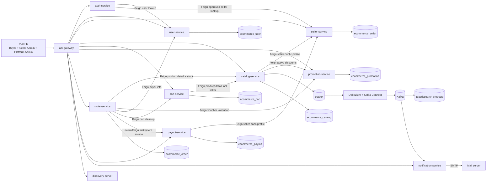

# 02-kien-truc-moi.md

## 1. Mục tiêu kiến trúc mới

Kiến trúc mới giữ microservice hiện tại nhưng mở rộng sang marketplace nhiều seller. Nguyên tắc:

| Nguyên tắc | Áp dụng |
|---|---|
| Database per service | Service nào sở hữu domain đó, service khác chỉ lưu ID/snapshot cần thiết |
| Không rewrite từ đầu | Reuse catalog/cart/order/promotion/auth/user hiện có |
| Seller isolation | API Seller Admin lấy `sellerId` server-side từ JWT, không nhận từ client |
| Bỏ POS | Không duy trì luồng bán hàng tại quầy trong marketplace |
| Payment một lần, xử lý nhiều seller | Một payment cho order cha, nhiều sub-order theo seller |
| Search là read model | Elasticsearch dùng cho storefront search, MySQL vẫn là source of truth |

## 2. Service giữ/sửa/thêm/bỏ

| Trạng thái | Service/module | Thay đổi |
|---|---|---|
| Giữ | `discovery-server` | Giữ Eureka |
| Giữ + sửa | `api-gateway` | Thêm route `/api/v1/sellers/**`, `/api/v1/seller/**`, `/api/v1/payouts/**`; thêm filter role `SELLER`; có thể set header nội bộ `X-Seller-Id` sau khi verify JWT |
| Giữ | `common-lib` | Có thể thêm DTO lỗi/auth context dùng chung; không thêm shared JPA entity |
| Giữ + mở rộng | `auth-service` | JWT thêm role `SELLER`, claim `sellerId`; refresh token nếu đang thiếu cần bổ sung đồng bộ với FE |
| Giữ + mở rộng | `user-service` | Buyer/customer vẫn ở đây; liên kết seller bằng ID, không copy bảng seller |
| Giữ + mở rộng | `catalog-service` | Thêm seller ownership cho product/product-detail; seller API filter theo seller; search payload thêm shop info |
| Giữ + mở rộng | `promotion-service` | Voucher/campaign có scope platform hoặc seller |
| Giữ + refactor lớn | `order-service` | Bỏ POS; thêm order cha/sub-order; trạng thái riêng từng sub-order; seller order management |
| Giữ + mở rộng | `cart-service` | Cart response group theo seller/shop; lưu seller snapshot tối thiểu nếu cần |
| Giữ | `notification-service` | Dùng cho seller approved/rejected, order status |
| Thêm mới | `seller-service` | Shop registration, approval, profile, status, follow shop, banner platform nếu không tách config-service |
| Thêm mới | `payout-service` | Wallet, commission, settlement period, payout transaction |
| Bỏ | POS/offline invoice module | Xóa API/UI bán hàng tại quầy và phần hóa đơn offline không còn phù hợp |

## 3. Kiến trúc tổng thể mới



## 4. API boundary đề xuất

### 4.1 Public Buyer API

| Service | API mới/sửa | Mục đích |
|---|---|---|
| `seller-service` | `GET /api/v1/permitall/shops/{slug}` | Trang shop public |
| `seller-service` | `GET /api/v1/permitall/shops/featured` | Shop nổi bật |
| `seller-service` | `POST /api/v1/permitall/shops/{sellerId}/follow` | Buyer follow shop |
| `catalog-service` | `GET /api/v1/permitall/san-pham/...` | Bổ sung filter seller/rating/sold sort |
| `catalog-service` | `GET /api/catalog/user/products/search` | Search Elasticsearch có seller fields |
| `cart-service` | `GET /api/v1/permitall/cart` | Trả cart grouped by shop |
| `order-service` | `POST /api/orders/create` | Tạo order cha + sub-order, payment một lần |
| `order-service` | `GET /api/v1/permitall/don-mua/**` | Trả order cha + sub-order |
| `order-service` hoặc `seller-service` | `POST /api/v1/permitall/reviews` | Review product/shop sau khi hoàn thành |

### 4.2 Seller Admin API

Prefix đề xuất: `/api/v1/seller/**`.

| Service | API | Mục đích |
|---|---|---|
| `seller-service` | `GET/PUT /api/v1/seller/profile` | Hồ sơ shop của seller hiện tại |
| `catalog-service` | `GET/POST/PUT /api/v1/seller/products/**` | Product CRUD trong shop |
| `promotion-service` | `GET/POST/PUT /api/v1/seller/vouchers/**` | Voucher shop |
| `promotion-service` | `GET/POST/PUT /api/v1/seller/promotions/**` | Đợt giảm giá shop |
| `order-service` | `GET/PUT /api/v1/seller/orders/**` | Sub-order của shop |
| `payout-service` | `GET /api/v1/seller/wallet`, `/settlements` | Ví/đối soát seller |
| `order-service` | `GET /api/v1/seller/statistics/**` | Thống kê shop |

Quy tắc: mọi API prefix này lấy seller từ JWT/header nội bộ, không nhận `sellerId` query/body.

### 4.3 Platform Admin API

Prefix hiện có `/api/v1/admin/**` vẫn dùng cho platform admin.

| Service | API | Mục đích |
|---|---|---|
| `seller-service` | `/api/v1/admin/sellers/pending`, `/approve`, `/reject`, `/suspend`, `/reopen` | Duyệt/quản lý seller |
| `catalog-service` | `/api/v1/admin/danh-muc/**` | Danh mục chung toàn sàn |
| `promotion-service` | `/api/v1/admin/voucher/**` | Voucher toàn sàn khi `seller_id = null` |
| `seller-service` | `/api/v1/admin/banners/**` | Banner trang chủ |
| `payout-service` | `/api/v1/admin/settlements/**` | Đối soát tổng |
| `order-service` | `/api/v1/admin/disputes/**` | Khiếu nại/tranh chấp, phase sau |
| `order-service` | `/api/v1/admin/thong-ke/**` | Thống kê toàn sàn |

## 5. Multi-tenancy và security

### 5.1 JWT claims

JWT sau khi seller được duyệt nên có:

| Claim | Ví dụ | Mục đích |
|---|---|---|
| `sub`/`email` | `seller1@email.com` | Principal |
| `role` hoặc `roles` | `["USER","SELLER"]` | Một user có nhiều vai trò |
| `customerId` | `KH001` | Buyer context |
| `sellerId` | `SELLER001` | Seller Admin scope |
| `sellerStatus` | `APPROVED` | Guard nhanh; service vẫn verify khi cần |

### 5.2 Gateway filters

| Filter | Rule |
|---|---|
| Admin filter hiện có | Giữ cho `/api/v1/admin/**`, role `ADMIN` |
| Seller filter mới | Áp cho `/api/v1/seller/**`, yêu cầu role `SELLER`, seller status `APPROVED` |
| Internal header | Sau khi verify JWT, gateway có thể set `X-User-Id`, `X-Customer-Id`, `X-Seller-Id`, `X-Roles` cho downstream |

Nếu không set header ở gateway, từng service phải parse JWT bằng shared util trong `common-lib`. Ưu tiên gateway set header + service validate lại ownership theo database.

### 5.3 Ownership checks

| Domain | Check bắt buộc |
|---|---|
| Product | `san_pham.seller_id == sellerId` khi seller update/delete |
| Product detail | Seller ownership đi qua `san_pham` hoặc denormalized `seller_id` |
| Voucher shop | `voucher.seller_id == sellerId`; seller không tạo voucher platform |
| Sub-order | `sub_order.seller_id == sellerId` |
| Payout | `seller_wallet.seller_id == sellerId` |
| Review reply | Seller chỉ reply review thuộc product/shop mình |

## 6. Data ownership theo service mới

| Service | Sở hữu | Không sở hữu |
|---|---|---|
| `seller-service` | `seller`, `seller_status_history`, `shop_follow`, `shop_banner` nếu không tách config, shop public profile | Product gốc, order, payout transaction |
| `catalog-service` | Product/product-detail/attribute, seller ownership ID trên product, search outbox | Seller profile full, payout |
| `cart-service` | Cart/cart item, product-detail ID, seller snapshot tối thiểu để group | Product/shop master |
| `order-service` | Order cha, sub-order, order item snapshot, payment state, order status history | Product/shop/customer master |
| `promotion-service` | Voucher/campaign, seller ID scope | Seller profile, customer full |
| `payout-service` | Wallet, settlement, payout transaction, commission config snapshot | Order item details full, seller KYC full |
| `user-service` | Buyer/staff account | Seller shop profile |
| `auth-service` | Token/session auth | User/seller master data |

## 7. Search pipeline mới

Search hiện có:

```text
catalog-service transaction -> outbox -> MySQL binlog -> Debezium -> Kafka -> Elasticsearch products
```

Marketplace cần mở rộng outbox payload:

| Field mới | Nguồn |
|---|---|
| `sellerId` | `san_pham.seller_id` |
| `sellerName` | Snapshot từ `seller-service` hoặc cache nội bộ catalog |
| `sellerSlug` | Snapshot từ `seller-service` |
| `sellerLogoUrl` | Snapshot |
| `ratingAverage` | Review aggregate |
| `soldCount` | Order aggregate hoặc projection |
| `shopStatus` | Chỉ index product seller `APPROVED` |

Nếu tránh Feign trong transaction catalog, có thể dùng Kafka event từ `seller-service` cập nhật seller projection tối thiểu trong catalog. Phase đầu có thể Feign read public seller profile khi build response, nhưng search index nên có snapshot để filter nhanh.

## 8. Frontend kiến trúc mới

| Khu vực | Route đề xuất | Reuse |
|---|---|---|
| Buyer storefront | `/trang-chu`, `/san-pham`, `/san-pham-chi-tiet/:idsp`, `/shop/:sellerSlug`, `/gio-hang`, `/thanh-toan`, `/don-mua` | Reuse layout `Users.vue` |
| Seller onboarding | `/dang-ky-ban-hang`, `/seller/pending` | New pages |
| Seller Admin | `/seller/dashboard`, `/seller/products`, `/seller/orders`, `/seller/vouchers`, `/seller/wallet`, `/seller/profile`, `/seller/reviews` | Reuse style/layout từ `Admin.vue`, tách menu |
| Platform Admin | `/admin/*` | Reuse Admin hiện tại, bỏ POS, thêm sellers/payout/banner |

State/auth:

| Mục | Thay đổi |
|---|---|
| Pinia auth | Lưu thêm roles, sellerId, sellerStatus |
| Route guard | Guard `ADMIN` cho `/admin`, `SELLER` cho `/seller` |
| API client | Không gửi sellerId; chỉ gửi Bearer token |
| Role switch | Từ buyer UI hiển thị nút "Kênh Người Bán" nếu có seller approved |

## 9. Rủi ro kỹ thuật

| Rủi ro | Cách xử lý |
|---|---|
| `order-service` đang dùng `HoaDon` cho cả online/POS | Tách dần order cha/sub-order, giữ endpoint online compatibility trước, sau đó xóa POS |
| FE đang có nhiều admin route comment guard | Phase 1 phải củng cố auth guard trước khi mở seller admin |
| FE gọi `/api/v1/auth/refresh` nhưng backend chưa thấy endpoint | Phase 1 bổ sung hoặc sửa FE/backend đồng bộ |
| Search cần seller data nhưng catalog không sở hữu seller | Dùng seller public snapshot/projection, không copy full seller table |
| Voucher 2 tầng có nhiều rule | Tách rõ platform voucher (`seller_id null`) và shop voucher (`seller_id not null`) |
