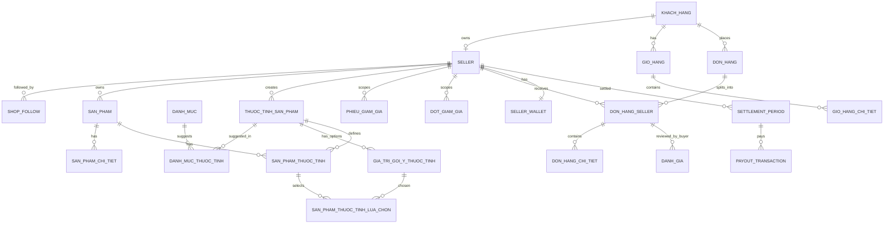

# 03-erd-database.md

## 1. Nguyên tắc database

Mỗi service giữ database riêng. Bảng mới chỉ nằm ở service sở hữu bounded context. Cross-service chỉ lưu ID tham chiếu hoặc snapshot bất biến tại thời điểm giao dịch.

| Service | Database hiện tại/đề xuất |
|---|---|
| `user-service` | `ecommerce_user` |
| `seller-service` | `ecommerce_seller` |
| `catalog-service` | `ecommerce_catalog` |
| `cart-service` | `ecommerce_cart` |
| `promotion-service` | `ecommerce_promotion` |
| `order-service` | `ecommerce_order` |
| `payout-service` | `ecommerce_payout` |

## 2. ERD tổng quan



## 3. seller-service schema

### 3.1 `seller`

| Column | Type | Null | Ghi chú |
|---|---|---|---|
| `id` | varchar(36) | No | PK |
| `owner_customer_id` | varchar(36) | No | ID `khach_hang`, không FK cross DB |
| `shop_name` | varchar(255) | No | Unique |
| `seller_slug` | varchar(255) | No | Unique, dùng `/shop/:sellerSlug` |
| `description` | text | Yes | Mô tả shop |
| `logo_url` | varchar(1000) | Yes | Logo |
| `cover_image_url` | varchar(1000) | Yes | Ảnh bìa |
| `pickup_address` | varchar(1000) | No | Địa chỉ lấy hàng |
| `contact_phone` | varchar(20) | No | SĐT liên hệ |
| `identity_type` | varchar(30) | No | `CCCD`, `CMND`, `TAX_CODE` |
| `identity_number` | varchar(100) | No | Mock được ở phase đầu |
| `bank_name` | varchar(255) | No | Ngân hàng nhận tiền |
| `bank_account_no` | varchar(100) | No | Số tài khoản |
| `bank_account_holder` | varchar(255) | No | Chủ tài khoản |
| `main_category_id` | varchar(36) | Yes | ID `danh_muc`, không FK cross DB |
| `status` | varchar(30) | No | `PENDING_APPROVAL`, `APPROVED`, `REJECTED`, `SUSPENDED`, `CLOSED` |
| `rejection_reason` | varchar(1000) | Yes | Lý do từ chối |
| `approved_by_staff_id` | varchar(36) | Yes | ID `nhan_vien` admin duyệt |
| `approved_at` | datetime | Yes | Thời điểm duyệt |
| `created_at` | datetime | No | Audit |
| `updated_at` | datetime | No | Audit |

Index:

| Index | Columns | Mục đích |
|---|---|---|
| `uk_seller_slug` | `seller_slug` | URL shop unique |
| `uk_shop_name` | `shop_name` | Tránh trùng tên |
| `idx_seller_owner` | `owner_customer_id` | Lookup seller theo account |
| `idx_seller_status` | `status` | Màn duyệt seller |

### 3.2 `seller_status_history`

| Column | Type | Null | Ghi chú |
|---|---|---|---|
| `id` | bigint | No | PK |
| `seller_id` | varchar(36) | No | Local FK tới `seller.id` |
| `from_status` | varchar(30) | Yes | Trạng thái cũ |
| `to_status` | varchar(30) | No | Trạng thái mới |
| `changed_by_user_id` | varchar(36) | Yes | Customer/staff ID |
| `changed_by_role` | varchar(30) | Yes | `SELLER`, `ADMIN`, `SYSTEM` |
| `reason` | varchar(1000) | Yes | Lý do |
| `created_at` | datetime | No | Audit |

### 3.3 `shop_follow`

| Column | Type | Null | Ghi chú |
|---|---|---|---|
| `id` | bigint | No | PK |
| `seller_id` | varchar(36) | No | Shop được follow |
| `customer_id` | varchar(36) | No | Buyer follow |
| `created_at` | datetime | No | Audit |

Unique: `(seller_id, customer_id)`.

### 3.4 `platform_banner`

| Column | Type | Null | Ghi chú |
|---|---|---|---|
| `id` | varchar(36) | No | PK |
| `title` | varchar(255) | No | Tiêu đề |
| `image_url` | varchar(1000) | No | Ảnh banner |
| `target_url` | varchar(1000) | Yes | Link khi click |
| `position` | varchar(50) | No | `HOME_TOP`, `HOME_MIDDLE` |
| `sort_order` | int | No | Thứ tự |
| `status` | varchar(30) | No | `ACTIVE`, `INACTIVE` |
| `start_at` | datetime | Yes | Bắt đầu |
| `end_at` | datetime | Yes | Kết thúc |

## 4. user-service schema mở rộng

Không copy bảng seller vào `user-service`. Chỉ thêm liên kết/role cần thiết.

### 4.1 `khach_hang` bổ sung

| Column mới | Type | Null | Ghi chú |
|---|---|---|---|
| `seller_id` | varchar(36) | Yes | ID seller approved/latest của customer, nếu chỉ cho 1 shop/account |
| `roles` | varchar(255) | Yes | Hoặc chuẩn hóa bảng role riêng; tối thiểu gồm `USER`, `SELLER` |

Nếu muốn sạch hơn:

### 4.2 `user_role`

| Column | Type | Null | Ghi chú |
|---|---|---|---|
| `id` | bigint | No | PK |
| `user_type` | varchar(30) | No | `CUSTOMER`, `STAFF` |
| `user_id` | varchar(36) | No | ID `khach_hang` hoặc `nhan_vien` |
| `role` | varchar(30) | No | `USER`, `SELLER`, `ADMIN`, `STAFF` |

Unique: `(user_type, user_id, role)`.

## 5. catalog-service schema mở rộng

### 5.1 `san_pham` bổ sung

| Column mới | Type | Null | Ghi chú |
|---|---|---|---|
| `seller_id` | varchar(36) | No | ID shop sở hữu |
| `seller_name_snapshot` | varchar(255) | Yes | Snapshot để trả response/search nhanh |
| `seller_slug_snapshot` | varchar(255) | Yes | Snapshot public URL |
| `sold_count` | bigint | No default 0 | Projection bán chạy |
| `rating_average` | decimal(3,2) | Yes | Projection review |
| `rating_count` | int | No default 0 | Số review |

Index:

| Index | Columns |
|---|---|
| `idx_san_pham_seller` | `seller_id` |
| `idx_san_pham_seller_status` | `seller_id`, `status` |
| `idx_san_pham_rating` | `rating_average` |

### 5.2 `san_pham_chi_tiet` bổ sung

| Column mới | Type | Null | Ghi chú |
|---|---|---|---|
| `seller_id` | varchar(36) | No | Denormalized từ `san_pham`, giúp validate nhanh |

Nếu không denormalize, service luôn join local `san_pham` để lấy seller; nhưng thêm `seller_id` trên detail giúp order/cart giảm round trip.

### 5.3 `outbox` payload mở rộng

Không đổi bảng bắt buộc, nhưng JSON payload cần thêm:

```json
{
  "id": "SP001",
  "name": "Giay sneaker",
  "sellerId": "SELLER001",
  "sellerName": "Shop Sneaker A",
  "sellerSlug": "shop-sneaker-a",
  "sellerLogoUrl": "...",
  "ratingAverage": 4.8,
  "soldCount": 120
}
```

Payload product sau Mục 10 bổ sung mảng `attributes`; các field seller và ID product/detail hiện hữu vẫn giữ nguyên để không phá contract của cart/order:

```json
{
  "attributes": [
    {
      "attributeId": "ATTR_MATERIAL",
      "name": "Chất liệu",
      "dataType": "TEXT",
      "textValue": "Da tổng hợp",
      "optionIds": []
    }
  ]
}
```

### 5.4 `thuoc_tinh_san_pham`

Bảng định nghĩa thuộc tính dùng chung trong `catalog-service`; một thuộc tính có thể được gợi ý ở nhiều danh mục qua bảng M:N tại Mục 5.6.

| Column | Type | Null | Ghi chú |
|---|---|---|---|
| `id` | varchar(36) | No | PK |
| `code` | varchar(100) | No | Mã ổn định, unique sau khi chuẩn hóa |
| `name` | varchar(255) | No | Tên hiển thị do platform hoặc seller nhập |
| `normalized_name` | varchar(255) | No | Tên đã trim/lowercase/bỏ khoảng trắng thừa để autocomplete và phát hiện trùng |
| `data_type` | varchar(30) | No | `TEXT`, `NUMBER`, `SINGLE_SELECT`, `MULTI_SELECT` |
| `creator_seller_id` | varchar(36) | Yes | `null` nếu platform tạo; ID seller nếu seller tự thêm, không FK cross DB |
| `normalization_status` | varchar(30) | No | `PENDING`, `STANDARDIZED`, `MERGED`, `HIDDEN` |
| `merged_into_attribute_id` | varchar(36) | Yes | Self FK tới thuộc tính chuẩn khi đã gộp |
| `created_at` | datetime | No | Audit |
| `updated_at` | datetime | No | Audit |

Index/constraint:

| Tên | Columns | Mục đích |
|---|---|---|
| `idx_thuoc_tinh_normalized_name` | `normalized_name` | Autocomplete/phát hiện tên gần trùng |
| `idx_thuoc_tinh_creator_status` | `creator_seller_id`, `normalization_status` | Hậu kiểm và truy vấn theo phạm vi seller |
| `idx_thuoc_tinh_merged_into` | `merged_into_attribute_id` | Resolve thuộc tính chuẩn |

Chính sách đã chốt: thuộc tính `PENDING` do seller tạo chỉ được gợi ý/tái sử dụng cho chính `creator_seller_id`. Seller khác chỉ được thấy trong suggestion/autocomplete sau khi Platform Admin chuẩn hóa thành `STANDARDIZED` và gắn thuộc tính vào danh mục. Public product detail vẫn hiển thị giá trị thuộc tính `PENDING` đang dùng nếu record không bị `HIDDEN`.

### 5.5 `gia_tri_goi_y_thuoc_tinh`

| Column | Type | Null | Ghi chú |
|---|---|---|---|
| `id` | varchar(36) | No | PK |
| `attribute_id` | varchar(36) | No | FK `thuoc_tinh_san_pham.id` |
| `value` | varchar(500) | No | Giá trị hiển thị của dropdown |
| `normalized_value` | varchar(500) | No | Giá trị chuẩn hóa để hạn chế trùng |
| `creator_seller_id` | varchar(36) | Yes | Seller tạo option; `null` nếu platform tạo |
| `status` | varchar(30) | No | `ACTIVE`, `HIDDEN`, `MERGED` |
| `merged_into_option_id` | varchar(36) | Yes | Self FK khi Admin gộp option |
| `display_order` | int | No | Thứ tự hiển thị |
| `created_at` | datetime | No | Audit |

Unique logic: `(attribute_id, normalized_value)` với các record chưa bị gộp. Bảng chỉ áp dụng cho `SINGLE_SELECT`/`MULTI_SELECT`.

### 5.6 `danh_muc_thuoc_tinh`

| Column | Type | Null | Ghi chú |
|---|---|---|---|
| `id` | bigint | No | PK |
| `category_id` | varchar(36) | No | Local FK tới `danh_muc.id` |
| `attribute_id` | varchar(36) | No | FK `thuoc_tinh_san_pham.id` |
| `is_default_suggestion` | boolean | No | Hiện sẵn trên form seller |
| `is_filterable` | boolean | No | Buyer được filter theo thuộc tính này |
| `is_required` | boolean | No | Mặc định `false`; hậu kiểm không tự làm hỏng product cũ |
| `display_order` | int | No | Thứ tự form/filter |
| `status` | varchar(30) | No | `ACTIVE`, `HIDDEN` |
| `created_at` | datetime | No | Audit |

Unique: `(category_id, attribute_id)`. Đây là quan hệ M:N giữa danh mục và thuộc tính chuẩn/gợi ý.

### 5.7 `san_pham_thuoc_tinh`

| Column | Type | Null | Ghi chú |
|---|---|---|---|
| `id` | varchar(36) | No | PK |
| `product_id` | varchar(36) | No | FK `san_pham.id` |
| `attribute_id` | varchar(36) | No | FK `thuoc_tinh_san_pham.id` |
| `text_value` | text | Yes | Giá trị cho `TEXT` |
| `number_value` | decimal(19,4) | Yes | Giá trị cho `NUMBER` |
| `unit` | varchar(50) | Yes | Đơn vị hiển thị nếu kiểu số cần dùng |
| `display_order` | int | No | Thứ tự trên chi tiết sản phẩm |
| `created_at` | datetime | No | Audit |
| `updated_at` | datetime | No | Audit |

Unique: `(product_id, attribute_id)`. Check ở application/service bảo đảm chỉ cột đúng với `data_type` có giá trị; dropdown lưu lựa chọn ở bảng 5.8.

Application constraint đã chốt: mỗi product có tối đa 50 record thuộc tính động. Seller được tạo đủ bốn kiểu `TEXT`, `NUMBER`, `SINGLE_SELECT`, `MULTI_SELECT`; service validate text/number/options tương ứng trong cùng transaction.

### 5.8 `san_pham_thuoc_tinh_lua_chon`

| Column | Type | Null | Ghi chú |
|---|---|---|---|
| `product_attribute_value_id` | varchar(36) | No | FK `san_pham_thuoc_tinh.id` |
| `option_id` | varchar(36) | No | FK `gia_tri_goi_y_thuoc_tinh.id` |

Primary key: `(product_attribute_value_id, option_id)`. `SINGLE_SELECT` có đúng một record; `MULTI_SELECT` có một hoặc nhiều record.

### 5.9 Elasticsearch document cho thuộc tính động

Không dùng tên thuộc tính làm field động trực tiếp vì dễ nổ mapping. Product document index một mảng `nested` có schema ổn định:

```json
{
  "attributes": [
    {
      "attributeId": "ATTR_MATERIAL",
      "name": "Chất liệu",
      "dataType": "TEXT",
      "textValues": ["Da tổng hợp"],
      "keywordValues": ["da tong hop"],
      "numberValue": null,
      "optionIds": []
    }
  ]
}
```

- Query phải dùng `nested` theo cùng `attributeId` và value để không match chéo hai thuộc tính.
- Filter được dựng từ các record `danh_muc_thuoc_tinh.is_filterable = true` của danh mục đang xem; không hard-code Size/Màu cho mọi danh mục.
- Merge/ẩn thuộc tính phát outbox để reindex toàn bộ product bị ảnh hưởng; MySQL vẫn là nguồn sự thật.
- `san_pham_chi_tiet` tiếp tục giữ variant/SKU, giá và tồn kho. Cart/order tiếp tục dùng `productDetailId`; thuộc tính động chỉ bổ sung metadata sản phẩm nên contract hiện hữu không bị phá.

## 6. cart-service schema mở rộng

### 6.1 `gio_hang_chi_tiet` bổ sung

| Column mới | Type | Null | Ghi chú |
|---|---|---|---|
| `seller_id` | varchar(36) | No | Snapshot từ product-detail tại lúc add cart |
| `seller_name_snapshot` | varchar(255) | Yes | Hiển thị nhóm shop |
| `seller_slug_snapshot` | varchar(255) | Yes | Link shop |

Không lưu full shop profile. Khi seller đổi tên, có thể cập nhật snapshot async hoặc lấy live qua seller-service ở response.

## 7. promotion-service schema mở rộng

### 7.1 `phieu_giam_gia` bổ sung

| Column mới | Type | Null | Ghi chú |
|---|---|---|---|
| `seller_id` | varchar(36) | Yes | `null` = voucher toàn sàn; not null = voucher shop |
| `scope_type` | varchar(30) | No | `PLATFORM`, `SHOP` |
| `max_discount_amount` | decimal | Yes | Trần giảm nếu phần trăm |
| `created_by_role` | varchar(30) | No | `ADMIN`, `SELLER` |

Rule:

| Scope | Rule |
|---|---|
| Platform voucher | `seller_id IS NULL`, chỉ Platform Admin tạo |
| Shop voucher | `seller_id = sellerId`, chỉ áp dụng item/sub-order của shop đó |

### 7.2 `dot_giam_gia` bổ sung

| Column mới | Type | Null | Ghi chú |
|---|---|---|---|
| `seller_id` | varchar(36) | Yes | null nếu platform campaign |
| `scope_type` | varchar(30) | No | `PLATFORM`, `SHOP` |

### 7.3 `dot_giam_gia_chi_tiet_san_pham` bổ sung

| Column mới | Type | Null | Ghi chú |
|---|---|---|---|
| `seller_id` | varchar(36) | No | Validate product-detail thuộc seller |

## 8. order-service schema mới

Giữ tên bảng cũ nếu muốn migrate ít, nhưng domain cần rõ order cha/sub-order. Đề xuất tạo bảng mới để tránh lẫn POS `hoa_don`.

### 8.1 `don_hang`

Order cha buyer nhìn thấy, thanh toán một lần.

| Column | Type | Null | Ghi chú |
|---|---|---|---|
| `id` | varchar(36) | No | PK |
| `ma_don_hang` | varchar(50) | No | Mã buyer thấy |
| `customer_id` | varchar(36) | No | ID `khach_hang` |
| `customer_name_snapshot` | varchar(255) | Yes | Snapshot |
| `customer_phone_snapshot` | varchar(20) | Yes | Snapshot |
| `shipping_address_snapshot` | varchar(1000) | No | Địa chỉ giao |
| `platform_voucher_id` | varchar(36) | Yes | Voucher toàn sàn |
| `subtotal_amount` | decimal | No | Tổng hàng |
| `shipping_fee_total` | decimal | No | Tổng phí ship |
| `shop_discount_total` | decimal | No | Tổng voucher shop |
| `platform_discount_amount` | decimal | No | Voucher sàn |
| `total_payment_amount` | decimal | No | Số thanh toán VNPay/COD |
| `payment_method` | varchar(30) | No | `VNPAY`, `COD` |
| `payment_status` | varchar(30) | No | `UNPAID`, `PAID`, `FAILED`, `REFUNDED` |
| `order_status` | varchar(30) | No | Tổng hợp: `PENDING_PAYMENT`, `PROCESSING`, `PARTIALLY_COMPLETED`, `COMPLETED`, `CANCELLED` |
| `created_at` | datetime | No | Audit |
| `updated_at` | datetime | No | Audit |

### 8.2 `don_hang_seller`

Sub-order theo shop.

| Column | Type | Null | Ghi chú |
|---|---|---|---|
| `id` | varchar(36) | No | PK |
| `don_hang_id` | varchar(36) | No | Local FK tới `don_hang` |
| `ma_sub_order` | varchar(50) | No | Mã riêng từng shop |
| `seller_id` | varchar(36) | No | Shop xử lý |
| `seller_name_snapshot` | varchar(255) | No | Snapshot |
| `seller_slug_snapshot` | varchar(255) | Yes | Snapshot |
| `shop_voucher_id` | varchar(36) | Yes | Voucher shop |
| `subtotal_amount` | decimal | No | Tổng hàng shop |
| `shipping_fee` | decimal | No | Phí ship shop |
| `shop_discount_amount` | decimal | No | Giảm shop |
| `platform_discount_allocated` | decimal | No | Phần voucher sàn phân bổ |
| `commission_amount` | decimal | No | Hoa hồng platform |
| `seller_receivable_amount` | decimal | No | Tiền seller được đối soát |
| `status` | varchar(30) | No | `CHO_XAC_NHAN`, `DA_XAC_NHAN`, `DANG_DONG_GOI`, `DANG_GIAO`, `HOAN_THANH`, `DA_HUY`, `TRA_HANG_HOAN_TIEN` |
| `created_at` | datetime | No | Audit |
| `updated_at` | datetime | No | Audit |

Index: `(seller_id, status)`, `(don_hang_id)`.

### 8.3 `don_hang_chi_tiet`

| Column | Type | Null | Ghi chú |
|---|---|---|---|
| `id` | varchar(36) | No | PK |
| `don_hang_seller_id` | varchar(36) | No | Local FK |
| `product_id` | varchar(36) | No | ID `san_pham` |
| `product_detail_id` | varchar(36) | No | ID `san_pham_chi_tiet` |
| `product_name_snapshot` | varchar(255) | No | Snapshot |
| `sku_snapshot` | varchar(100) | Yes | Màu/size |
| `image_url_snapshot` | varchar(1000) | Yes | Ảnh |
| `unit_price` | decimal | No | Giá tại lúc mua |
| `quantity` | int | No | Số lượng |
| `line_total` | decimal | No | Thành tiền |

### 8.4 `lich_su_trang_thai_don_hang_seller`

| Column | Type | Null | Ghi chú |
|---|---|---|---|
| `id` | bigint | No | PK |
| `don_hang_seller_id` | varchar(36) | No | Sub-order |
| `from_status` | varchar(30) | Yes | Trạng thái cũ |
| `to_status` | varchar(30) | No | Trạng thái mới |
| `changed_by_role` | varchar(30) | No | `SELLER`, `BUYER`, `ADMIN`, `SYSTEM` |
| `changed_by_id` | varchar(36) | Yes | ID actor |
| `note` | varchar(1000) | Yes | Ghi chú |
| `created_at` | datetime | No | Audit |

### 8.5 `payment_transaction`

Có thể thay/chuẩn hóa `lich_su_thanh_toan`.

| Column | Type | Null | Ghi chú |
|---|---|---|---|
| `id` | varchar(36) | No | PK |
| `don_hang_id` | varchar(36) | No | Order cha |
| `provider` | varchar(30) | No | `VNPAY`, `COD` |
| `amount` | decimal | No | Số tiền |
| `provider_transaction_id` | varchar(255) | Yes | Mã VNPay |
| `status` | varchar(30) | No | `INIT`, `SUCCESS`, `FAILED`, `REFUNDED` |
| `raw_response` | text | Yes | Payload provider |
| `created_at` | datetime | No | Audit |

## 9. Review/follow schema

Review có thể đặt ở `order-service` nếu gắn chặt order completion, hoặc `seller-service` nếu tập trung shop public profile. Đề xuất `seller-service` sở hữu review shop/product public aggregate, lưu ID tham chiếu order.

### 9.1 `danh_gia`

| Column | Type | Null | Ghi chú |
|---|---|---|---|
| `id` | varchar(36) | No | PK |
| `customer_id` | varchar(36) | No | Buyer |
| `seller_id` | varchar(36) | No | Shop |
| `product_id` | varchar(36) | Yes | Product |
| `product_detail_id` | varchar(36) | Yes | SKU |
| `don_hang_seller_id` | varchar(36) | No | Sub-order đã hoàn thành |
| `product_rating` | int | Yes | 1-5 |
| `shop_rating` | int | Yes | 1-5 |
| `comment` | text | Yes | Bình luận |
| `image_urls` | text | Yes | JSON array hoặc bảng con |
| `seller_reply` | text | Yes | Seller phản hồi |
| `seller_replied_at` | datetime | Yes | Thời điểm reply |
| `status` | varchar(30) | No | `VISIBLE`, `HIDDEN` |
| `created_at` | datetime | No | Audit |

Unique: `(customer_id, don_hang_seller_id, product_detail_id)` để tránh review trùng item.

## 10. payout-service schema

### 10.1 `seller_wallet`

| Column | Type | Null | Ghi chú |
|---|---|---|---|
| `id` | varchar(36) | No | PK |
| `seller_id` | varchar(36) | No | Unique |
| `pending_amount` | decimal | No | Chờ đối soát |
| `available_amount` | decimal | No | Có thể rút/chi |
| `paid_amount` | decimal | No | Đã chi |
| `updated_at` | datetime | No | Audit |

### 10.2 `commission_config`

| Column | Type | Null | Ghi chú |
|---|---|---|---|
| `id` | varchar(36) | No | PK |
| `category_id` | varchar(36) | Yes | Null = default toàn sàn |
| `commission_rate` | decimal(5,2) | No | % hoa hồng |
| `status` | varchar(30) | No | `ACTIVE`, `INACTIVE` |
| `effective_from` | datetime | No | Hiệu lực |

### 10.3 `settlement_period`

| Column | Type | Null | Ghi chú |
|---|---|---|---|
| `id` | varchar(36) | No | PK |
| `seller_id` | varchar(36) | No | Seller |
| `period_code` | varchar(50) | No | Ví dụ `2026-W34` |
| `from_date` | date | No | Từ ngày |
| `to_date` | date | No | Đến ngày |
| `gross_amount` | decimal | No | Doanh thu gộp |
| `commission_amount` | decimal | No | Hoa hồng |
| `refund_amount` | decimal | No | Hoàn/khấu trừ |
| `net_amount` | decimal | No | Thực nhận |
| `status` | varchar(30) | No | `DRAFT`, `PENDING_APPROVAL`, `APPROVED`, `PAID` |
| `approved_by_staff_id` | varchar(36) | Yes | Admin duyệt |
| `approved_at` | datetime | Yes | Thời điểm duyệt |

### 10.4 `payout_transaction`

| Column | Type | Null | Ghi chú |
|---|---|---|---|
| `id` | varchar(36) | No | PK |
| `settlement_period_id` | varchar(36) | No | Kỳ đối soát |
| `seller_id` | varchar(36) | No | Seller |
| `amount` | decimal | No | Số tiền chi |
| `bank_name_snapshot` | varchar(255) | No | Snapshot từ seller |
| `bank_account_no_snapshot` | varchar(100) | No | Snapshot |
| `bank_account_holder_snapshot` | varchar(255) | No | Snapshot |
| `status` | varchar(30) | No | `INIT`, `PROCESSING`, `SUCCESS`, `FAILED` |
| `transaction_ref` | varchar(255) | Yes | Mã giao dịch |
| `created_at` | datetime | No | Audit |

## 11. Migration mapping từ bảng cũ

| Bảng hiện tại | Xử lý |
|---|---|
| `hoa_don`, `hoa_don_chi_tiet` | Giữ tạm để không vỡ online flow; migrate sang `don_hang`, `don_hang_seller`, `don_hang_chi_tiet`; loại phần POS |
| `phieu_giam_gia` | Thêm `seller_id`, `scope_type`; dữ liệu cũ là voucher platform |
| `dot_giam_gia` | Thêm `seller_id`, `scope_type`; dữ liệu cũ là platform campaign |
| `san_pham` | Thêm seller mặc định cho data cũ, ví dụ platform seed shop `SELLER_PLATFORM_DEFAULT` |
| `gio_hang_chi_tiet` | Backfill seller từ product-detail |
| Search `products` | Reindex sau khi product có seller fields |

### 11.1 Migration thuộc tính giày cũ theo Mục 10

Migration phải chạy theo hai script riêng có version, ví dụ `m10_dynamic_attributes_up.sql` và `m10_dynamic_attributes_down.sql`; không sửa dữ liệu trực tiếp bằng câu lệnh thủ công.

Trình tự `up` bắt buộc:

1. Tạo các bảng 5.4-5.8 và constraint nhưng chưa xóa cột/bảng cũ.
2. Tạo các bảng backup có hậu tố version/timestamp cho dữ liệu `san_pham` và các bảng tra cứu Thương hiệu, Xuất xứ, Chất liệu, Loại đế liên quan; ghi manifest gồm thời điểm, số record và checksum/count đối soát.
3. Tìm hoặc tạo danh mục `Giày`; tạo bốn định nghĩa chuẩn `Thương hiệu`, `Xuất xứ`, `Chất liệu`, `Loại đế` và gắn làm gợi ý của danh mục này.
4. Backfill từng giá trị cũ sang `san_pham_thuoc_tinh`, giữ nguyên text/ID nguồn trong backup; dữ liệu demo/test áp dụng cùng quy tắc.
5. Đối soát số product có giá trị trước/sau cho từng field. Nếu lệch, rollback transaction/batch và không reindex.
6. Phát outbox/reindex Elasticsearch sau khi MySQL đối soát thành công.
7. Chỉ đánh dấu field cũ deprecated sau runtime smoke; chưa drop ở lần migration đầu để giữ API tương thích.

Script `down` phải xóa dữ liệu động do đúng migration version tạo, khôi phục field/quan hệ cũ từ backup, phát lại outbox và đối soát count. Việc drop backup hoặc field legacy là một migration sau, chỉ thực hiện khi đã qua ít nhất một chu kỳ release và có phê duyệt riêng.

Policy Mục 10.6 đã chốt ngày 2026-08-22: custom attribute `PENDING` chỉ riêng shop tạo, tối đa 50 thuộc tính động/product, seller được chọn đủ `TEXT`, `NUMBER`, `SINGLE_SELECT`, `MULTI_SELECT`. Migration/API/FE phải dùng đúng ba ràng buộc này.
