# 04-luong-nghiep-vu.md

Nghiệp vụ thuộc tính sản phẩm động ở Mục 10 của prompt được gắn trực tiếp vào Mục 3.2 (Seller tạo/sửa sản phẩm), Mục 3.3 (Buyer xem/search/filter) và Mục 3.4 (Platform Admin hậu kiểm); đây không phải một flow độc lập ngoài marketplace.

## 1. Đăng ký và duyệt seller

### 1.1 Luồng buyer đăng ký bán hàng

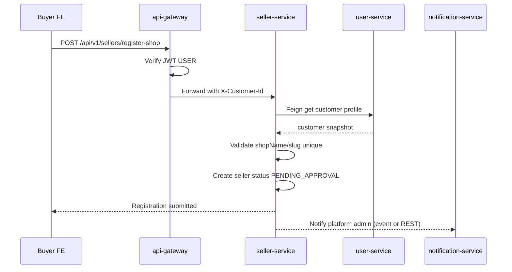

Các bước chi tiết:

| Bước | Xử lý |
|---|---|
| 1 | Buyer đăng nhập bằng tài khoản hiện có |
| 2 | FE mở trang "Đăng ký bán hàng" |
| 3 | Form thu tên shop, slug, mô tả, logo/cover, địa chỉ lấy hàng, phone, định danh, bank, ngành hàng |
| 4 | FE không gửi `sellerId`; backend lấy customer từ JWT |
| 5 | `seller-service` validate unique `shop_name`, `seller_slug` |
| 6 | Tạo `seller` với trạng thái `PENDING_APPROVAL` |
| 7 | Seller thấy màn "Đang chờ duyệt"; chưa truy cập được Seller Admin product/order/voucher |

### 1.2 Platform Admin duyệt/từ chối seller

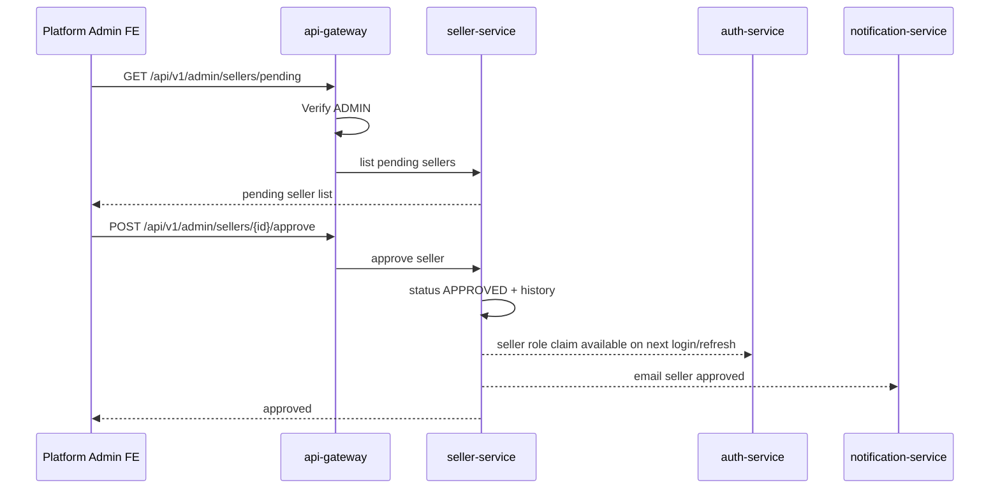

Approve:

| Rule | Mô tả |
|---|---|
| Actor | Chỉ Platform Admin |
| Điều kiện | Seller đang `PENDING_APPROVAL` hoặc resubmit sau `REJECTED` |
| Kết quả | `status = APPROVED`, ghi `approvedBy`, `approvedAt`, status history |
| Auth | Lần login/refresh tiếp theo JWT có role `SELLER`, claim `sellerId` |

Reject:

| Rule | Mô tả |
|---|---|
| Actor | Chỉ Platform Admin |
| Điều kiện | Hồ sơ thiếu/sai |
| Kết quả | `status = REJECTED`, lưu `rejectionReason`, status history |
| Seller action | Seller sửa hồ sơ và nộp lại |

Suspend/close:

| Trạng thái | Actor | Điều kiện |
|---|---|---|
| `SUSPENDED` | Platform Admin | Shop vi phạm, tranh chấp, rủi ro |
| `CLOSED` | Seller owner hoặc Platform Admin | Đóng shop theo chính sách; cần xử lý order đang mở trước |

## 2. Login và chuyển vai trò Buyer/Seller/Admin

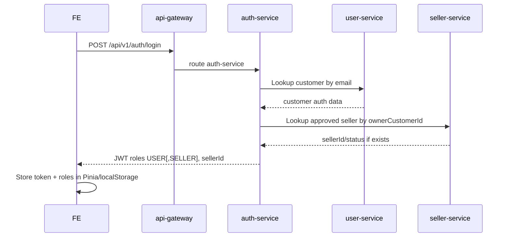

FE behavior:

| User state | UI |
|---|---|
| Buyer only | Storefront + nút "Đăng ký bán hàng" |
| Seller pending | Storefront + màn trạng thái "Đang chờ duyệt" |
| Seller approved | Storefront + nút "Kênh Người Bán" |
| Admin | Platform Admin link `/admin` |

Backend guard:

| Prefix | Rule |
|---|---|
| `/api/v1/admin/**` | Role `ADMIN` |
| `/api/v1/seller/**` | Role `SELLER`, seller status `APPROVED` |
| `/api/v1/permitall/**` | Public/buyer, token optional tùy endpoint |

## 3. Seller Admin - quản lý sản phẩm

### 3.1 CRUD sản phẩm theo seller

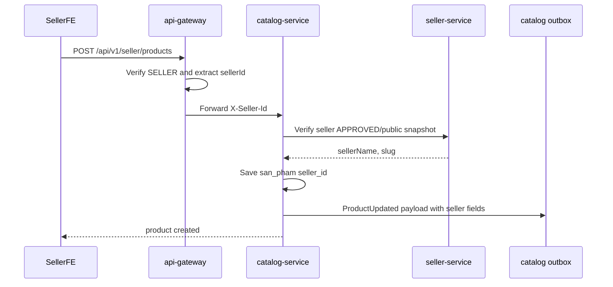

Rules:

| Rule | Mô tả |
|---|---|
| Seller scope | Seller chỉ thấy product `seller_id = sellerId` |
| Create | `seller_id` lấy từ JWT/header, không từ body |
| Update/delete | Validate ownership trước khi sửa |
| Attributes | Seller chọn danh mục, dùng thuộc tính gợi ý hoặc tự thêm; không hard-code Thương hiệu/Xuất xứ/Chất liệu/Loại đế cho mọi ngành hàng |
| Search | Product public chỉ index nếu product active và seller approved |

### 3.2 Seller tự thêm thuộc tính động khi tạo/sửa sản phẩm

Endpoint trong diagram là contract dự kiến; tên cuối cùng phải bám convention controller hiện hữu khi code.

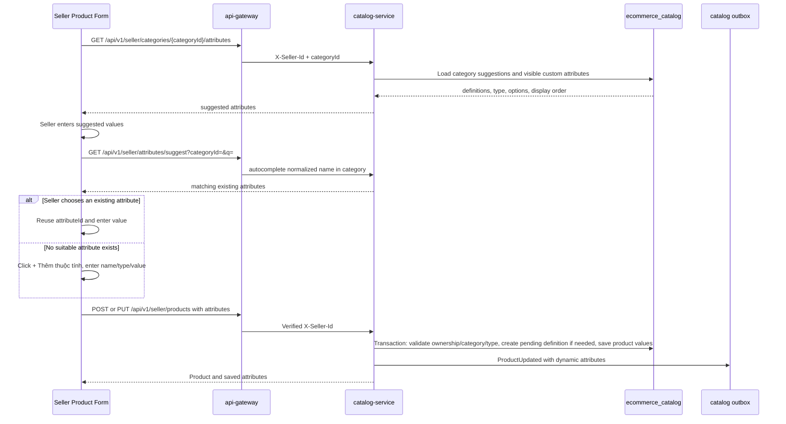

Rules:

| Rule | Xử lý |
|---|---|
| Chọn danh mục trước | Chỉ tải thuộc tính gợi ý/autocomplete sau khi có `categoryId` |
| Tự thêm | Không yêu cầu Admin duyệt trước khi lưu/đăng product; thuộc tính mới có trạng thái `PENDING` để hậu kiểm |
| Chống trùng | Chuẩn hóa tên và autocomplete theo cùng danh mục trước khi cho tạo mới; backend vẫn kiểm tra race condition |
| Ownership | `creator_seller_id` lấy từ JWT/header, không nhận tin cậy từ body |
| Kiểu và giá trị | Seller được chọn `TEXT`, `NUMBER`, `SINGLE_SELECT`, `MULTI_SELECT`; backend validate typed value và option ownership |
| Số lượng | Tối đa 50 thuộc tính động/product; FE chặn trước và backend luôn kiểm tra lại |
| Phạm vi gợi ý | Thuộc tính `PENDING` chỉ gợi ý/tái sử dụng cho shop tạo; seller khác chỉ thấy sau khi Admin chuyển `STANDARDIZED` và gắn danh mục |
| Tính nguyên tử | Product, definition mới, option mới, actual values và outbox ghi trong cùng transaction |

Khi đổi danh mục sau khi đã nhập thuộc tính:

```mermaid
sequenceDiagram
  participant Seller
  participant Form as Seller Product Form
  participant CATALOG as catalog-service

  Seller->>Form: Select another category
  Form->>Form: Detect entered attribute values
  alt No attribute value entered
    Form->>CATALOG: Load suggestions for new category
  else Existing values may be incompatible
    Form-->>Seller: Confirm category change and attribute reset/review
    alt Seller cancels
      Form->>Form: Keep old category and values
    else Seller confirms
      Form->>CATALOG: Load suggestions for new category
      Form->>Form: Keep only explicitly compatible reused attributes; mark remaining values for review
    end
  end
```

## 4. Seller Admin - quản lý đơn hàng

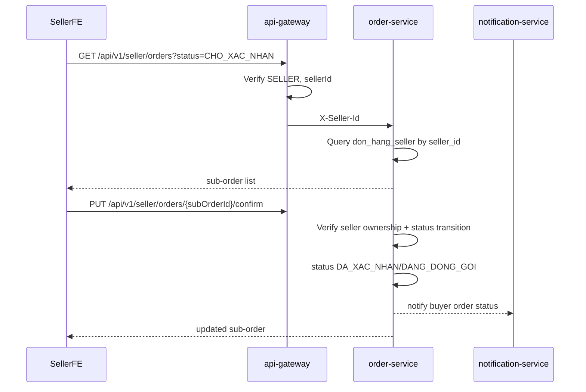

Trạng thái sub-order:

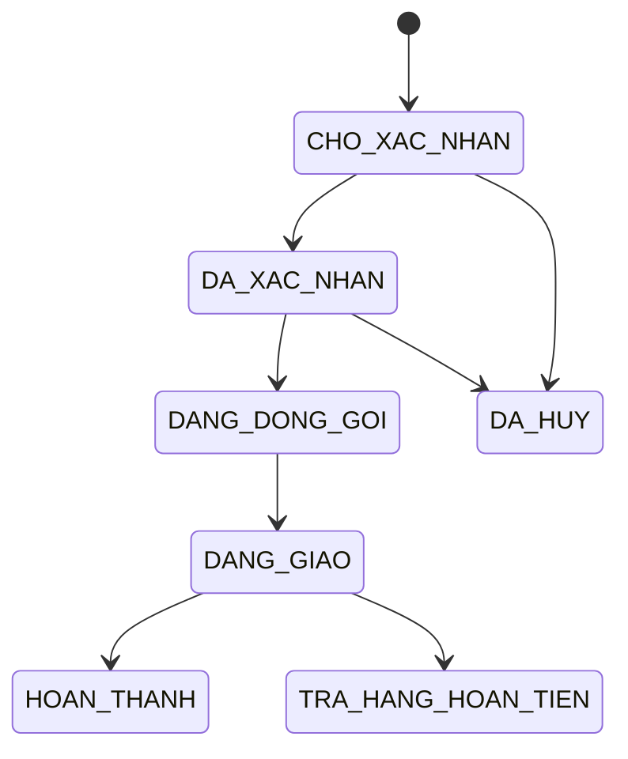

Seller actions:

| Action | Allowed status | Result |
|---|---|---|
| Xác nhận | `CHO_XAC_NHAN` | `DA_XAC_NHAN` |
| Đóng gói/in phiếu | `DA_XAC_NHAN` | `DANG_DONG_GOI` |
| Bàn giao vận chuyển | `DANG_DONG_GOI` | `DANG_GIAO` |
| Hủy | `CHO_XAC_NHAN`, `DA_XAC_NHAN` | `DA_HUY`, cần hoàn/điều chỉnh payout nếu đã paid |

## 5. Seller voucher và đợt giảm giá

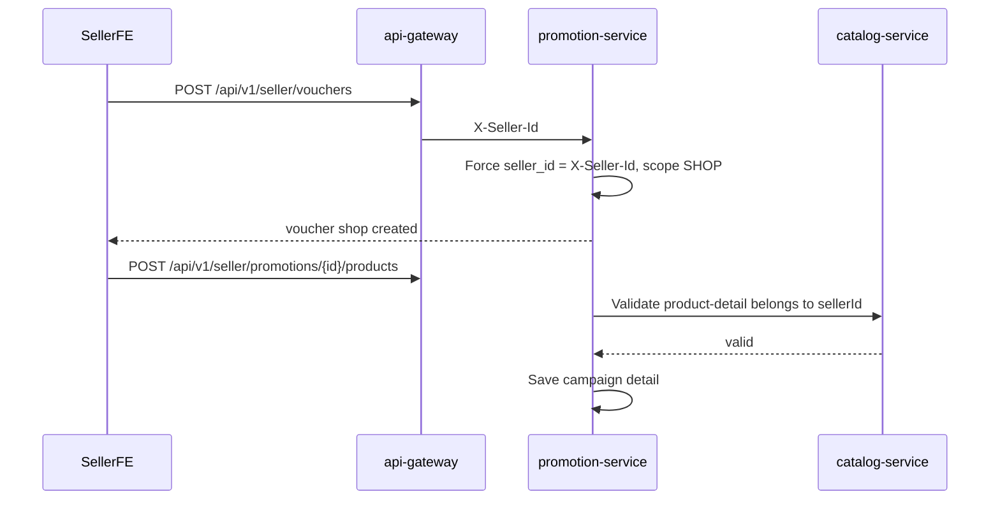

Rules:

| Scope | Ai tạo | Áp dụng |
|---|---|---|
| Voucher shop | Seller approved | Chỉ sub-order của seller đó |
| Voucher toàn sàn | Platform Admin | Order cha hoặc phân bổ vào sub-order |
| Đợt giảm giá shop | Seller approved | Product-detail thuộc seller |
| Đợt giảm giá platform | Platform Admin | Theo rule toàn sàn |

## 6. Buyer storefront nhiều shop

### 6.1 Trang chủ và search

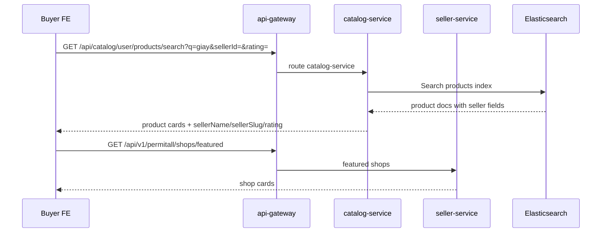

Product card phải có:

| Field | Nguồn |
|---|---|
| Product name/image/price | `catalog-service` |
| Seller name/slug/logo | Search payload hoặc seller-service |
| Rating/sold count | Product projection |
| Discount | `promotion-service` hoặc catalog enriched response |

Filter và chi tiết sản phẩm theo danh mục (liên kết Mục 3.3):

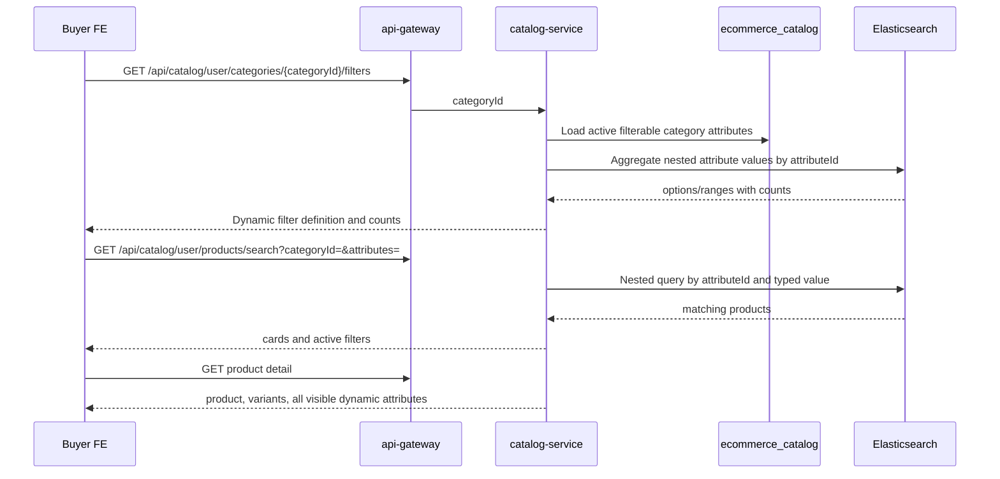

- FE không hiển thị cố định Size/Màu cho mọi danh mục; filter được dựng từ response của danh mục hiện tại.
- Query một filter phải ràng buộc `attributeId` và value trong cùng nested object để không match chéo.
- Trang chi tiết hiển thị cả thuộc tính gợi ý và seller tự thêm nếu thuộc tính/value còn visible.
- Thuộc tính Admin ẩn không còn dùng cho filter/public detail, nhưng dữ liệu nguồn chưa bị xóa vật lý để còn audit/revert.

### 6.2 Trang shop riêng

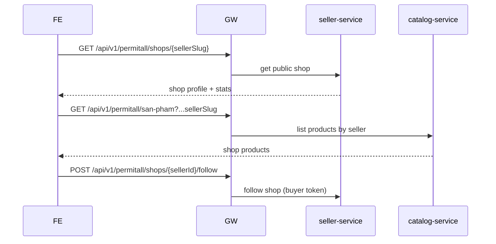

## 7. Cart multi-seller

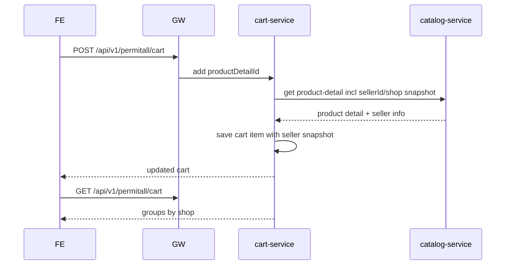

Response shape đề xuất:

```json
{
  "shops": [
    {
      "sellerId": "SELLER001",
      "sellerName": "Shop A",
      "sellerSlug": "shop-a",
      "items": [
        { "cartDetailId": "1", "productDetailId": "SPCT1", "quantity": 2, "price": 100000 }
      ],
      "subtotal": 200000
    }
  ],
  "totalQuantity": 2,
  "totalAmount": 200000
}
```

## 8. Checkout split-order và thanh toán một lần

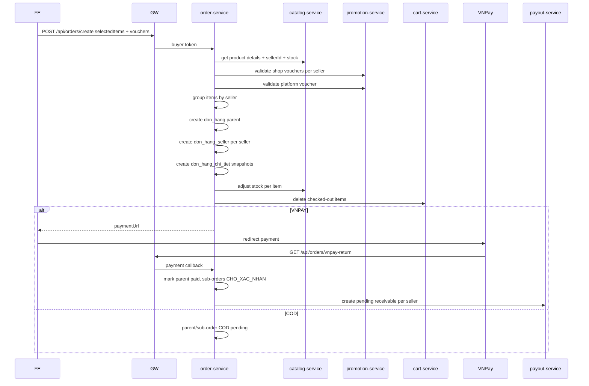

Voucher allocation:

| Voucher | Apply level | Rule |
|---|---|---|
| Shop voucher | Sub-order | Chỉ tính vào subtotal của seller đó |
| Platform voucher | Order cha | Phân bổ theo tỉ lệ subtotal từng sub-order để tính payout đúng |

## 9. Lịch sử đơn mua và review

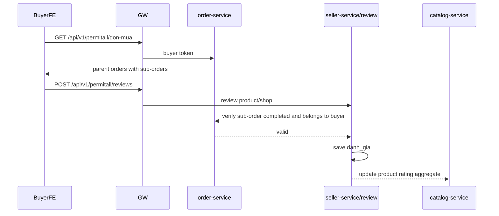

Review rule:

| Rule | Mô tả |
|---|---|
| Chỉ review sau hoàn thành | `don_hang_seller.status = HOAN_THANH` |
| Không review sản phẩm chưa mua | Verify buyer/sub-order/item |
| Một item một review | Unique theo buyer + sub-order + product-detail |
| Seller reply | Seller chỉ reply review thuộc shop mình |

## 10. Payout/đối soát

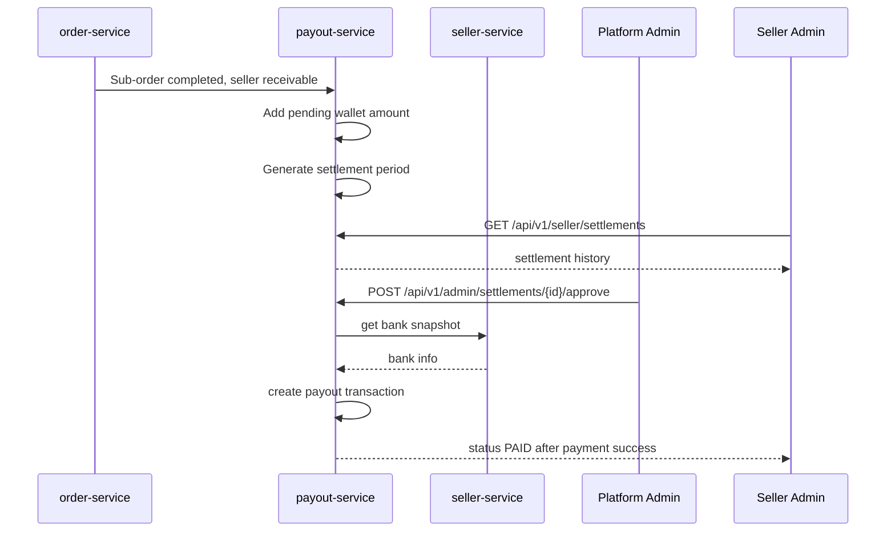

Payout amount:

```text
seller_receivable = sub_order_subtotal
                  + shipping_fee_charged_to_buyer_if_passed_to_seller
                  - shop_discount
                  - platform_commission
                  - refund/penalty
```

## 11. Platform Admin flows

### 11.1 Banner

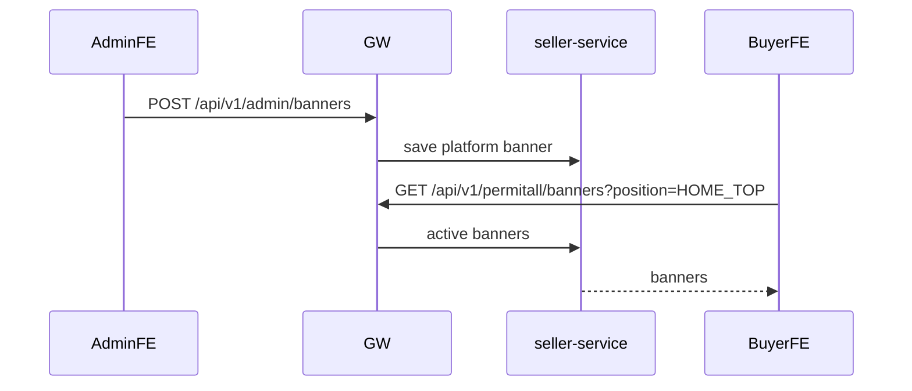

### 11.2 Khiếu nại/tranh chấp

Phase sau, nhưng domain cần chuẩn bị:

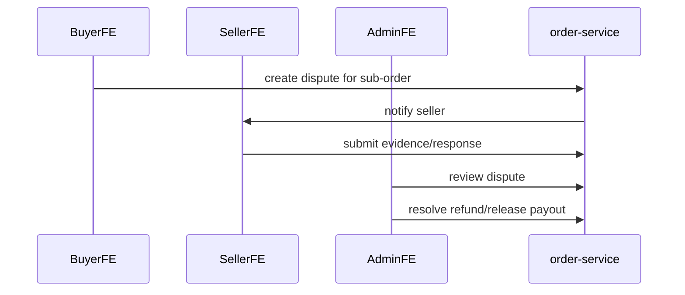

### 11.3 Hậu kiểm, chuẩn hóa và gộp thuộc tính sản phẩm

Màn Platform Admin **Quản lý thuộc tính** bổ sung vào phạm vi Mục 3.4 của prompt. Seller không phải chờ thao tác này để đăng sản phẩm.

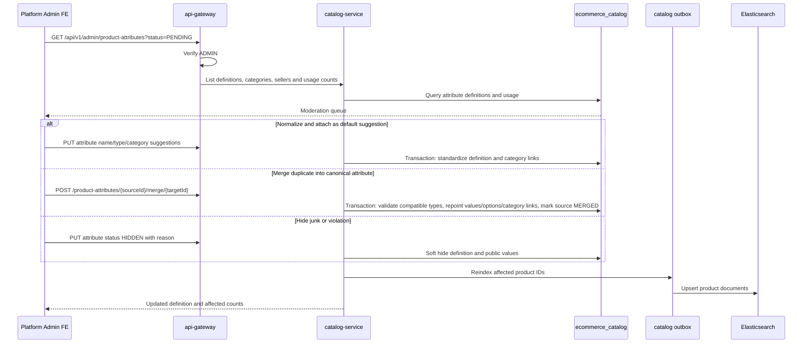

Merge/normalize rules:

| Rule | Xử lý |
|---|---|
| Hậu kiểm | `PENDING` dùng được ngay trong shop tạo và không được gợi ý chéo shop; Admin xử lý sau |
| Merge type | Chỉ tự động gộp khi type tương thích; đổi `TEXT` sang dropdown/number phải preview lỗi và có mapping rõ |
| Atomicity | Repoint product values, options và category suggestions trong một transaction; source giữ `MERGED` + `merged_into_attribute_id` |
| Duplicate option | Gộp theo `normalized_value`, không tạo hai lựa chọn tương đương trong target |
| Hide/delete | Mặc định soft hide để không mất dữ liệu product; hard delete chỉ khi usage count bằng 0 và đã có audit/backup |
| Search | Mọi normalize/merge/hide phát outbox cho toàn bộ product bị ảnh hưởng và theo dõi reindex failure |
| Audit | Lưu actor, reason, source/target và affected counts trong audit log triển khai ở Phase 5 |

## 12. Thông báo

`notification-service` hiện có REST email và Kafka consumer. Marketplace dùng cho:

| Event | Recipient |
|---|---|
| Seller submitted | Platform Admin |
| Seller approved/rejected/suspended | Seller owner |
| Buyer paid order | Seller(s) |
| Seller confirmed/shipped/completed sub-order | Buyer |
| Review created/replied | Seller/buyer |
| Settlement paid | Seller |

Kafka producer cụ thể từ `order-service` hiện chưa thấy trong source; khi code cần bổ sung producer/event publisher rõ ràng.
