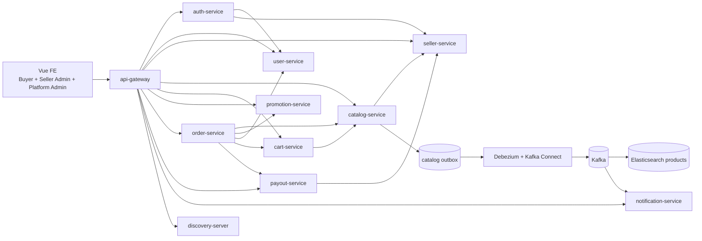
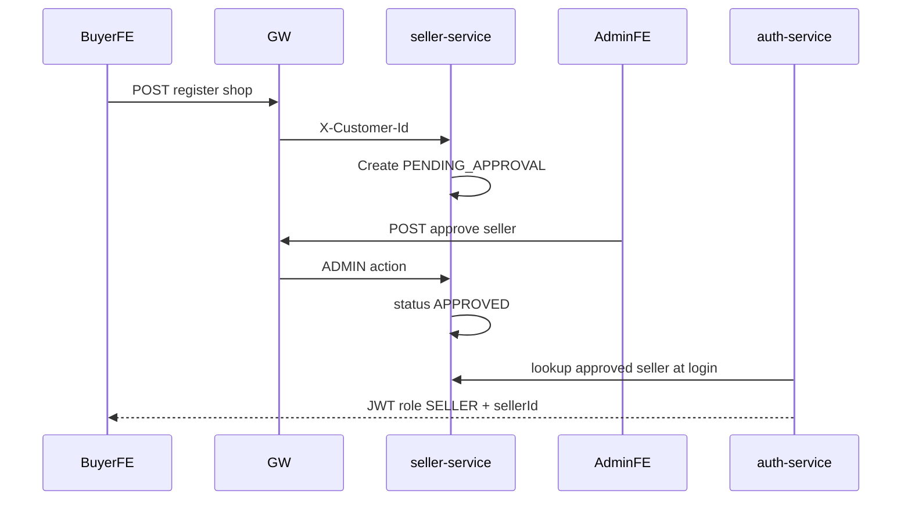
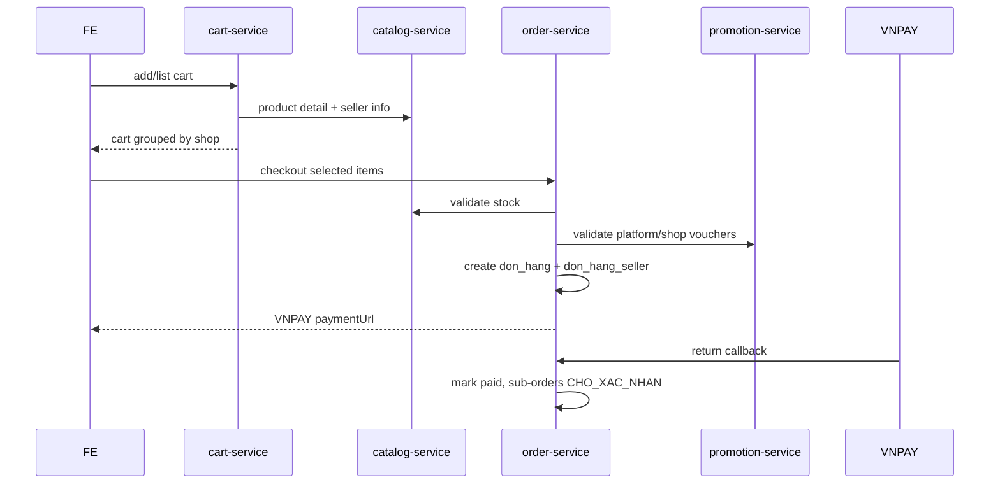
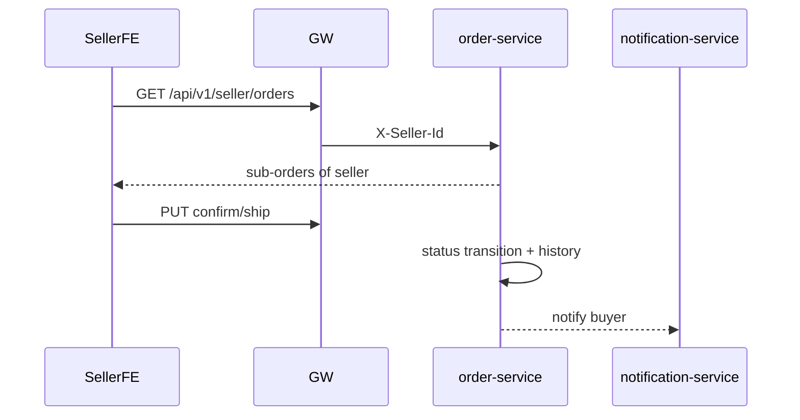

# ARCHITECTURE.md - Marketplace target architecture

## 1. Hiện trạng ngắn gọn

Source hiện tại là hệ thống e-commerce bán giày một cửa hàng, microservice Java/Spring + Vue. Backend gồm `discovery-server`, `api-gateway`, `common-lib`, `auth-service`, `user-service`, `catalog-service`, `promotion-service`, `order-service`, `cart-service`, `notification-service`. FE dùng Vue 3/Vite/Pinia/Vue Router/Axios.

Các domain đang có:

| Domain | Service hiện tại | Trạng thái marketplace |
|---|---|---|
| Auth buyer/admin | `auth-service`, `user-service` | Reuse, thêm SELLER/JWT sellerId |
| Product/catalog | `catalog-service` | Reuse, thêm seller ownership |
| Cart | `cart-service` | Reuse, group theo shop |
| Order/checkout/VNPay | `order-service` | Reuse checkout/VNPay, refactor split-order |
| POS/offline invoice | `order-service`, FE admin `banhang` | Bỏ hẳn |
| Voucher/promotion | `promotion-service` | Reuse, thêm scope platform/shop |
| Notification | `notification-service` | Reuse, bổ sung event producer |
| Search | catalog outbox + Debezium + Kafka Connect + Elasticsearch | Reuse, thêm seller fields |

## 2. Kiến trúc marketplace mới

Service mới:

| Service | Database | Trách nhiệm |
|---|---|---|
| `seller-service` | `ecommerce_seller` | Đăng ký shop, duyệt seller, hồ sơ shop, trạng thái, follow shop, banner platform |
| `payout-service` | `ecommerce_payout` | Ví seller, hoa hồng, kỳ đối soát, payout transaction |

Service mở rộng:

| Service | Thay đổi chính |
|---|---|
| `api-gateway` | Route seller/payout, filter role SELLER, set `X-Seller-Id` |
| `auth-service` | Token roles array, `sellerId`, seller status |
| `user-service` | Buyer/staff giữ nguyên, thêm role/link seller ID |
| `catalog-service` | `seller_id` trên product/detail, seller product APIs, search seller fields |
| `cart-service` | Cart item seller snapshot, response grouped by shop |
| `order-service` | Order cha/sub-order, seller order APIs, bỏ POS |
| `promotion-service` | Voucher/campaign `seller_id nullable`, scope `PLATFORM`/`SHOP` |
| `notification-service` | Email/event cho seller approval, order status, payout |

## 3. Data model cốt lõi

| Bảng | Service | Vai trò |
|---|---|---|
| `seller` | `seller-service` | Hồ sơ shop, trạng thái duyệt |
| `seller_status_history` | `seller-service` | Audit trạng thái shop |
| `shop_follow` | `seller-service` | Buyer follow shop |
| `san_pham.seller_id` | `catalog-service` | Product ownership |
| `san_pham_chi_tiet.seller_id` | `catalog-service` | SKU ownership/tối ưu validate |
| `gio_hang_chi_tiet.seller_id` | `cart-service` | Group cart theo shop |
| `don_hang` | `order-service` | Order cha, thanh toán một lần |
| `don_hang_seller` | `order-service` | Sub-order theo seller, trạng thái riêng |
| `don_hang_chi_tiet` | `order-service` | Item snapshot theo sub-order |
| `phieu_giam_gia.seller_id` | `promotion-service` | Null = voucher sàn, not null = voucher shop |
| `seller_wallet`, `settlement_period`, `payout_transaction` | `payout-service` | Đối soát |
| `danh_gia` | `seller-service` hoặc review module | Review product/shop |

## 4. Luồng chính

### Seller onboarding

### Cart/checkout nhiều seller

### Seller xử lý đơn

## 5. Frontend target

| Khu vực | Route |
|---|---|
| Buyer storefront | `/trang-chu`, `/san-pham`, `/san-pham-chi-tiet/:idsp`, `/shop/:sellerSlug`, `/gio-hang`, `/thanh-toan`, `/don-mua` |
| Seller onboarding | `/dang-ky-ban-hang`, `/seller/pending` |
| Seller Admin | `/seller/dashboard`, `/seller/products`, `/seller/orders`, `/seller/vouchers`, `/seller/wallet`, `/seller/profile`, `/seller/reviews` |
| Platform Admin | `/admin/sellers`, `/admin/danh-muc`, `/admin/voucher`, `/admin/banners`, `/admin/settlements`, `/admin/thong-ke` |

Loại bỏ khỏi UI marketplace: `/admin/ban-hang` POS và các màn hóa đơn offline không còn tương thích.

## 6. Roadmap

| Phase | Mục tiêu |
|---|---|
| Phase 0 | Tài liệu hóa baseline |
| Phase 1 | Seller onboarding, role/JWT/gateway seller guard |
| Phase 2 | Catalog seller ownership, cart grouped, checkout split-order, bỏ POS |
| Phase 3 | Seller order, voucher 2 tầng, payout-service nền |
| Phase 4 | Storefront marketplace, shop page, search/filter, dashboard/statistics |
| Phase 5 | Review/follow/notification |
| Phase 6 optional | Chat buyer-seller, flash sale toàn sàn |

Chi tiết phase nằm ở `docs/05-roadmap.md`.
