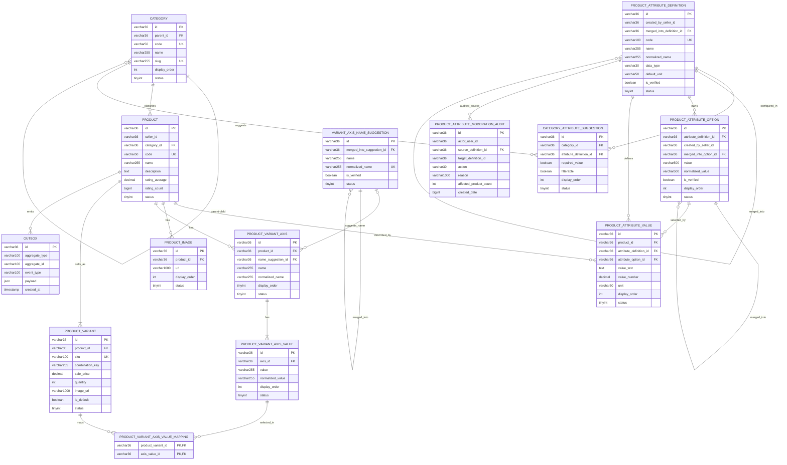

# ERD chuẩn hóa domain Sản phẩm

## 1. Mục tiêu schema

- Giữ `product`, `product_variant`, `category`, `outbox` nhưng sửa cấu trúc quanh thuộc tính/phân loại.
- Xóa hoàn toàn `brand`, `color`, `material`, `origin`, `size`, `sole_type`.
- Xóa `product_attribute_value_option`; `product_attribute_value` là bảng value duy nhất.
- Tách rõ bảng thông số mô tả và bảng trục sinh variant.
- Tách ảnh tổng thể sản phẩm vào `product_image`; `product_variant.image_url` chỉ là ảnh riêng của tổ hợp variant.
- Mọi product có ít nhất một variant; product không trục có đúng một default variant.

## 2. Mermaid ERD

## 3. Chi tiết bảng và ràng buộc

### 3.1. `category`

Giữ identity hiện tại, bổ sung:

- `parent_id` nullable tự tham chiếu để tạo cây.
- `slug` unique phục vụ URL/filter ổn định.
- `display_order`.

Category phải tạo thành cây hợp lệ. Chỉ category lá được gắn trực tiếp vào product; filter category cha mở rộng xuống toàn bộ descendant. Ràng buộc “chỉ category lá được gắn sản phẩm” được kiểm tra ở tầng service trong transaction. MySQL không tự enforce được ràng buộc này chỉ bằng FK/check vì `category` là cây tự tham chiếu và trạng thái lá phụ thuộc việc có category con hay không.

### 3.2. `product`

Giữ các field lõi: seller, category, code, name, description, rating, status và audit time.

Xóa cột/FK:

- `brand_id`
- `origin_id`
- `material_id`
- `sole_type_id`

Không lưu price/quantity/image trực tiếp trên row `product`. Giá hiển thị danh sách là min price của variant active; gallery tổng thể nằm ở `product_image`.

### 3.3. `product_image`

Lưu bộ ảnh tổng thể/gallery của sản phẩm, độc lập với ảnh riêng của từng variant:

- `product_id` FK bắt buộc, `ON DELETE CASCADE` khi xóa vật lý product trong môi trường cho phép hard-delete.
- `url` bắt buộc; `display_order` xác định thứ tự hiển thị; `status` cho phép ẩn ảnh mà không làm mất lịch sử.
- Unique `(product_id, display_order)` để thứ tự ảnh không trùng trong cùng sản phẩm.
- `product_variant.image_url` chỉ dùng cho ảnh đại diện của đúng tổ hợp variant; không dùng thay cho gallery tổng thể.

### 3.4. `product_attribute_definition`

`data_type` chỉ nhận `TEXT`, `NUMBER`, `SELECT_ONE`, `SELECT_MULTI`.

- `created_by_seller_id = null`: Admin/platform tạo.
- `is_verified = false`: seller tạo, dùng ngay và chờ hậu kiểm.
- `default_unit` nullable, chỉ được dùng khi `data_type = NUMBER`; đây là đơn vị chuẩn mặc định dùng chung cho definition.
- `merged_into_definition_id`: FK tự tham chiếu nullable và chỉ cho phép gộp một tầng. Target bắt buộc có `merged_into_definition_id IS NULL`; không được chọn một definition đã gộp làm target.
- `status`: `ACTIVE/INACTIVE`; definition merged/hidden chuyển inactive nhưng không mất dữ liệu lịch sử.

Index:

- `(normalized_name, status)` cho autocomplete.
- `(created_by_seller_id, is_verified, status)` cho hậu kiểm.
- FK `merged_into_definition_id` dùng `ON DELETE RESTRICT`.

### 3.5. `product_attribute_option`

Áp dụng cho `SELECT_ONE/SELECT_MULTI`.

- Unique `(attribute_definition_id, normalized_value)`.
- `is_verified` và `created_by_seller_id` theo hậu kiểm.
- `merged_into_option_id` là FK tự tham chiếu nullable và chỉ cho phép gộp một tầng. Target bắt buộc có `merged_into_option_id IS NULL`; không được chọn một option đã gộp làm target.

### 3.6. `category_attribute_suggestion`

Unique `(category_id, attribute_definition_id)`.

Không cần `default_suggestion` vì bản thân việc có row active đã mang nghĩa được gợi ý. Giữ `required_value`, `filterable`, `display_order`, `status`.

### 3.7. `product_attribute_value`

Đây là bảng value duy nhất:

- `TEXT`: chỉ `value_text` có giá trị.
- `NUMBER`: chỉ `value_number` có giá trị. `unit` nullable và chỉ lưu khi cần override bằng đơn vị khác `product_attribute_definition.default_unit`; đơn vị hiệu lực là `COALESCE(product_attribute_value.unit, product_attribute_definition.default_unit)`.
- `SELECT_ONE`: đúng một row với `attribute_option_id`.
- `SELECT_MULTI`: nhiều row cùng `(product_id, attribute_definition_id)`, mỗi row là một `attribute_option_id` khác nhau.

Không giữ `product_attribute_value_option`.

Ràng buộc service bắt buộc:

- Mỗi row chỉ có đúng một trong `value_text`, `value_number`, `attribute_option_id` theo type definition.
- TEXT/NUMBER/SELECT_ONE có tối đa một value logic cho một `(product, definition)`.
- SELECT_MULTI unique `(product_id, attribute_definition_id, attribute_option_id)`.
- Option phải thuộc đúng definition canonical sau khi áp dụng trực tiếp mapping merge một tầng.

Service phải normalize `unit`: không lặp lại `default_unit` trên từng product value; chỉ giữ giá trị override thực sự khác mặc định. MySQL có thể bổ sung generated key `value_slot` hoặc trigger/check để phòng vệ singleton ở DB, nhưng business rule vẫn phải được enforce trong transaction ở service bằng lock/serialization phù hợp và có test ghi đồng thời.

### 3.8. Từ điển gợi ý tên trục

`variant_axis_name_suggestion` chỉ là autocomplete/hậu kiểm, không phải definition sinh variant toàn sàn.

- Axis thực tế vẫn lưu `name` trên `product_variant_axis` để bảo toàn cách seller đặt tên.
- Seller có thể chọn gợi ý hoặc gõ tên khác.
- Admin merge/verify/ẩn từ điển, không sửa cưỡng bức axis đã bán.

### 3.9. `product_variant_axis` và value

Ràng buộc:

- Unique `(product_id, display_order)`.
- Check `display_order IN (1,2)`.
- Unique `(product_id, normalized_name)`.
- Mỗi axis active có ít nhất một axis value active.
- Axis value unique `(axis_id, normalized_value)`.

Tối đa hai axis được enforce cả ở service và bằng cặp unique/check display order.

### 3.10. `product_variant`

Thay đổi so với DB thật:

- Bỏ `size_id`, `color_id`.
- Bỏ `seller_id`; seller được lấy từ `product.seller_id`.
- Thêm `is_default NOT NULL DEFAULT false`.
- Thêm `combination_key NOT NULL` và unique `(product_id, combination_key)`.
- `sale_price` đổi từ `double` sang `decimal(19,2)`.
- `sku`/`code` unique; dùng một tên canonical trong entity/API là `sku`.

Invariant:

- Product 0 axis: đúng một variant active, `is_default=true`, mapping count=0.
- Product 1/2 axis: mọi variant `is_default=false`; mapping count bằng axis count.
- `combination_key` là bắt buộc cho mọi variant: product 0 axis dùng sentinel canonical `DEFAULT`; product 1/2 axis dùng key canonical từ axis theo `display_order` và axis value ID.
- Unique tổ hợp được enforce đồng thời ở service và bằng unique `(product_id, combination_key)` tại DB để chống hai request tạo trùng tổ hợp.

### 3.11. Mapping variant-value

PK kép `(product_variant_id, axis_value_id)`.

Service phải kiểm tra:

- Axis value thuộc một axis của cùng product với variant.
- Một variant không map hai value của cùng axis.
- Không thiếu axis nào.

## 4. Thứ tự xóa/tạo schema

Vì dữ liệu là demo và prompt chốt reset, migration schema thực hiện theo thứ tự:

1. Ngắt/clear connector catalog và index Elasticsearch dev để tránh phát event nửa schema.
2. Xóa dữ liệu consumer demo có FK/ID variant cũ hoặc reset đồng bộ bộ seed marketplace.
3. Drop `product_attribute_value_option`, các bảng dynamic cũ cần recreate, `product_variant`, `product`, rồi sáu bảng cứng theo thứ tự FK.
4. Alter/recreate `category` thành cây.
5. Tạo nhóm descriptive attribute mới, gồm `default_unit` và constraint/index liên quan.
6. Tạo `product_image` và FK/index thứ tự ảnh.
7. Tạo từ điển axis, axis, axis value, variant có `combination_key NOT NULL`, unique tổ hợp và mapping.
8. Tạo lại outbox/index cần thiết.
9. Seed data mới.
10. Start service với `ddl-auto=validate` hoặc tối thiểu kiểm tra schema; không dùng `update` làm cơ chế migration chính.

Không chạy script migration M10 cũ trong cutover này vì script đó backup/map dữ liệu cũ và tiếp tục giữ sáu bảng cứng, trái Mục 5 của prompt sản phẩm.

## 5. Truy vấn kiểm chứng bắt buộc

- Không còn bảng `brand`, `color`, `material`, `origin`, `size`, `sole_type`, `product_attribute_value_option`.
- `product` không còn bốn FK cứng; `product_variant` không còn `size_id/color_id/seller_id`.
- `product_image` có FK về product, URL/thứ tự/trạng thái; gallery tổng thể không lấy từ `product_variant.image_url`.
- Definition NUMBER có `default_unit`; value chỉ lưu `unit` khi override khác mặc định.
- Definition/option merge chỉ một tầng và mọi target merge có con trỏ merge bằng `NULL`.
- Không product nào có hơn hai axis.
- Product không axis có đúng một default variant.
- Product có axis không có default variant và mọi variant map đủ axis.
- Mọi variant có `combination_key` khác null và không có tổ hợp trùng trong cùng product.
- Không value nào có kiểu/cột sai hoặc option khác definition.
- Outbox payload mới không còn `brandId/brand` top-level và có `attributes`, `variantAxes`, `variants` đúng mapping.
